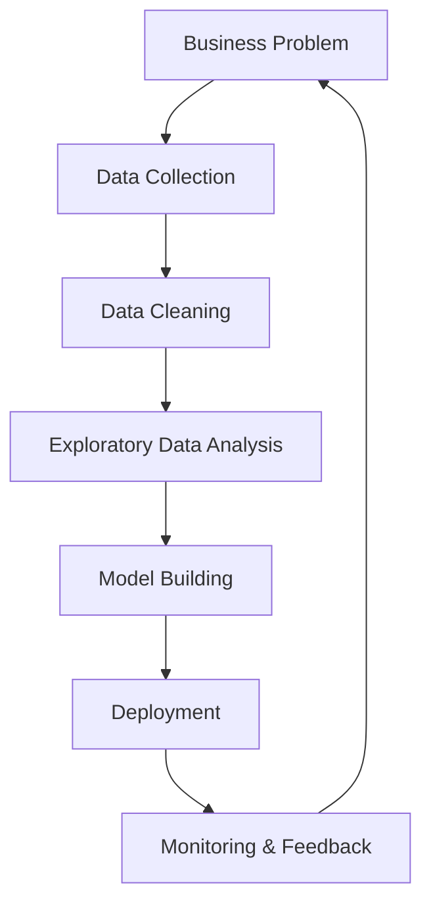

## 1. Chapter Overview
This chapter serves as the compass for the entire book. We define what Data Science is, untangle it from related fields like Machine Learning and AI, and explore the lifecycle of a typical project. You will learn to see data not just as numbers in a table, but as a digital reflection of physical reality.

## 2. Why This Topic Matters
In an era of "big data," the ability to extract meaning from noise is a superpower. Understanding the scope of data science prevents you from treating it as a "black box" and allows you to choose the right tools for the right problems.

## 3. Real-World Applications
- **Healthcare**: Predicting disease outbreaks and personalizing medicine.
- **Finance**: Detecting fraudulent transactions in milliseconds.
- **Entertainment**: Recommending your next favorite show on Netflix.
- **Logistics**: Optimizing delivery routes for companies like Amazon or UPS.

## 4. Core Intuition
Data science is the **scientific method applied to digital information**. Just as a detective uses clues to reconstruct a crime scene, a data scientist uses data points to reconstruct the underlying "truth" of a system.

## 5. Beginner-Friendly Explanation
### Explain Like I Am New
Imagine you own a small lemonade stand. You want to know if you should buy more lemons for tomorrow. 
- **The Data**: You look at your notebook and see that on sunny days, you sell 50 cups. On rainy days, you sell 5 cups.
- **The Science**: You check the weather forecast. It says tomorrow will be sunny.
- **The Insight**: You decide to buy extra lemons.
Data science is just this, but on a much larger scale, using computers to find patterns that are too complex for a person to see at a glance.

## 6. Technical Foundations
Data science sits at the intersection of three domains:
1. **Computer Science**: Programming and data manipulation.
2. **Mathematics/Statistics**: The logic used to find patterns.
3. **Domain Expertise**: Knowing what questions to ask (e.g., finance, biology).

## 7. Mathematical Foundations
At its simplest, data science relies on **Probability** and **Linear Algebra**.
- **Probability**: Quantifying uncertainty (e.g., "There is an 80% chance this email is spam").
- **Linear Algebra**: Representing data as vectors and matrices so computers can process them efficiently.

## 8. Step-by-Step Workflow
The **Data Science Lifecycle** (OSEMN framework):
1. **O**btain: Gathering data from databases, APIs, or scraping.
2. **S**crub: Cleaning data (missing values, errors).
3. **E**xplore: Finding initial patterns and trends.
4. **M**odel: Building predictive algorithms.
5. **I**nterpret: Explaining the findings to stakeholders.

## 9. Algorithms and Architectures
While we dive deep later, Chapter 1 introduces the concept of a **Model**. A model is a mathematical "guess" that improves over time. 

## 10. Visual Explanation


## 11. Code Implementation
Here is a simple example of the "Lemonade Stand" intuition in Python:

```python
import pandas as pd

# 1. Create a simple dataset
data = {
    'weather': ['Sunny', 'Rainy', 'Sunny', 'Cloudy', 'Sunny'],
    'sales': [50, 5, 45, 20, 55]
}
df = pd.DataFrame(data)

# 2. Extract an insight
average_sunny_sales = df[df['weather'] == 'Sunny']['sales'].mean()

print(f"Average sales on sunny days: {average_sunny_sales} cups")
```

## 12. Optimization Techniques
In Data Science, "optimization" usually refers to the **Gradient Descent** process—finding the "lowest point" of error in a model's prediction.

## 13. Common Mistakes
- **Assuming Correlation equals Causation**: Just because two things happen together doesn't mean one caused the other.
- **Data Leakage**: Accidentally giving the model the "answer" during training.

## 14. Debugging Guide
When your data science project fails, check:
1. **Data Quality**: Is the data biased or missing?
2. **Problem Definition**: Are you asking the wrong question?

## 15. Performance Considerations
As datasets grow to billions of rows, simple scripts become slow. We solve this using **Vectorization** (NumPy) and **Distributed Computing** (Spark/Dask).

## 16. Research Evolution
Historically, data science was called "Statistics." With the rise of the internet and cheap storage, it evolved into "Big Data," and eventually with powerful GPUs, it became "Artificial Intelligence."

## 17. Industry Case Study
**Case Study: Uber's Surge Pricing**. Uber uses real-time data science to balance supply (drivers) and demand (riders). When demand spikes, the algorithm increases prices to encourage more drivers to go online.

## 18. Hands-On Exercise
- [ ] Install Python on your machine.
- [ ] Find a CSV file on [Kaggle](https://www.kaggle.com) and open it in Excel or Google Sheets.
- [ ] Identify 3 "features" (columns) and 1 "target" (the thing you want to predict).

## 19. Mini Project
**The Personal Finance Tracker**: Create a spreadsheet of your monthly expenses. Calculate the average spent on food versus rent. This is the first step of "Exploratory Data Analysis" (EDA).

## 20. Interview Questions
1. What is the difference between supervised and unsupervised learning?
2. Explain the "Bias-Variance Tradeoff" to a non-technical person.
3. What are the steps of the OSEMN framework?

## 21. Summary
Data science is a systematic approach to turning raw information into actionable knowledge. It requires a blend of coding, math, and curiosity.

## 22. Further Reading
- *Storytelling with Data* by Cole Nussbaumer Knaflic.
- *The Art of Data Science* by Roger Peng.

## 23. Research Papers
- *Fifty Years of Data Science* by David Donoho (2017).

## 24. Key Takeaways
- Data Science = Coding + Math + Domain Knowledge.
- Always start with a clear business question.
- Data cleaning is 80% of the work.