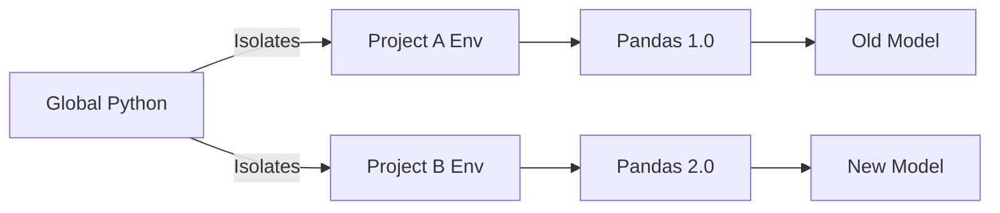

# Chapter 2: Setting Up Your Environment

## 1. Chapter Overview
A professional data science project is only as good as the environment it runs in. This chapter walks you through the essential tools of the trade: from the Python ecosystem and virtual environments to powerful IDEs like VS Code and high-performance hardware like GPUs.

## 2. Why This Topic Matters
"It works on my machine" is the enemy of collaboration. Setting up a reproducible environment ensures that your code remains functional across different computers and after library updates.

## 3. Real-World Applications
- **Team Collaboration**: Ensuring everyone on the project uses the same version of libraries.
- **Production Deployment**: Using Docker to mirror your local setup in the cloud.
- **Cost Management**: Using Google Colab for free GPU access instead of buying expensive hardware.

## 4. Core Intuition
Think of your operating system as a kitchen. If you cook everything (math projects, web apps, games) in the same pot, flavors will mix and ruin the dish. **Virtual Environments** are separate "mini-kitchens" for every project.

## 5. Beginner-Friendly Explanation
### Explain Like I Am New
Starting data science without setting up an environment is like trying to build a house by throwing tools into a giant pile. You might find a hammer, but you'll lose the nails.
We use **VS Code** as our workbench, **Python** as our engine, and **Conda** or **Pip** as our storage bins that keep everything organized so one project's tools don't break another's.

## 6. Technical Foundations
The modern stack consists of:
1. **The Interpreter**: Usually Python 3.9+.
2. **The IDE**: VS Code or PyCharm.
3. **The Interactive Layer**: Jupyter Notebooks (.ipynb).
4. **The Package Manager**: `pip` (standard) or `conda` (scientific).

## 7. Mathematical Foundations
While setup is technical, understanding **GPU Computing** requires knowing that GPUs are designed for **Matrix Operations**. Unlike a CPU, which is like a fast car (serial), a GPU is like a giant bus (parallel) that can solve thousands of simple math problems at once.

## 8. Step-by-Step Workflow
1. **Install Python**: Download from python.org or use a manager.
2. **Create a Virtual Environment**:
   ```bash
   python -m venv ds_env
   source ds_env/bin/activate  # Mac/Linux
   # or
   ds_env\Scripts\activate     # Windows
   ```
3. **Install VS Code**: Add the "Python" and "Jupyter" extensions.
4. **Install Libraries**: `pip install numpy pandas matplotlib jupyter`

## 9. Algorithms and Architectures
We distinguish between **Standard Execution** (local laptop) and **Cloud Execution** (Colab/AWS). Cloud architectures allow you to rent "virtual" computers with better specs than your own.

## 10. Visual Explanation


## 11. Code Implementation
Checking your environment setup with a script:

```python
import sys
import platform

def check_env():
    print(f"Python Version: {sys.version}")
    print(f"Platform: {platform.system()} {platform.release()}")
    
    try:
        import numpy as np
        print(f"NumPy Version: {np.__version__} (INSTALLED)")
    except ImportError:
        print("NumPy: NOT INSTALLED")

if __name__ == "__main__":
    check_env()
```

## 12. Optimization Techniques
- **Requirement Files**: Always use `pip freeze > requirements.txt` to lock your versions.
- **Docker**: For complete environment isolation (OS + Libraries).

## 13. Common Mistakes
- **Installing to Global Python**: This will eventually lead to "Dependency Hell" where libraries conflict.
- **Forgetting to activate the environment**: You'll install packages, but your code won't see them.

## 14. Debugging Guide
If a package isn't found:
1. Run `which python` (Linux/Mac) or `where python` (Windows).
2. Ensure the path points to your `ds_env` folder and not the system folder.

## 15. Performance Considerations
When working with heavy Deep Learning models, use **NVIDIA GPUs** with **CUDA** drivers. If you don't have one, **Google Colab** provides them for free in the browser.

## 16. Research Evolution
Setup has moved from manual compilation (checking C++ headers) to one-click installers and cloud-native "Zero-Setup" environments like Github Codespaces and Colab.

## 17. Industry Case Study
**Netflix's Metaflow**: Netflix built a tool to help their scientists manage environments and cloud compute seamlessly, so they could focus on the math instead of the Linux commands.

## 18. Hands-On Exercise
- [ ] Create a folder named `my_first_ds_project`.
- [ ] Create a virtual environment inside it.
- [ ] Install `pandas` and `plotly`.
- [ ] Create a `.ipynb` file and print "Hello Data Science".

## 19. Mini Project
**Environment Doctor**: Write a bash script that automatically detects if Python is installed and creates a `requirements.txt` file for a new project directory.

## 20. Interview Questions
1. Why is a virtual environment important in a production setting?
2. What is the difference between `pip` and its lockfiles?
3. What are the advantages of using Jupyter Notebooks for exploration?

## 21. Summary
A stable environment is the bedrock of reproducible science. By using virtual environments and VS Code, you ensure your code works today, tomorrow, and on your colleague's machine.

## 22. Further Reading
- [VS Code Python Documentation](https://code.visualstudio.com/docs/languages/python)
- [Managing Environments with Conda](https://docs.conda.io/projects/conda/en/latest/user-guide/tasks/manage-environments.html)

## 23. Research Papers
- *Software Engineering for Machine Learning: A Case Study* (Amershi et al., 2019)

## 24. Key Takeaways
- One project = One virtual environment.
- Lock your versions in `requirements.txt`.
- Start local, scale to the Cloud.
