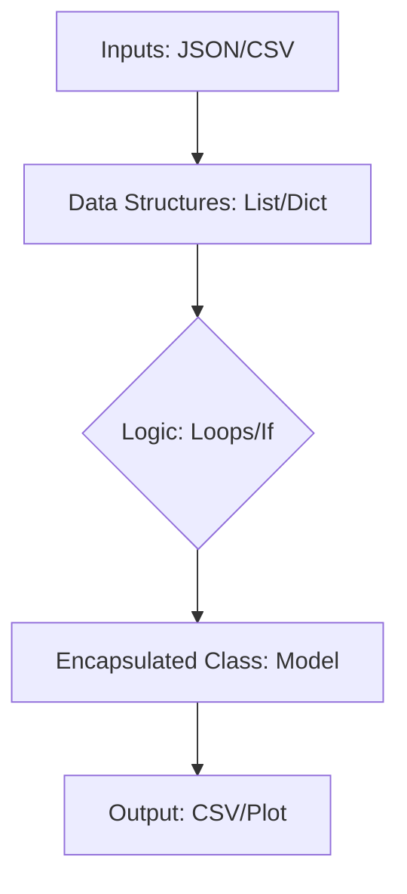

## 1. Chapter Overview
Python is the bridge between human logic and machine intelligence. This chapter covers the foundational programming concepts required for data science: from variables and control flow to Object-Oriented Programming (OOP) and interacting with web APIs.

## 2. Why This Topic Matters
While you don't need to be a software engineer to be a data scientist, you must be a competent programmer. Clean, modular, and efficient Python code is what separates a model that runs in a research lab from one that powers a million-user application.

## 3. Real-World Applications
- **Automated Data Digestion**: Writing scripts to download thousands of CSV files every night.
- **Microservices**: Building small APIs with Flask or FastAPI to serve your models.
- **Data Enrichment**: Using Python to pull social media sentiment from Twitter/X APIs.

## 4. Core Intuition
Programming is about **data structures** and **algorithms**. Think of data structures (lists, dictionaries) as containers and algorithms (loops, functions) as the recipes that mix them. In data science, we optimize these recipes to handle millions of records.

## 5. Beginner-Friendly Explanation
### Explain Like I Am New
Think of Python as a very obedient assistant. 
- **Variables** are labels on boxes where you store items (e.g., `price = 10`).
- **Lists** are rows of boxes.
- **Dictionaries** are boxes with name tags.
- **Functions** are "shortcuts"—if you tell your assistant "Make Coffee," they follow a saved set of steps (boil water, add beans) without you repeating every detail every time.

## 6. Technical Foundations
- **Variables and Types**: Strings, Integers, Floats, Booleans.
- **Collections**: Lists, Tuples, Sets, Dictionaries.
- **Control Flow**: `if-else` logic, `for` and `while` loops.
- **Functions**: `def`, `args`, `kwargs`, and `lambda` functions.

## 7. Mathematical Foundations
Python handles large numbers using **Arbitrary-precision integers**. For data science, we care about **Floating-point precision** ($2.0 + 2.0$ isn't always $4.000...$ in computer memory). We also use Python to implement mathematical concepts like **Recursion** and **Set Theory**.

## 8. Step-by-Step Workflow
1. **Define the Problem** in plain English.
2. **Prototype** logic in a Jupyter cell.
3. **Refactor** into a reusable Python function.
4. **Document** using docstrings for others (and yourself).

## 9. Algorithms and Architectures
We introduce the concept of **Encapsulation**. By using classes and objects, we "bundle" data (e.g., a person's name) with the actions that use it (e.g., calculating their BMI). This is the basis for most ML libraries like Scikit-Learn.

## 10. Visual Explanation


## 11. Code Implementation
A simple Python pipeline to process a list of sales:

```python
import json

class SalesTracker:
    def __init__(self, currency="$"):
        self.sales = []
        self.currency = currency
    
    def add_sale(self, amount):
        if amount > 0:
            self.sales.append(amount)
    
    def get_total(self):
        return sum(self.sales)

# Usage
tracker = SalesTracker()
tracker.add_sale(100.50)
tracker.add_sale(45.00)

print(f"Total Sales: {tracker.currency}{tracker.get_total():.2f}")
```

## 12. Optimization Techniques
- **List Comprehensions**: Faster and cleaner than traditional `for` loops.
- **Generators**: Use `yield` to process massive datasets without loading them all into RAM at once.

## 13. Common Mistakes
- **Mutable Default Arguments**: Never use `def func(a=[])`—the list will persist across calls!
- **Ignoring PEP 8**: Writing messy code makes it impossible for others to review.

## 14. Debugging Guide
1. Use `print()` for quick checks.
2. Use the **VS Code Debugger** with breakpoints.
3. Check types using `type(my_variable)`.

## 15. Performance Considerations
Python is "slow" compared to C++. For Data Science, we use Python as a **wrapper**—the Python code tells the computer BRAIN what to do, but the heavy lifting is done by C++ libraries underneath (like NumPy).

## 16. Research Evolution
Python surpassed R as the dominant data science language around 2017 due to its versatility (it can do web dev, automation, AND AI) and the explosion of the PyTorch/TensorFlow ecosystem.

## 17. Industry Case Study
**Instagram**: The backend of Instagram is largely built in Django (a Python framework). They handle millions of posts per minute using Python's ability to scale with asynchronous programming.

## 18. Hands-On Exercise
- [ ] Create a dictionary representing a student (Name, Age, Grades).
- [ ] Write a function that calculates the average grade.
- [ ] Use a list comprehension to filter out failing grades (< 50).

## 19. Mini Project
**Weather API Fetcher**: Use the `requests` library to fetch current weather data for your city in JSON format and save it to a CSV file.

## 20. Interview Questions
1. What is the difference between a list and a tuple?
2. How does a dictionary achieve $O(1)$ lookup time? (Hint: Hashing).
3. Explain the `zip()` function with an example.

## 21. Summary
Python is your tool for automation and logic. Mastering its syntax and its data structures is the first step toward becoming an AI engineer.

## 22. Further Reading
- *Automate the Boring Stuff with Python* by Al Sweigart.
- *Fluent Python* by Luciano Ramalho (Advanced).

## 23. Research Papers
- *The Python Language Reference* (Python Software Foundation).

## 24. Key Takeaways
- Use Dictionaries for lookups, Lists for order.
- Follow OOP for complex systems.
- Always handle errors with `try...except`.