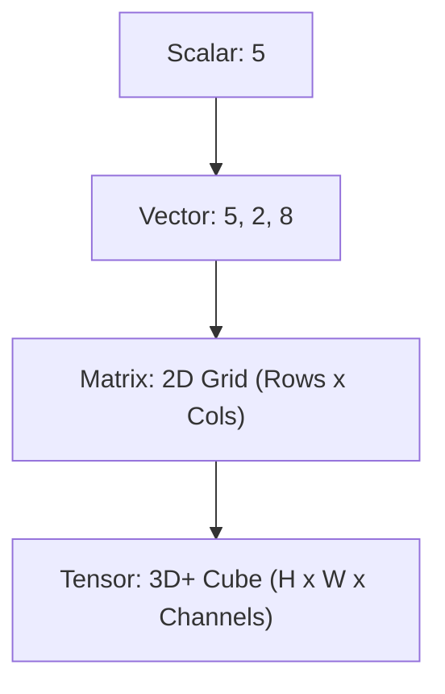

# Chapter 4: Numerical Computing

## 1. Chapter Overview
Standard Python is too slow for big data. This chapter introduces **NumPy**, the library that makes Python "fast." We explore the power of arrays and tensors, the speed of vectorization, and build a geometric intuition for linear algebra.

## 2. Why This Topic Matters
Modern AI models (like ChatGPT or Stable Diffusion) are essentially giant collections of numbers being multiplied and added. To build or understand these models, you must speak the language of **NumPy**—where operations that take seconds in standard Python happen in milliseconds.

## 3. Real-World Applications
- **Image Processing**: Representing a photo as a 3D tensor (Height, Width, RGB).
- **Physics Simulators**: Calculating the forces on thousands of particles simultaneously.
- **Stock Market Analysis**: Performing complex math on decades of pricing data instantly.

## 4. Core Intuition
A standard Python list is like a shopping basket where every item (number, string, fruit) is stored in its own separate bag. **NumPy Arrays** are like an ice cube tray—every slot is the exact same size and type, allowing the computer's brain to process the whole tray at once without checking individual "bags."

## 5. Beginner-Friendly Explanation
### Explain Like I Am New
If you have 1,000 numbers and you want to double them:
- **Standard Python**: "Take number 1, double it. Take number 2, double it..." (Very slow).
- **NumPy**: "Take this whole block of numbers and double everything in it right now!" (Very fast).
This is called **Vectorization**. It's the difference between walking to another city and flying there.

## 6. Technical Foundations
- **NDArray**: The N-Dimensional Array object.
- **Dtypes**: Why specifying `int32` or `float64` saves memory.
- **Reshaping**: Turning a flat list of 12 numbers into a 3x4 grid.
- **Slicing**: Extracting just the first 5 rows and 2 columns.

## 7. Mathematical Foundations
- **Scalars**: A single number (magnitude).
- **Vectors**: A row or column of numbers (magnitude + direction).
- **Matrices**: A grid of numbers (transformations).
- **Tensors**: Grids inside grids (the foundation of Deep Learning).

## 8. Step-by-Step Workflow
1. **Import NumPy** (standardized as `import numpy as np`).
2. **Initialize** an array from a list or using `np.zeros()`, `np.ones()`, `np.random`.
3. **Perform Operations** using built-in methods (`np.sum`, `np.mean`).
4. **Reshape** or **Slice** as needed for your algorithm.

## 9. Algorithms and Architectures
We introduce **Broadcasting**. This is NumPy's ability to perform math between arrays of different shapes (e.g., adding a single number to every element of a matrix) without manually looping.

## 10. Visual Explanation


## 11. Code Implementation
Comparing speed: Standard Python vs. NumPy.

```python
import numpy as np
import time

# Create 1 million numbers
size = 1_000_000
python_list = list(range(size))
numpy_array = np.arange(size)

# 1. Standard Python loop
start = time.time()
python_result = [x * 2 for x in python_list]
print(f"Python Loop: {time.time() - start:.4f}s")

# 2. NumPy Vectorization
start = time.time()
numpy_result = numpy_array * 2
print(f"NumPy Vectorization: {time.time() - start:.4f}s")
```

## 12. Optimization Techniques
- **Memory Mapping**: Opening files that are too large for RAM.
- **Stride Tricks**: Manipulating how memory is read for extreme performance.

## 13. Common Mistakes
- **Shape Mismatch**: Trying to multiply a 3x3 matrix by a 2x2 matrix.
- **Copies vs. Views**: Modifying a "slice" sometimes modifies the original data (be careful!).

## 14. Debugging Guide
1. Check shapes using `array.shape`.
2. Check types using `array.dtype`.
3. Use `np.nan` to handle missing numbers without breaking the math.

## 15. Performance Considerations
NumPy is written in **C and Fortran**. By using NumPy functions, you are running highly optimized machine code while writing simple Python. Never write a `for` loop over a NumPy array if a built-in function exists!

## 16. Research Evolution
NumPy (originally Numeric) was created in 1995 but became the industry standard in the mid-2000s. Today, it is the parent of almost all scientific Python libraries (Pandas, Scikit-Learn, PyTorch).

## 17. Industry Case Study
**NASA's Black Hole Imaging**: The first ever image of a black hole (M87) was processed using NumPy and other Python libraries to combine petabytes of radio telescope data into a single image.

## 18. Hands-On Exercise
- [ ] Create a 5x5 matrix of random numbers.
- [ ] Calculate the mean of each row.
- [ ] Replace all numbers greater than 0.5 with the number 1.

## 19. Mini Project
**Image Grayscale Converter**: Use NumPy to load an image (which is a 3D array of R, G, B colors) and calculate the average of the color channels to create a black-and-white version.

## 20. Interview Questions
1. What is the difference between a Python list and a NumPy array?
2. How does broadcasting work?
3. What is an "Axis" in NumPy? (e.g., `axis=0` vs `axis=1`).

## 21. Summary
NumPy is the "engine room" of Data Science. Mastering arrays and vectorization is non-negotiable for anyone serious about AI.

## 22. Further Reading
- [NumPy Absolute Beginners Guide](https://numpy.org/doc/stable/user/absolute_beginners.html)
- *Python for Data Analysis* by Wes McKinney.

## 23. Research Papers
- *Array programming with NumPy* (Harris et al., Nature 2020).

## 24. Key Takeaways
- Vectorization > Loops.
- Understand your shapes and dtypes.
- NumPy is the foundation of the entire AI stack.
