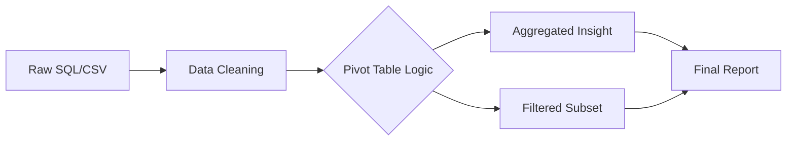

# Chapter 5: Data Handling

## 1. Chapter Overview
Data in the wild is messy. This chapter introduces **Pandas**, the industry-standard library for data manipulation. We move from raw arrays to **DataFrames** (smart spreadsheets), learning how to clean missing values, merge datasets, and aggregate information for analysis.

## 2. Why This Topic Matters
Real-world data is never "clean." It has typos, missing dates, and duplicate records. Being able to programmatically "wrangle" this data into a usable format is the primary job of a data scientist. If Chapter 4 was the engine, Chapter 5 is the steering wheel.

## 3. Real-World Applications
- **Customer Segmentation**: Aggregating millions of transactions to find your top 10% spenders.
- **Log Analysis**: Filtering through gigabytes of server errors to find a specific bug.
- **Financial Reporting**: Merging salary data from three different regional databases into one report.

## 4. Core Intuition
If a NumPy array is like an ice cube tray (pure math), a **Pandas DataFrame** is like an Excel spreadsheet on steroids. Every column has a name, every row has an index, and you can perform complex "SQL-like" operations using simple Python commands.

## 5. Beginner-Friendly Explanation
### Explain Like I Am New
Imagine you have a giant pile of messy receipts.
- **Standard NumPy**: You strictly organize them by their size and color.
- **Pandas**: You put them into a smart filing cabinet. You can say "Show me all receipts from January over $50," and the cabinet instantly pulls them out for you.
Pandas makes data **searchable**, **filterable**, and **readable**.

## 6. Technical Foundations
- **Series**: A single column of data.
- **DataFrame**: A collection of Series (the table).
- **Indices**: How we label rows (dates, IDs, etc.).
- **Dtypes**: Understanding `object` (text) vs `float64` (numbers).

## 7. Mathematical Foundations
Data handling relies on **Relational Algebra**. This involves:
- **Joins**: Combining sets of data based on a common key.
- **Aggregations**: Reducing a set of numbers to a single value (sum, mean, count).
- **Transformations**: Applying a mathematical function (like a log scale) to an entire column.

## 8. Step-by-Step Workflow
1. **Load Data**: `read_csv()`, `read_json()`, or `read_sql()`.
2. **First Look**: `df.head()`, `df.info()`, `df.describe()`.
3. **Clean**: Remove duplicates and handle `NaN` (Not a Number) values.
4. **Transform**: Create new columns based on existing ones.
5. **Group**: Aggregate data using `groupby()`.

## 9. Algorithms and Architectures
We explore the **Split-Apply-Combine** strategy. 
- **Split**: Break data into groups (e.g., by city).
- **Apply**: Do math on each group (e.g., find average temperature).
- **Combine**: Put the results back into a new table.

## 10. Visual Explanation


## 11. Code Implementation
A typical data cleaning pipeline:

```python
import pandas as pd

# 1. Load messy data
data = {
    'Name': ['Alice', 'Bob', 'Alice', 'Charlie', 'Bob'],
    'Spend': [100, 200, None, 150, 250],
    'Date': ['2023-01-01', '2023-01-01', '2023-01-02', '2023-01-02', '2023-01-03']
}
df = pd.DataFrame(data)

# 2. Handle missing values
df['Spend'] = df['Spend'].fillna(0)

# 3. Aggregate: Total spend per person
total_per_person = df.groupby('Name')['Spend'].sum().reset_index()

print("Cleaned Aggregated Data:")
print(total_per_person)
```

## 12. Optimization Techniques
- **Vectorized String Operations**: Using `.str.lower()` instead of looping through names.
- **Categorical Data**: Converting text columns to the `category` type to save up to 90% memory.

## 13. Common Mistakes
- **SettingWithCopyWarning**: Trying to modify a slice of a DataFrame incorrectly.
- **Ignoring the Index**: Forgetting that Pandas uses indices for alignment during joins.

## 14. Debugging Guide
1. Use `df.isna().sum()` to see exactly where the holes in your data are.
2. Use `df.dtypes` to ensure your numbers aren't being treated as text.
3. Check for duplicates with `df.duplicated().any()`.

## 15. Performance Considerations
Pandas loads the entire dataset into **RAM**. If your dataset is 50GB and your laptop has 8GB of RAM, Pandas will crash. We solve this using **chunking** (`chunksize`) or alternative libraries like **Polars**.

## 16. Research Evolution
Pandas was created by Wes McKinney at AQR Capital Management in 2008 to handle financial time-series. It was open-sourced in 2009 and quickly replaced Excel for complex data science tasks.

## 17. Industry Case Study
**Walmart Inventory Management**: Walmart uses Pandas (and distributed versions like Dask) to track the stock levels of millions of items across thousands of stores, ensuring that your favorite cereal is always on the shelf.

## 18. Hands-On Exercise
- [ ] Read a CSV file into a DataFrame.
- [ ] Rename the columns to lowercase.
- [ ] Drop rows where a specific column has a null value.

## 19. Mini Project
**The Movie Recommender Data Prep**: Load a dataset of movie ratings. Clean the titles, remove users who only rated one movie, and find the top 5 highest-rated movies with at least 100 reviews.

## 20. Interview Questions
1. How do you handle missing data in Pandas? (Explain `dropna` vs `fillna`).
2. What is the difference between `merge()` and `concat()`?
3. What is a "Pivot Table" in Pandas?

## 21. Summary
Data handling is where the "heavy lifting" of data science happens. Mastering Pandas allows you to turn raw, chaotic information into the clean structures required for machine learning.

## 22. Further Reading
- [Pandas Official Getting Started](https://pandas.pydata.org/docs/getting_started/index.html)
- *Pandas for Everyone* by Daniel Y. Chen.

## 23. Research Papers
- *Data Wrangling with Pandas* (McKinney, 2011).

## 24. Key Takeaways
- Vectorization works for text and tables too.
- `groupby` is your best friend for insights.
- Always check your `dtypes` after loading data.
