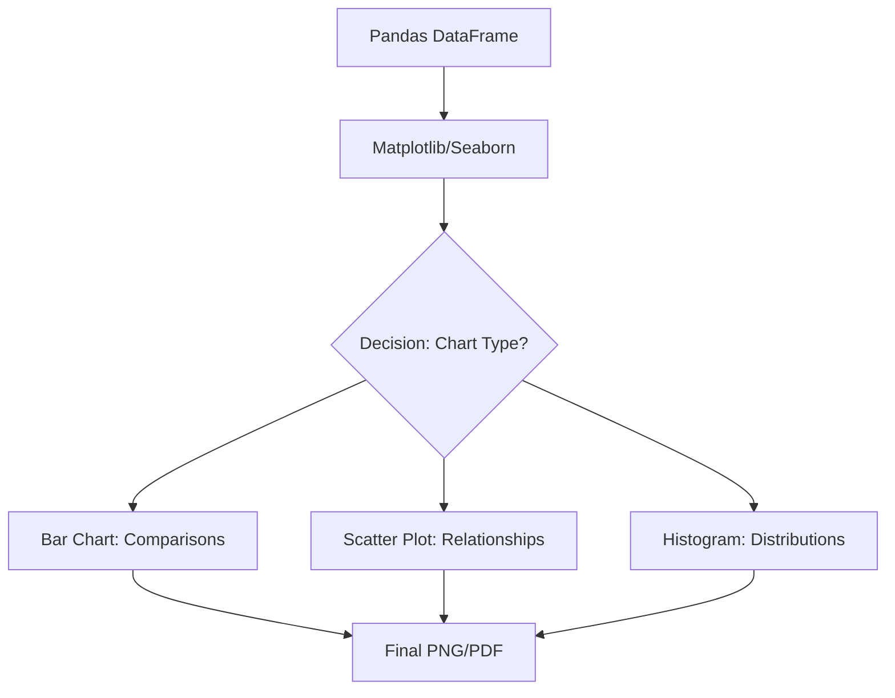

# Chapter 6: Data Visualization

## 1. Chapter Overview
Data without visualization is just a collection of abstract numbers. This chapter explores how to turn raw data into persuasive stories using **Matplotlib**, **Seaborn**, and **Plotly**. We discuss the psychology of color, the importance of chart selection, and how to build interactive dashboards that people actually want to use.

## 2. Why This Topic Matters
A stakeholder who doesn't understand your code will always understand your chart. Visualization is the "final mile" of data science—if you can't communicate your results visually, your insights will stay hidden in your notebook.

## 3. Real-World Applications
- **Epidemiology**: Mapping the spread of a virus over time and geography.
- **E-commerce**: Identifying "drop-off" points in a customer's shopping journey using funnel charts.
- **Public Policy**: Comparing the GDP of different nations using bubble charts.

## 4. Core Intuition
Visualization is about **Mapping Data to Aesthetics**. We take a column of numbers and "map" it to the length of a bar, or take a category and "map" it to a specific color. Good visualization chooses mappings that the human brain can process instantly.

## 5. Beginner-Friendly Explanation
### Explain Like I Am New
If I tell you "The temperature was 70 on Monday, 72 on Tuesday, and 85 on Wednesday," you have to think about it. If I show you a line that suddenly spikes upward, you immediately feel the heat. 
Visualization is **converting logic into emotion**. We use tools like **Matplotlib** to draw the lines and **Seaborn** to make those lines look professional and beautiful.

## 6. Technical Foundations
- **The Figure and Axes**: The "canvas" vs the "painting."
- **Plot Types**: Scatter, Line, Bar, Boxplot, Histogram.
- **Customization**: Titles, labels, legends, and gridlines.
- **Layers**: Adding a trend line on top of raw scatter points.

## 7. Mathematical Foundations
Visualization relies on **Coordinate Geometric Transforms**.
- **Linear Scaling**: Mapping values to pixels on a screen.
- **Logarithmic Scaling**: Useful when data spans multiple orders of magnitude (e.g., $10$ to $10,000,000$).
- **Kernal Density Estimation (KDE)**: Creating smooth curves from jagged histograms to see the underlying distribution.

## 8. Step-by-Step Workflow
1. **Choose the Question**: What do you want to show? (Comparison? Distribution? Relationship?)
2. **Prepare Data**: Filter and aggregate in Pandas.
3. **Select Plot**: Bar chart for categories, Scatter for relationships.
4. **Refine**: Remove "Chart Junk" (unnecessary lines/text).
5. **Annotate**: Add text to highlight the most important part of the graph.

## 9. Algorithms and Architectures
We introduce the **Grammar of Graphics** (used by Seaborn and Plotly). Instead of saying "Draw a line," we specify:
1. **Data**
2. **Aesthetics** (mapping columns to x/y)
3. **Geometry** (telling the tool to draw a line)

## 10. Visual Explanation


## 11. Code Implementation
Comparing distributions with Seaborn:

```python
import seaborn as sns
import matplotlib.pyplot as plt
import pandas as pd
import numpy as np

# 1. Generate random data
data = {
    'Category': ['A']*50 + ['B']*50,
    'Value': np.concatenate([np.random.normal(0, 1, 50), np.random.normal(2, 1, 50)])
}
df = pd.DataFrame(data)

# 2. Create the plot
plt.figure(figsize=(10, 6))
sns.histplot(data=df, x='Value', hue='Category', kde=True, palette='viridis')

# 3. Add polish
plt.title("Distribution of Values by Category")
plt.xlabel("Measurement")
plt.ylabel("Frequency")

plt.show()
```

## 12. Optimization Techniques
- **Rasterization**: Using `.jpg` for plots with millions of points to save file size.
- **Vector Graphics**: Using `.svg` or `.pdf` for high-quality reports that never get blurry.

## 13. Common Mistakes
- **The Pie Chart Trap**: Rarely use pie charts; the human brain is bad at comparing angles. Use bar charts instead.
- **Overplotting**: When you have so many dots that you can't see the density (Solution: Use transparency `alpha` or a 2D histogram).

## 14. Debugging Guide
1. If your plot is empty, check if your data was filtered to zero rows.
2. If the labels are overlapping, use `plt.xticks(rotation=45)`.
3. If using Plotly in a script, remember to call `.show()`!

## 15. Performance Considerations
Interactive libraries like **Plotly** or **Altair** store the data inside the chart file. If you plot 1 million points, your browser will crash. **Sample your data** down to 5,000 points before making it interactive.

## 16. Research Evolution
Visualization evolved from hand-drawn charts (1800s) to the strict grammar of John Tukey (1970s), and finally to the interactive, web-based dashboards we see today with **Streamlit** and **Dash**.

## 17. Industry Case Study
**The New York Times Data Journalism**: The NYT set the gold standard for using D3.js and Python to explain complex global events (like election results or COVID tracking) using interactive maps and flow charts.

## 18. Hands-On Exercise
- [ ] Create a line chart showing a fake stock price over 30 days.
- [ ] Change the color of the line to orange and add a grid.
- [ ] Save the plot as a high-resolution PNG.

## 19. Mini Project
**The Weather Dashboard**: Use the data from Chapter 3's Mini Project to create a dashboard showing the temperature trend and a bar chart of rainy vs sunny days in your city.

## 20. Interview Questions
1. When should you use a Log scale on an axis?
2. What is the "Data to Ink Ratio"?
3. How do you visualize three-dimensional data on a two-dimensional screen?

## 21. Summary
Visualization is the heart of storytelling. By mastering Matplotlib and Seaborn, you gain the power to turn your technical analysis into a clear, persuasive narrative.

## 22. Further Reading
- *Envisioning Information* by Edward Tufte.
- [Seaborn Tutorial Gallery](https://seaborn.pydata.org/tutorial.html)

## 23. Research Papers
- *The Grammar of Graphics* (Leland Wilkinson, 1999).

## 24. Key Takeaways
- Select the right chart for the right data type.
- Less is more: remove excess gridlines and labels.
- Interactivity should enhance, not distract.
