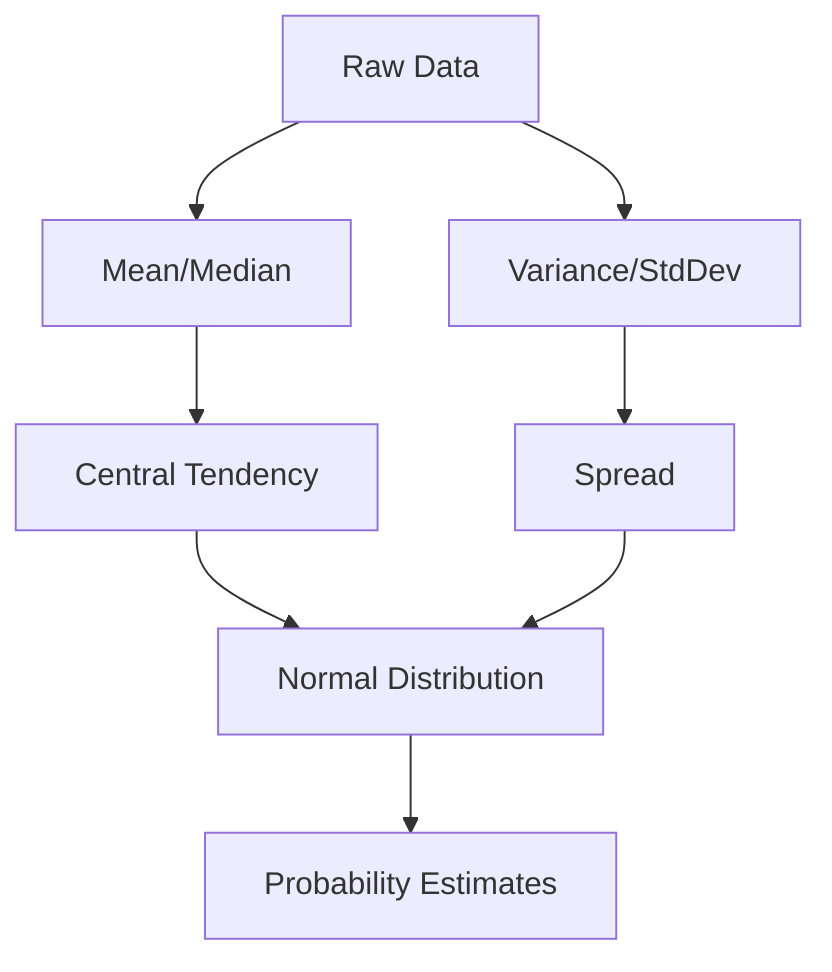

# Chapter 7: Statistics Essentials

## 1. Chapter Overview
Statistics is the science of learning from data. This chapter covers the fundamental tools used to summarize information and make decisions under uncertainty: from measures of central tendency to probability distributions and the Central Limit Theorem.

## 2. Why This Topic Matters
Machine Learning is essentially "Statistics on Steroids." If you don't understand variance or distributions, you will misinterpret your model's performance and fail to recognize when your results are just due to random chance.

## 3. Real-World Applications
- **A/B Testing**: Deciding if a new website button color actually increases sales.
- **Risk Assessment**: Predicting the likelihood of an insurance claim.
- **Quality Control**: Detecting defective products in a factory using sampling.

## 4. Core Intuition
Statistics is about **Signals and Noise**. The "Signal" is the true underlying pattern, and the "Noise" is the random variation. Our goal is to use mathematics to filter out the noise so we can see the signal clearly.

## 5. Beginner-Friendly Explanation
### Explain Like I Am New
Imagine you want to know the "average" height of people in your city.
- **The Mean**: You add everyone's height and divide by the number of people.
- **The Variance**: You check how much people's heights differ from that average. If everyone is nearly the same height, variance is low. If there are giants and toddlers, variance is high.
- **The Distribution**: You plot the heights on a graph. Most people are in the middle (the "Bell Curve"), and very few are extremely tall or short.

## 6. Technical Foundations
- **Central Tendency**: Mean, Median, Mode.
- **Dispersion**: Range, Variance, Standard Deviation.
- **Skewness and Kurtosis**: Is the data leaning to one side or "peaky"?
- **Outliers**: Data points that don't belong.

## 7. Mathematical Foundations
- **The Normal Distribution**: $f(x | \mu, \sigma^2) = \frac{1}{\sqrt{2\pi\sigma^2}} e^{-\frac{(x-\mu)^2}{2\sigma^2}}$
- **Expected Value**: The "long-run average" of a random variable.
- **Central Limit Theorem (CLT)**: The discovery that the sum of independent random variables tends toward a normal distribution, regardless of their original shape.

## 8. Step-by-Step Workflow
1. **Descriptive Stats**: Summarize the raw data (mean, count).
2. **Visualize**: Plot histograms to see the shape.
3. **Inferential Stats**: Use a subset of data to make a guess about the whole population.
4. **Hypothesis Testing**: Check if your guess is statistically significant.

## 9. Algorithms and Architectures
While not an "algorithm" in the coding sense, the **Sampling Architecture** is crucial. We must ensure our sample is unbiased, or our statistics will lead us to the wrong conclusions.

## 10. Visual Explanation


## 11. Code Implementation
Implementing basic stats from scratch in Python:

```python
import numpy as np
from scipy import stats

data = [10, 12, 12, 13, 15, 18, 20, 100] # 100 is an outlier

# 1. Standard Averages
mean_val = np.mean(data)
median_val = np.median(data) # Better for outliers

# 2. Spread
std_dev = np.std(data)

# 3. Z-Score (How many standard deviations away from the mean)
z_scores = stats.zscore(data)

print(f"Mean: {mean_val}")
print(f"Median: {median_val}")
print(f"Z-Scores: {z_scores}")
```

## 12. Optimization Techniques
- **Bessel's Correction**: Dividing by $n-1$ instead of $n$ when calculating sample variance to correct for bias.
- **Winsorization**: Handling outliers by "clamping" extreme values to a specific percentile.

## 13. Common Mistakes
- **Using Mean for Skewed Data**: Don't use the mean for salaries (a few billionaires ruin it); use the Median.
- **P-Hacking**: Running many tests until you find a random pattern that looks significant.

## 14. Debugging Guide
1. If your variance is zero, all your data points are identical.
2. If your probability is > 1.0, your math is broken.
3. Always check if your data follows a **Power Law** instead of a Normal Distribution.

## 15. Performance Considerations
Statistical functions on billions of rows should use **Streamed Statistics** (calculating the mean one item at a time) rather than loading everything into memory.

## 16. Research Evolution
Statistics moved from **Frequentist** (Focus on long-run frequency) to **Bayesian** (Focus on updating beliefs with new data). Bayesian statistics is now a core part of modern AI.

## 17. Industry Case Study
**Pharmaceutical Drug Trials**: Companies use the principles in this chapter to prove that a new drug is better than a "placebo" (a sugar pill) with 95% or 99% certainty before it can be sold to the public.

## 18. Hands-On Exercise
- [ ] Calculate the mean and median of your weekly screen time.
- [ ] Identify if there are any outliers (e.g., a day you forgot to charge your phone).
- [ ] Plot a histogram of the data.

## 19. Mini Project
**The Coin Toss Simulator**: Write a script that flips a virtual coin 1,000 times. Plot how the ratio of heads/tails gets closer to 50/50 as you increase the number of flips (demonstrating the Law of Large Numbers).

## 20. Interview Questions
1. What is the Central Limit Theorem?
2. When would you prefer the Median over the Mean?
3. What is a P-value?

## 21. Summary
Statistics provides the tools to measure reality accurately. By understanding distributions and variance, you gain the ability to tell if a pattern is real or just a ghost in the data.

## 22. Further Reading
- *Naked Statistics* by Charles Wheelan.
- *Statistics in Plain English* by Timothy C. Urdan.

## 23. Research Papers
- *The Central Limit Theorem for Independent Variables* (Lyapunov, 1901).

## 24. Key Takeaways
- Summarize with Mean/Median.
- Measure risk with Variance/StdDev.
- Everything eventually becomes a Bell Curve (CLT).
