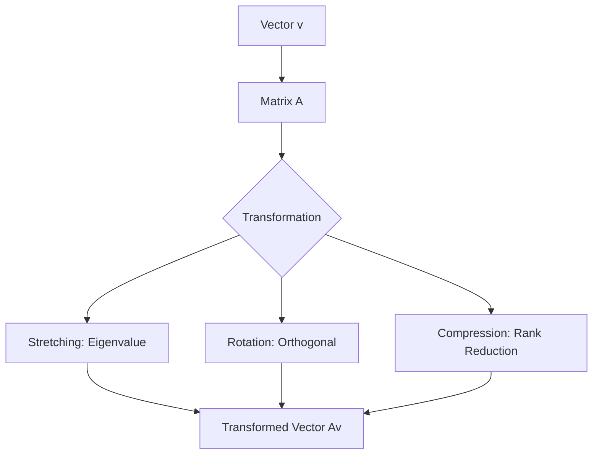

# Chapter 8: Linear Algebra for ML

## 1. Chapter Overview
If statistics is the "brain" of data science, Linear Algebra is the "circulatory system." This chapter explores how to represent data as vectors and matrices, perform high-dimensional transformations, and understand the core intuition behind Singular Value Decomposition (SVD) and Eigenvalues.

## 2. Why This Topic Matters
Machine Learning models don't "see" pictures or text; they see matrices of numbers. When you rotate a photo on your phone or when ChatGPT calculates the next word, it is performing millions of linear algebra operations. Understanding these allows you to optimize and debug complex neural architectures.

## 3. Real-World Applications
- **Computer Graphics**: Moving a 3D character in a video game using transformation matrices.
- **Recommendation Systems**: Reducing a billion-row user-item matrix into a smaller, manageable set of "latent features."
- **Facial Recognition**: Using "Eigenfaces" to identify unique features in a human face.

## 4. Core Intuition
Linear Algebra is the study of **Space and Transformations**. A matrix isn't just a grid of numbers; it's a "map" that tells every point in space how to move. Multiplying a vector by a matrix is the act of **moving that point** to a new location.

## 5. Beginner-Friendly Explanation
### Explain Like I Am New
Think of a **Vector** as an arrow in space. It has a length (magnitude) and points in a specific direction.
Think of a **Matrix** as a "Funhouse Mirror." When you stand in front of it (multiply your vector by it), it might stretch you, shrink you, or flip you upside down. 
Data Science is about finding the specific "mirror" that stretches our messy data into a straight line so we can make predictions.

## 6. Technical Foundations
- **Vectors**: Addition, Scalar Multiplication, Dot Product ($a \cdot b$).
- **Matrices**: Multiplication (Rows x Cols), Identity Matrix, Inverse.
- **Spaces**: Span, Basis, and Rank.
- **Determinant**: Does the "mirror" squash space down to zero?

## 7. Mathematical Foundations
- **Matrix Multiplication**: $C_{ij} = \sum_k A_{ik} B_{kj}$
- **Eigenvalues/Vectors**: $Av = \lambda v$. Finding the directions where the "mirror" only stretches you and doesn't rotate you.
- **Singular Value Decomposition (SVD)**: Decomposing any matrix into three simpler parts ($U, \Sigma, V^T$).

## 8. Step-by-Step Workflow
1. **Represent data** as a matrix (Samples x Features).
2. **Standardize** the matrix (subtract the mean).
3. **Decompose** (PCA or SVD) to find the "principle" directions.
4. **Project** the high-dimensional data onto a 2D or 3D plane for visualization.

## 9. Algorithms and Architectures
We introduce **Principal Component Analysis (PCA)**. PCA uses Linear Algebra to find the most important "directions" in our data, allowing us to compress a dataset with 1,000 columns down to just 2 or 3 without losing much information.

## 10. Visual Explanation


## 11. Code Implementation
Solving a system of linear equations ($Ax = b$) with NumPy:

```python
import numpy as np

# 1. Define the system: 3x + y = 9, x + 2y = 8
A = np.array([[3, 1], [1, 2]])
b = np.array([9, 8])

# 2. Solve for x and y
solution = np.linalg.solve(A, b)

# 3. Verify with dot product
check = np.allclose(np.dot(A, solution), b)

print(f"X = {solution[0]}, Y = {solution[1]}")
print(f"Verification: {check}")
```

## 12. Optimization Techniques
- **Sparse Matrices**: Storing only the non-zero values to save massive amounts of RAM (crucial for NLP).
- **LU Decomposition**: A faster way to solve linear systems by breaking matrices into Lower and Upper triangles.

## 13. Common Mistakes
- **Order of Multiplication**: $AB$ is NOT the same as $BA$!
- **Singular Matrices**: Trying to invert a matrix that has a determinant of zero (it's "un-invertible").

## 14. Debugging Guide
1. Check compatibility: Can you multiply a 5x3 by a 2x5? (No, the inner numbers must match: $5 \times \mathbf{3}$ and $\mathbf{2} \times 5$ is a fail).
2. Check for `Rank Deficiency` if your model isn't learning.

## 15. Performance Considerations
Large scale matrix multiplication is done using **BLAS** (Basic Linear Algebra Subprograms) which are optimized for specific CPU/GPU architectures. This is why we use libraries like OpenBLAS or MKL.

## 16. Research Evolution
Linear Algebra dates back to the 1600s (Leibniz), but its "Modern Era" began with the creation of the first computers. The **PageRank** algorithm (which powered the original Google) is essentially one giant Eigenvector calculation.

## 17. Industry Case Study
**Spotify Collaborative Filtering**: Spotify uses **Matrix Factorization** to represent every user as a vector and every song as a vector. If your vector points in the same direction as a "heavy metal" vector, you'll get recommended more Metallica.

## 18. Hands-On Exercise
- [ ] Create a 3x3 matrix in NumPy.
- [ ] Calculate its determinant.
- [ ] Find its transpose.
- [ ] Multiply it by its inverse and see if you get the Identity matrix.

## 19. Mini Project
**The Image Compressor**: Use SVD to decompose an image. Throw away the "small" singular values and reconstruct the image. Watch how the file size drops while the image stays recognizable.

## 20. Interview Questions
1. What is the difference between dot product and cross product?
2. Explain PCA in terms of Eigenvalues.
3. Why is matrix multiplication NOT commutative?

## 21. Summary
Linear Algebra allows us to describe complex, multi-dimensional worlds using simple grids of numbers. It is the fundamental syntax of modern computer science and AI.

## 22. Further Reading
- *Introduction to Linear Algebra* by Gilbert Strang.
- [Essence of Linear Algebra (YouTube)](https://www.youtube.com/playlist?list=PLZHQObOWTQDPD3MizzM2xVFitgF8hE_ab) - Highly Recommended!

## 23. Research Papers
- *The PageRank Citation Ranking: Bringing Order to the Web* (Page et al., 1999).

## 24. Key Takeaways
- Scalars < Vectors < Matrices < Tensors.
- Matrices = Space Transformations.
- SVD is the Swiss Army knife of data compression.
