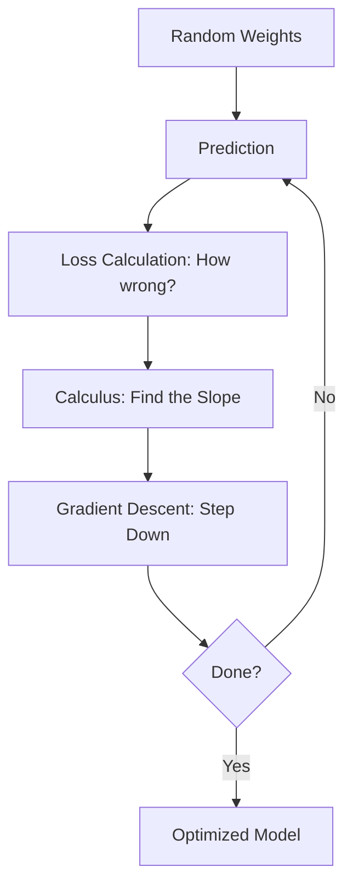

## 1. Chapter Overview
Calculus is the "verb" of machine learning. If your data is a map, calculus is the engine that moves you across it. This chapter introduces the concepts of Derivatives, Gradients, and the Chain Rule, culminating in the most important algorithm in AI: **Gradient Descent**.

## 2. Why This Topic Matters
Machine learning is essentially a giant game of "Hot or Cold." We have a "Loss Function" that tells us how wrong our model is. Calculus is the tool we use to figure out exactly how to change our model's settings (weights) to make that error smaller. Without calculus, AI would just be blind guessing.

## 3. Real-World Applications
- **Neural Network Training**: Adjusting millions of parameters simultaneously to recognize a face.
- **Economic Modeling**: Finding the "price point" that maximizes profit while keeping demand high.
- **Robotics**: Calculating the precise velocity required for a robot arm to pick up an egg without breaking it.

## 4. Core Intuition
Calculus is about **Change and Slopes**. A derivative tells you: "If I change this input a tiny bit, how much will the output change?" In ML, we ask: "If I change this weight slightly, will the model's error go up or down?"

## 5. Beginner-Friendly Explanation
### Explain Like I Am New
Imagine you are blindfolded on a foggy mountain (your error). Your goal is to reach the valley (zero error).
- **The Derivative**: You tap your foot in every direction. The slope tells you which way is "down."
- **The Gradient**: An arrow pointing toward the steepest part of the mountain.
- **Gradient Descent**: Taking a small step in the opposite direction of the gradient (toward the valley).
- **The Chain Rule**: If you are wearing shoes (weight 1) inside boots (weight 2), the chain rule helps you calculate how a wiggle of your toes affects the footprint you leave in the snow.

## 6. Technical Foundations
- **Derivatives**: $f'(x) = \lim_{h \to 0} \frac{f(x+h) - f(x)}{h}$.
- **Partial Derivatives**: Calculating the slope for just one variable while holding others constant.
- **The Gradient ($\nabla$)**: A vector containing all the partial derivatives.
- **The Chain Rule**: $\frac{dy}{dx} = \frac{dy}{du} \cdot \frac{du}{dx}$.

## 7. Mathematical Foundations
- **Loss Function**: Our mathematical definition of "Failure" (e.g., Mean Squared Error).
- **Optimization**: The process of finding the global minimum of the loss function.
- **Hessian Matrix**: High-order curvature (the "bowl-ness" of the mountain).

## 8. Step-by-Step Workflow
1. **Initialize** your model weights randomly.
2. **Forward Pass**: Make a prediction and calculate the error.
3. **Backward Pass**: Use the Chain Rule to calculate the gradient of the error with respect to every weight.
4. **Update**: Subtract a small fraction of the gradient from the weights.
5. **Repeat** until the error stops decreasing.

## 9. Algorithms and Architectures
We introduce **Backpropagation**. This is the architecture used to train almost all modern neural networks. It is simply a clever and efficient implementation of the Chain Rule across many layers of math.

## 10. Visual Explanation


## 11. Code Implementation
Simple Gradient Descent from scratch:

```python
import numpy as np

def f(x): return x**2  # Our target function (the mountain)
def df(x): return 2*x  # The derivative (the slope)

# 1. Start at a random point
x = 10 
learning_rate = 0.1

print(f"Starting at x = {x}")

# 2. Step downhill 20 times
for i in range(20):
    slope = df(x)
    x = x - (learning_rate * slope) # Move opposite to the slope
    print(f"Step {i+1}: x = {x:.4f}, f(x) = {f(x):.4f}")

print(f"Final minimum found at x ≈ {x:.2f}")
```

## 12. Optimization Techniques
- **Learning Rate Decay**: Slowing down your steps as you get closer to the valley to avoid "overshooting."
- **Momentum**: Using the "speed" of previous steps to push through small bumps in the mountain.

## 13. Common Mistakes
- **Learning Rate too high**: You'll bounce over the valley and never find the bottom.
- **Learning Rate too low**: It will take years to reach the bottom.
- **Vanishing Gradients**: When your slope becomes so flat (zero) that the model stops learning entirely.

## 14. Debugging Guide
1. If your loss is increasing, your learning rate is too high or you are stepping *up* the gradient instead of *down*.
2. Use "Gradient Checking" (numerical vs analytical) to ensure your math code is correct.

## 15. Performance Considerations
Modern libraries like **PyTorch** and **TensorFlow** use **Automatic Differentiation (Autograd)**. This means the computer calculates the calculus for you instantly, allowing you to build networks with billions of weights without ever picking up a pen and paper.

## 16. Research Evolution
Optimization moved from simple Gradient Descent to **Stochastic Gradient Descent (SGD)**—using small random samples of data to speed up the process—and eventually to **Adam**, the "gold standard" optimizer used in almost all LLMs today.

## 17. Industry Case Study
**AlphaGo**: To beat the world champion at Go, Google DeepMind used deep reinforcement learning where the "Calculus" involved updating millions of neural connections every time the AI won or lost a simulated game.

## 18. Hands-On Exercise
- [ ] Calculate the derivative of $f(x) = 3x^2 + 5$ by hand.
- [ ] Implement the "Step Downhill" loop for a different function (e.g., $f(x) = (x-5)^2$).
- [ ] Experiment with different learning rates (0.001, 0.1, 1.0) and observe the behavior.

## 19. Mini Project
**The Linear Regression Engine**: Build a model that finds the best-fit line through some points using ONLY Gradient Descent (no Scikit-Learn allowed!). 

## 20. Interview Questions
1. What is the difference between a Local Minimum and a Global Minimum?
2. Explain the Chain Rule in the context of Backpropagation.
3. Why is "Learning Rate" the most important hyperparameter?

## 21. Summary
Calculus is how machines learn. By understanding slopes and gradients, you understand the fundamental mechanism that allows an AI to improve itself from data.

## 22. Further Reading
- *Calculus Made Easy* by Silvanus P. Thompson.
- *Mathematics for Machine Learning* by Deisenroth et al.

## 23. Research Papers
- *Adam: A Method for Stochastic Optimization* (Kingma & Ba, 2014).

## 24. Key Takeaways
- Derivative = Slope = Direction of change.
- Gradient = Arrow pointing Uphill.
- Gradient Descent = Stepping Downhill.
- Chain Rule = Connecting layers of learning.