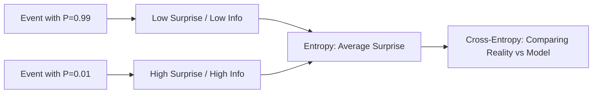

## 1. Chapter Overview
How do you measure a "surprise"? This chapter introduces **Information Theory**, the bridge between probability and communication. We explore **Entropy** (uncertainty), **Cross-Entropy** (how we compare models), and **KL Divergence** (how we measure the distance between two distributions).

## 2. Why This Topic Matters
In modern AI, we don't just want a model to be correct; we want it to be *certain*. All Large Language Models (LLMs) like GPT-4 are trained using **Cross-Entropy Loss**. Understanding this allows you to understand exactly what a model is trying to optimize when it predicts the next token in a sentence.

## 3. Real-World Applications
- **Data Compression**: How `.zip` or `.mp3` files squeeze data by removing predictable info.
- **Deep Learning**: Using Cross-Entropy to penalize an AI for being confidently wrong.
- **Decision Trees**: deciding which question to ask first (e.g., "Is the fruit red?") based on **Information Gain**.

## 4. Core Intuition
Numerical information is a measure of **Surprise**. If I tell you "The sun rose this morning," I have given you zero information because it's 100% predictable. If I tell you "The sun did NOT rise," I have given you a massive amount of information. Data science is the art of finding and quantifying these non-obvious surprises in data.

## 5. Beginner-Friendly Explanation
### Explain Like I Am New
Imagine you are playing a game of "20 Questions."
- **High Entropy**: You have no idea what the object is (Absolute uncertainty). You need many questions to find the answer.
- **Low Entropy**: You already know it's a fruit (Low uncertainty). You only need 1 or 2 more questions.
**Entropy** is the count of how many "Yes/No" questions you need on average to solve a mystery.

## 6. Technical Foundations
- **The Bit**: The fundamental unit of information ($0$ or $1$).
- **Probability Distributions**: Assigning a likelihood to every possible outcome.
- **Optimization of Code**: Why common letters (like 'E') get shorter binary codes than rare letters (like 'Z') in Morse or Huffman encoding.

## 7. Mathematical Foundations
- **Self-Information**: $I(x) = -\log_2 P(x)$ (How surprising is event $x$?).
- **Entropy ($H$)**: The average surprise of a whole system $H(X) = -\sum P(x) \log_2 P(x)$.
- **Cross-Entropy**: $H(P, Q) = -\sum P(x) \log Q(x)$ (Comparing true labels $P$ to model guesses $Q$).
- **KL Divergence**: $D_{KL}(P || Q) = \sum P(x) \log \frac{P(x)}{Q(x)}$ (The "distance" between two distributions).

## 8. Step-by-Step Workflow
1. **Define the True Distribution** (e.g., $100\%$ Spam, $0\%$ Not Spam).
2. **Obtain the Model's Guess** (e.g., $80\%$ Spam, $20\%$ Not Spam).
3. **Calculate Cross-Entropy**: Penalize the model for that $20\%$ error.
4. **Minimize**: Update the model weights to make the Cross-Entropy as close to zero as possible.

## 9. Algorithms and Architectures
We introduce the **Softmax Layer**. This is the mathematical "nozzle" at the end of a neural network that turns raw numbers into a probability distribution that sums to 1.0, allowing us to calculate entropy.

## 10. Visual Explanation


## 11. Code Implementation
Calculating Entropy and Cross-Entropy in Python:

```python
import numpy as np

def entropy(probs):
    return -np.sum(probs * np.log2(probs + 1e-9)) # Add small epsilon to avoid log(0)

# 1. High certainty (Predictable)
p1 = np.array([0.9, 0.1])
print(f"Low Entropy (Certain): {entropy(p1):.4f} bits")

# 2. Maximum uncertainty (Random)
p2 = np.array([0.5, 0.5])
print(f"Max Entropy (Random): {entropy(p2):.4f} bits")

# 3. Cross Entropy (Reality vs Model)
def cross_entropy(actual, pred):
    return -np.sum(actual * np.log(pred + 1e-9))

reality = np.array([1, 0]) # It IS an apple
model_guess = np.array([0.8, 0.2]) # Model is 80% sure it's an apple
print(f"Cross-Entropy Loss: {cross_entropy(reality, model_guess):.4f}")
```

## 12. Optimization Techniques
- **Label Smoothing**: Instead of $1.0/0.0$, using $0.99/0.01$ to prevent the model from becoming "too confident" and suffering massive penalties for small errors.

## 13. Common Mistakes
- **Applying Log to Zero**: Always add a tiny number (epsilon like `1e-9`) to your probabilities before applying the log function!
- **Confusion with Variance**: Variance measures *spread* (distance in numbers); Entropy measures *uncertainty* (unpredictability in categories).

## 14. Debugging Guide
1. If your entropy is negative, your probability values are invalid (probabilities must be between 0 and 1).
2. If your Cross-Entropy stays high, your model is consistently guessing the wrong category with high confidence.

## 15. Performance Considerations
Information theory calculations are often the single most frequent operation during deep learning training. We use highly optimized CUDA kernels to perform these logs and summations in parallel across categories.

## 16. Research Evolution
Information theory was invented by **Claude Shannon** at Bell Labs in 1948. It was originally purely for radio signals and telephones, but it was rediscovered by AI researchers in the 1980s as a perfect way to define human learning and neural network training.

## 17. Industry Case Study
**Compression in Video Streaming**: Netflix uses information theory to decide which pixels in a movie are predictable (and can be compressed) and which are surprising (new information), allowing them to stream 4K movies over slow WiFi.

## 18. Hands-On Exercise
- [ ] Calculate the entropy of a fair 6-sided die.
- [ ] Calculate the entropy of a bias die (e.g., side '6' shows up 50% of the time).
- [ ] Which die is more "surprising"?

## 19. Mini Project
**The Information-Gain Classifier**: Write a script that takes a dataset of colors (Red/Blue) and Shapes (Circle/Square). Calculate which feature (Color or Shape) provides more "Information Gain" to predict if an object is a "Ball."

## 20. Interview Questions
1. What is the difference between Entropy and Cross-Entropy?
2. What does a KL Divergence of 0 mean?
3. Why do we use log-probability instead of raw probability? (Hint: Numerical stability and products vs sums).

## 21. Summary
Information theory allows us to quantify the abstract concepts of knowledge and surprise. It is the yardstick we use to measure how well our machine learning models are understanding the world.

## 22. Further Reading
- *Information Theory: A Tutorial Introduction* by James V. Stone.
- *Elements of Information Theory* by Cover and Thomas.

## 23. Research Papers
- *A Mathematical Theory of Communication* (Claude Shannon, 1948).

## 24. Key Takeaways
- Higher surprise = More information.
- Entropy = Measure of total uncertainty.
- Cross-Entropy = The distance between model and reality.
- ML is just the process of reducing entropy.