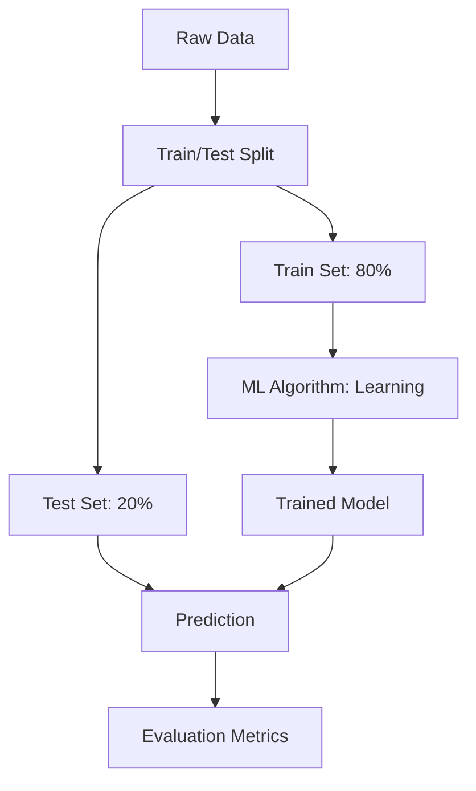

# Chapter 11: Introduction to Machine Learning

## 1. Chapter Overview
What does it mean for a machine to "learn"? This chapter defines the fundamental paradigms of Machine Learning: Supervised, Unsupervised, and Reinforcement Learning. We also discuss the critical concept of the **Train/Test Split** and how we measure success with evaluation metrics.

## 2. Why This Topic Matters
Many people confuse "Machine Learning" with "Deep Learning" or "Big Data." Understanding the core paradigms allows you to choose the right strategy. You don't use a bulldozer (Deep Learning) to plant a single flower (Linear Regression); knowing the landscape ensures efficiency and success.

## 3. Real-World Applications
- **Spam Detection**: Supervised learning using labeled emails.
- **Customer Segmentation**: Unsupervised learning finding groups of similar shoppers.
- **Autonomous Driving**: Reinforcement learning where an agent learns to drive by trial and error.

## 4. Core Intuition
Machine learning is **Pattern Recognition at Scale**. Instead of writing millions of `if-then` rules, we write one algorithm that is "shown" thousands of examples. The algorithm figures out the rules for itself and stores them in a mathematical model.

## 5. Beginner-Friendly Explanation
### Explain Like I Am New
Imagine you are teaching a child to recognize a dog.
- **Supervised Learning**: You point to 100 animals and say "Dog" or "Not a Dog." The child learns the features (fur, bark, tail).
- **Unsupervised Learning**: You put a child in a room with 1,000 animals and say "Group the ones that look similar." The child might put all the furry ones in one corner and all the scaly ones in another.
- **Reinforcement Learning**: You give the child a cookie every time they correctly identify a dog and a timeout when they don't. They learn through rewards.

## 6. Technical Foundations
- **Features (X)**: The input variables (e.g., Height, Weight).
- **Target (y)**: The output we want to predict (e.g., Salary).
- **Dataset Split**: Training (80%) to learn, Testing (20%) to verify.
- **Fit and Predict**: The two most common actions in ML libraries.

## 7. Mathematical Foundations
- **Mapping Function ($f$)**: Our goal is to find $y = f(X) + \epsilon$, where $f$ is the true pattern and $\epsilon$ is irreducible noise.
- **Error/Loss Function**: $L(y, \hat{y})$ measures the distance between the true value ($y$) and our prediction ($\hat{y}$).

## 8. Step-by-Step Workflow
1. **Define the Problem**: Is it regression (prediction) or classification (categorization)?
2. **Collect Data**: Ensure you have enough representative samples.
3. **Preprocess**: Clean, scale, and split your data.
4. **Choose Model**: Start simple (Linear/Logistic Regression).
5. **Train**: Let the model "fit" to the training data.
6. **Evaluate**: Check performance on the test set.

## 9. Algorithms and Architectures
We introduce the **Model Selection Architecture**. How do we decide which model is "good"? We use concepts like **Cross-Validation** to ensure our model works on different slices of the data.

## 10. Visual Explanation


## 11. Code Implementation
A complete ML "Hello World" using Scikit-Learn:

```python
from sklearn.model_selection import train_test_split
from sklearn.linear_model import LinearRegression
from sklearn.metrics import mean_squared_error
import numpy as np

# 1. Create fake data: y = 2x + 5
X = np.array([[1], [2], [3], [4], [5]])
y = np.array([7, 9, 11, 13, 15])

# 2. Split (though small, we follow the habit)
X_train, X_test, y_train, y_test = train_test_split(X, y, test_size=0.2, random_state=42)

# 3. Model
model = LinearRegression()
model.fit(X_train, y_train)

# 4. Predict and Evaluate
predictions = model.predict(X_test)
error = mean_squared_error(y_test, predictions)

print(f"Prediction: {predictions[0]:.2f}, True Value: {y_test[0]}")
print(f"Error: {error:.4f}")
```

## 12. Optimization Techniques
- **Random State**: Always set a `random_state=42` (or any number) to ensure your splits are repeatable.
- **Stratified Splitting**: Ensuring the "ratio" of categories (e.g., Spam vs Not Spam) is the same in both Train and Test sets.

## 13. Common Mistakes
- **Training on the Test Set**: This leads to perfect results that fail in the real world.
- **Ignoring Scale**: Giving one feature (like Salary) more weight than another (like Age) just because the numbers are bigger.

## 14. Debugging Guide
1. If your model gets 100% accuracy, you likely have **Data Leakage** (the answer was in the training data).
2. If your model does well on Train but terrible on Test, you have **Overfitting**.

## 15. Performance Considerations
As datasets grow to millions of rows, `train_test_split` remains efficient, but your `training` time will increase. We use **Batching** or **Sub-sampling** to handle large-scale data.

## 16. Research Evolution
ML has evolved from the basic statistics of the 1950s to the "Classical ML" era (1990s-2010s) dominated by Scikit-Learn, and finally to the Deep Learning era (2012-Present).

## 17. Industry Case Study
**Credit Card Fraud**: Banks use hybrid ML systems. Supervised learning flags "known" patterns of fraud, while Unsupervised learning (anomaly detection) flags "weird" new patterns they've never seen before.

## 18. Hands-On Exercise
- [ ] Load the `iris` dataset from Scikit-Learn.
- [ ] Split it into 70% Train and 30% Test.
- [ ] Count how many samples of each flower are in the test set.

## 19. Mini Project
**House Price Guesser**: Build a simple linear regression model using a CSV of house prices (Size, Bedrooms, Price). See if your model "understands" the relationship between size and cost.

## 20. Interview Questions
1. Define Supervised vs Unsupervised Learning.
2. Why do we need a Test set?
3. What is the difference between Regression and Classification?

## 21. Summary
Machine learning is the shift from "Writing rules" to "Finding rules." By mastering the lifecycle of train-test-evaluate, you lay the groundwork for building intelligent systems.

## 22. Further Reading
- *Hands-On Machine Learning with Scikit-Learn, Keras, and TensorFlow* by Aurélien Géron.
- *The Hundred-Page Machine Learning Book* by Andriy Burkov.

## 23. Research Papers
- *Machine Learning* (Tom Mitchell, 1997 - The original textbook).

## 24. Key Takeaways
- Supervised = Guided learning.
- Unsupervised = Exploring patterns.
- Train on 80%, Test on 20%.
- Always visualize your predictions.
