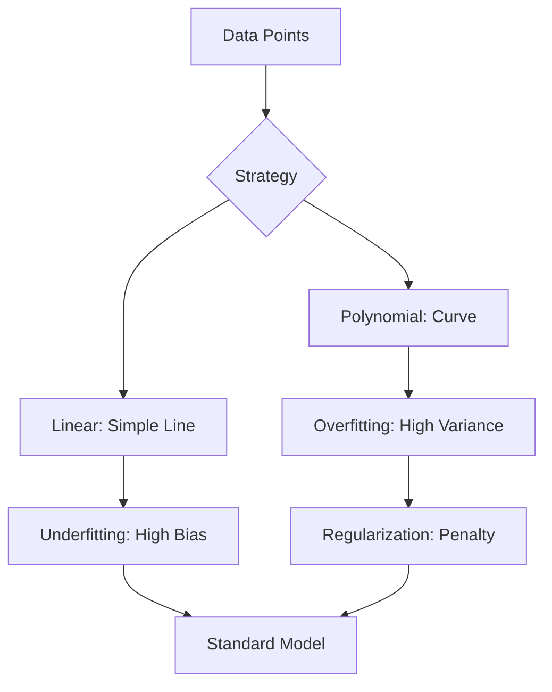

## 1. Chapter Overview
How do we predict a continuous number? This chapter explores **Regression**, the foundation of predictive modeling. We dive into Linear and Polynomial regression, the critical concept of **Regularization** (Lasso and Ridge), and the fundamental struggle of every data scientist: the **Bias-Variance Tradeoff**.

## 2. Why This Topic Matters
Regression is the most common task in industry. Whether you are predicting a stock price, the temperature, or the probability of a customer leaving, you are using regression. It is the baseline against which all "fancy" AI models are compared.

## 3. Real-World Applications
- **Real Estate**: Estimating the market value of a house based on square footage and location.
- **Supply Chain**: Forecasting the number of units to ship next week to avoid shortages.
- **Energy**: Predicting electricity demand based on the weather forecast.

## 4. Core Intuition
Regression is about **Finding the Line of Best Fit**. We have a cloud of data points, and we want to draw a line that minimizes the total distance (the "Error") between the line and the points. This line becomes our "prediction engine."

## 5. Beginner-Friendly Explanation
### Explain Like I Am New
Imagine you are trying to guess someone's weight based on their height.
- **Linear Regression**: You draw a straight line. "For every inch of height, add 5 pounds." It's simple but might miss some details.
- **Polynomial Regression**: You draw a curvy line that follows the data more closely. It's more accurate but might get too "wiggly" and start following random noise.
- **Regularization**: This is like a "wiggle penalty." It keeps your line from getting too complicated, ensuring it still works on people it hasn't met yet.

## 6. Technical Foundations
- **The Equation**: $y = \beta_0 + \beta_1 X_1 + ... + \beta_n X_n + \epsilon$.
- **Coefficients ($\beta$)**: The "weights" assigned to each feature.
- **Intercept ($\beta_0$)**: Where the line hits the y-axis.
- **Residuals**: The difference between the actual value and the predicted value.

## 7. Mathematical Foundations
- **Ordinary Least Squares (OLS)**: The method of minimizing the sum of the squared residuals ($RSS = \sum (y_i - \hat{y}_i)^2$).
- **$R^2$ Score**: The percentage of the variance explained by the model ($1.0$ is perfect, $0.0$ is useless).
- **L1 (Lasso) Regularization**: Penalizing the absolute size of weights (can force some weights to zero).
- **L2 (Ridge) Regularization**: Penalizing the squared size of weights (shrinks weights but keeps them small).

## 8. Step-by-Step Workflow
1. **Visualize** the relationship using a scatter plot.
2. **Train** a simple Linear Regression model.
3. **Check for Overfitting**: Compare training error vs. testing error.
4. **Apply Regularization** (Ridge/Lasso) if the model is too complex.
5. **Evaluate** using MAE (Mean Absolute Error) or RMSE (Root Mean Squared Error).

## 9. Algorithms and Architectures
We introduce the **Elastic Net**, which combines the power of Lasso and Ridge. It is the "all-in-one" solution for high-dimensional regression problems where you have many features.

## 10. Visual Explanation


## 11. Code Implementation
Comparing Linear vs. Ridge Regression in Scikit-Learn:

```python
from sklearn.linear_model import LinearRegression, Ridge
from sklearn.preprocessing import PolynomialFeatures
from sklearn.pipeline import make_pipeline
import numpy as np

# 1. Messy nonlinear data
X = np.array([[1], [2], [3], [4], [5]])
y = np.array([1, 4, 9, 16, 25]) + np.random.normal(0, 1, 5)

# 2. Linear Regression (will underfit)
lin_reg = LinearRegression().fit(X, y)

# 3. Ridge Regression with Polynomial Features
poly_model = make_pipeline(PolynomialFeatures(2), Ridge(alpha=1.0))
poly_model.fit(X, y)

print(f"Linear Prediction for x=6: {lin_reg.predict([[6]])[0]:.2f}")
print(f"Poly+Ridge Prediction for x=6: {poly_model.predict([[6]])[0]:.2f}")
```

## 12. Optimization Techniques
- **Feature Scaling**: Scaled features (StandardScaler) allow the gradient descent process to converge much faster for Ridge/Lasso.
- **Hyperparameter Tuning**: Finding the best "alpha" (penalty strength) using `GridSearchCV`.

## 13. Common Mistakes
- **Extrapolation**: Trying to predict values far outside your training range (e.g., predicting the price of a 50-bedroom house using data from 1-5 bedroom houses).
- **Ignoring Multicollinearity**: When two features are highly correlated (like "Height in cm" and "Height in inches"), it confuses the model weights.

## 14. Debugging Guide
1. Plot the **Residuals**. If you see a pattern (like a curve), your model is too simple (underfitting).
2. If your weights are huge (e.g., millions), you likely need Regularization.

## 15. Performance Considerations
Simple linear regression is extremely fast ($O(n \cdot p^2)$). For massive datasets, we use **Mini-batch SGD** rather than solving the matrix equations directly with OLS.

## 16. Research Evolution
Regression was invented by **Carl Friedrich Gauss** in 1809 to predict the orbit of asteroids. It was the only form of "Machine Learning" for over 100 years.

## 17. Industry Case Study
**Zillow's Zestimate**: Zillow uses a massive ensemble of regression models (including Ridge and Gradient Boosted Trees) to estimate the value of every home in America based on millions of data points.

## 18. Hands-On Exercise
- [ ] Implement Linear Regression for a "Years of Experience vs Salary" dataset.
- [ ] Calculate the $R^2$ score.
- [ ] Add a "Squared Experience" feature and see if the accuracy improves.

## 19. Mini Project
**The Weather Predictor**: Use 10 years of historical weather data to predict tomorrow’s temperature. Compare a simple linear model to a 3rd-degree polynomial model. Which one generalizes better to the test set?

## 20. Interview Questions
1. What is the difference between Lasso and Ridge regression?
2. Explain the Bias-Variance tradeoff.
3. What is $R^2$ and why can it be misleading?

## 21. Summary
Regression is about predicting the future using a line. By balancing complexity (Bias) with flexibility (Variance), you can build models that are both accurate and reliable.

## 22. Further Reading
- *Introduction to Statistical Learning* by James et al.
- *Applied Linear Regression* by Sanford Weisberg.

## 23. Research Papers
- *Regression Shrinkage and Selection via the Lasso* (Robert Tibshirani, 1996).

## 24. Key Takeaways
- Use Linear for simple trends.
- Use Polynomial for curves.
- Use Regularization to stop overfitting.
- Always check your residuals.