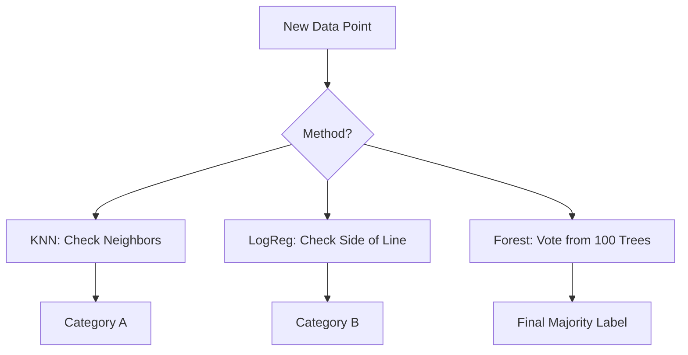

# Chapter 13: Classification Algorithms

## 1. Chapter Overview
The world isn't always about numbers; often, it's about categories. This chapter explores **Classification**, the art of sorting data into buckets. We cover Logistic Regression, K-Nearest Neighbors (KNN), Naive Bayes, and the power of ensembles like Decision Trees and Random Forests.

## 2. Why This Topic Matters
Is this email spam? Is this tumor malignant? Is this transaction fraudulent? These are all classification problems. Classification is the engine behind decision-making AI, allowing machines to categorize the infinite complexity of reality into actionable labels.

## 3. Real-World Applications
- **Healthcare**: Classifying diseases based on patient symptoms and test results.
- **Finance**: Credit scoring—deciding if a person belongs in the "Low Risk" or "High Risk" bucket.
- **Social Media**: Automatically tagging your friends in photos using image classification.

## 4. Core Intuition
Classification is about **Finding the Boundary**. If regression draws a line *through* the data, classification draws a line (or a curve) *between* the data. This boundary separates "Group A" from "Group B."

## 5. Beginner-Friendly Explanation
### Explain Like I Am New
Imagine you are sorting fruit into baskets.
- **Logistic Regression**: You draw a line on the ground. Everything left of the line is an apple, everything right is an orange.
- **KNN**: To decide what a new fruit is, you look at its 3 closest neighbors. If 2 are apples, it's probably an apple.
- **Decision Trees**: You ask a sequence of questions: "Is it red?" -> "Is it round?" -> "Does it have a stem?"
- **Random Forests**: You ask 100 people to guess, and you take the majority vote. This is much more accurate than one person’s guess.

## 6. Technical Foundations
- **Binary Classification**: Yes/No, Spam/Not Spam.
- **Multi-class Classification**: Red/Blue/Green.
- **Decision Boundary**: The mathematical threshold where the category flips.
- **Probability Scores**: Most classifiers don't just give a label; they give a confidence score (e.g., "90% sure it's a cat").

## 7. Mathematical Foundations
- **Sigmoid Function**: $\sigma(z) = \frac{1}{1 + e^{-z}}$. This squashes any number into a range between 0 and 1, creating the Logistic Regression curve.
- **Entropy & Gini Impurity**: Mathematical ways to measure how "messy" a basket of fruit is. Decision trees use these to decide which question to ask first.
- **Euclidean Distance**: $d(p, q) = \sqrt{\sum (p_i - q_i)^2}$, used by KNN to find neighbors.

## 8. Step-by-Step Workflow
1. **Encode Labels**: Convert text ("Spam") into numbers (1).
2. **Feature Engineering**: Select columns that best separate the classes.
3. **Train**: Fit several models (LogReg, Random Forest).
4. **Compare**: Use a Confusion Matrix to see where the models get confused.
5. **Tune**: Adjust hyperparameters like tree depth or number of neighbors.

## 9. Algorithms and Architectures
We introduce **Ensemble Learning**. By combining many "weak" learners (like simple decision trees) into a "strong" learner (a Random Forest), we significantly reduce the chance of making a stupid mistake.

## 10. Visual Explanation


## 11. Code Implementation
Comparing Logistic Regression and Random Forest:

```python
from sklearn.linear_model import LogisticRegression
from sklearn.ensemble import RandomForestClassifier
from sklearn.datasets import make_classification
from sklearn.model_selection import train_test_split
from sklearn.metrics import accuracy_score

# 1. Generate fake classification data
X, y = make_classification(n_samples=1000, n_features=10, random_state=42)
X_train, X_test, y_train, y_test = train_test_split(X, y, test_size=0.2)

# 2. Logistic Regression
log_model = LogisticRegression().fit(X_train, y_train)
log_acc = accuracy_score(y_test, log_model.predict(X_test))

# 3. Random Forest
rf_model = RandomForestClassifier(n_estimators=100).fit(X_train, y_train)
rf_acc = accuracy_score(y_test, rf_model.predict(X_test))

print(f"Logistic Regression Accuracy: {log_acc:.4f}")
print(f"Random Forest Accuracy: {rf_acc:.4f}")
```

## 12. Optimization Techniques
- **Feature Importance**: Random Forests tell you exactly which columns were most useful for making the decision.
- **Pruning**: Cutting off branches of a decision tree to stop it from memorizing specific data points (overfitting).

## 13. Common Mistakes
- **Ignoring Class Imbalance**: If 99% of your data is "Not Fraud," a model can get 99% accuracy just by always guessing "Not Fraud." It's 99% accurate but 100% useless!
- **K is too small in KNN**: If $K=1$, the model will be extremely sensitive to noise.

## 14. Debugging Guide
1. Check the **Confusion Matrix**. Are you confusing "Cat" with "Dog" or "Cat" with "Car"?
2. Plot the **Decision Boundary** in 2D to see if it looks logical.

## 15. Performance Considerations
KNN is "Lazy"—it doesn't learn anything during training, but it's very slow when you ask it for a prediction ($O(n)$). Random Forests are slow to train but near-instant to predict.

## 16. Research Evolution
Logistic regression dates back to the 19th century, while Random Forests were popularized by **Leo Breiman** in the early 2000s. Today, **XGBoost** and **LightGBM** (advanced versions of these) dominate Kaggle competitions for tabular data.

## 17. Industry Case Study
**Mastercard Fraud Detection**: Mastercard uses boosted decision tree models to evaluate every single transaction globally in under 50 milliseconds, protecting millions of users from theft.

## 18. Hands-On Exercise
- [ ] Load the `titanic` dataset.
- [ ] Predict who survived based on Age, Sex, and Class.
- [ ] See which feature was most important (Hint: it's not just "Age").

## 19. Mini Project
**The Music Genre Classifier**: Use a dataset of songs (Tempo, Energy, Loudness) to predict if a song is Jazz, Rock, or Pop. Compare a simple Decision Tree to a Random Forest.

## 20. Interview Questions
1. Why is Logistic Regression called "Regression" if it's for classification?
2. What is the difference between Bagging and Boosting?
3. How does Naive Bayes handle the "independence" assumption?

## 21. Summary
Classification is about drawing boundaries. Whether it's a simple line or a forest of trees, understanding these algorithms allows you to turn data into categorical insights.

## 22. Further Reading
- *Deep Learning* (Chapter 5) by Goodfellow et al. (for ML fundamentals).
- [Scikit-Learn Classifier Comparison](https://scikit-learn.org/stable/auto_examples/classification/plot_classifier_comparison.html)

## 23. Research Papers
- *Random Forests* (Leo Breiman, 2001).

## 24. Key Takeaways
- Logistic Regression for simple, fast baselines.
- Random Forest for robust, high-accuracy results.
- Always check for class imbalance.
- Precision and Recall are better than Accuracy for real-world tasks.
