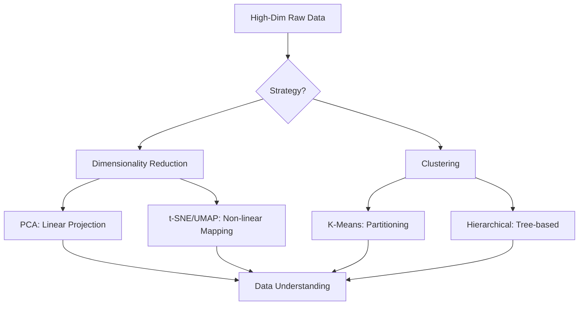

# Chapter 14: Clustering and Dimensionality Reduction

## 1. Chapter Overview
What if we don't have tags for our data? This chapter explores **Unsupervised Learning**, the art of finding structure in the dark. We dive into **Clustering** (K-Means, Hierarchical) and **Dimensionality Reduction** (PCA, t-SNE, UMAP), tools that allow us to simplify complex data and reveal hidden patterns.

## 2. Why This Topic Matters
Real-world data is often "unstructured"—we have millions of users but we don't know which ones are "Luxury Shoppers" and which are "Bargain Hunters." Unsupervised learning allows the data to speak for itself. Furthermore, modern data has thousands of columns (features); dimensionality reduction allows us to compress these while keeping the most important info.

## 3. Real-World Applications
- **Marketing**: Grouping customers into "Personas" for targeted advertising.
- **Genetics**: Finding clusters of genes that work together to cause a specific disease.
- **Anomaly Detection**: Identifying a bank transaction that "looks different" from everything else in a cluster.

## 4. Core Intuition
Unsupervised learning is about **Proximity and Compression**. 
- **Clustering**: "Birds of a feather flock together." We find the points that are closest to each other in mathematical space.
- **Dimensionality Reduction**: "Cutting the fat." We find the directions in the data that hold the most "spread" (variance) and ignore the rest.

## 5. Beginner-Friendly Explanation
### Explain Like I Am New
Imagine you are given a giant bucket of thousands of different LEGO pieces.
- **Clustering (K-Means)**: You are told to sort them into 5 piles. You pick 5 pieces to start and put every other piece next to the one it looks most like. You keep adjusting the piles until everything is organized perfectly.
- **Dimensionality Reduction (PCA)**: You want to take a photo of a giant 3D LEGO city to show your friends. You have to choose the perfect angle (the "Principal Component") that shows as much detail as possible in a 2D photo. 

## 6. Technical Foundations
- **Centroids**: The "center" of a cluster.
- **K-Means**: An iterative algorithm that moves centroids to the center of groups.
- **Dendrograms**: Tree diagrams that show how clusters are nested (Hierarchical).
- **Latent Variables**: Hidden features that the model discovers (e.g., "Size" might be a latent feature hidden in "Height" and "Weight").

## 7. Mathematical Foundations
- **Euclidean Distance**: $d = \sqrt{(x_2-x_1)^2 + (y_2-y_1)^2}$. The basis for almost all clustering.
- **Inertia**: The sum of distances of points to their centroids. We want this to be low.
- **Covariance Matrix**: Used in PCA to find which features move together.

## 8. Step-by-Step Workflow
1. **Normalize**: Distance-based algorithms (K-Means) FAIL if one feature is on a different scale.
2. **Choose K**: Use the "Elbow Method" to decide how many clusters you need.
3. **Run Algorithm**: Fit K-Means or PCA.
4. **Visualise**: Use a scatter plot (often after PCA) to see if the clusters make sense.
5. **Interpret**: Rename the clusters (e.g., Cluster 1 = "High Spend, Low Frequency").

## 9. Algorithms and Architectures
We introduce **t-SNE** and **UMAP**. Unlike PCA (which is linear), these use advanced manifolds to "unfold" complex data, allowing us to see clusters in 2D that were previously hidden in high-dimensional space.

## 10. Visual Explanation


## 11. Code Implementation
Implementing K-Means and PCA in Scikit-Learn:

```python
from sklearn.cluster import KMeans
from sklearn.decomposition import PCA
from sklearn.datasets import make_blobs
import matplotlib.pyplot as plt

# 1. Create fake 3D data with 3 clusters
X, _ = make_blobs(n_samples=300, n_features=3, centers=3, random_state=42)

# 2. Apply Clustering
kmeans = KMeans(n_clusters=3, n_init='auto').fit(X)
labels = kmeans.labels_

# 3. Apply PCA for 2D visualization
pca = PCA(n_components=2)
X_2d = pca.fit_transform(X)

# 4. Plot
plt.scatter(X_2d[:, 0], X_2d[:, 1], c=labels, cmap='viridis')
plt.title("Clustered Data Projected to 2D")
plt.show()
```

## 12. Optimization Techniques
- **K-Means++**: A smart way to pick the *initial* centroids so the algorithm converges faster.
- **Scree Plot**: A chart that shows the "Explained Variance Ratio" for every PCA component, helping you decide where to stop.

## 13. Common Mistakes
- **Assuming Clusters are Circular**: K-Means assumes groups are round balls. If they are long "worms," K-Means will fail (Use DBSCAN instead).
- **Incorrect K**: Choosing too many clusters leads to "over-segmentation" (every point is its own cluster).

## 14. Debugging Guide
1. If your clusters are changing every time you run the code, set a `random_state`.
2. If one cluster is taking over the whole dataset, check if your data was properly scaled.

## 15. Performance Considerations
As $N$ (number of samples) goes to millions, K-Means becomes slow. We use **Mini-Batch K-Means** or **DBSCAN** for massive datasets.

## 16. Research Evolution
Clustering stems from 1950s work in biology and anthropology. PCA was developed by **Karl Pearson** in 1901. **UMAP** is the new kid on the block (2018), becoming the gold standard for visualizing complex single-cell genomic data.

## 17. Industry Case Study
**Spotify "Discover Weekly"**: Spotify uses a form of clustering to group users who listen to similar "niche" artists. Even if those artists are totally different, if 1,000 users listen to Artists A and B, the model clusters them together and recommends Artist B to someone who only liked A.

## 18. Hands-On Exercise
- [ ] Take a dataset with 20 columns.
- [ ] Use PCA to reduce it to 2 columns.
- [ ] Plot the 2 columns and see if you can "see" any patterns.

## 19. Mini Project
**The Document Organizer**: Take 100 text documents. Use "TF-IDF" to turn them into numbers, and then use K-Means to automatically sort them into categories (e.g., Sports, Politics, Tech).

## 20. Interview Questions
1. How do you choose the number of clusters in K-Means?
2. What is the difference between PCA and t-SNE?
3. Why do we need to scale data before applying K-Means?

## 21. Summary
Unsupervised learning is the foundation of data exploration. By clustering similar points and compressing dimensions, you can find the underlying structure of even the messiest datasets.

## 22. Further Reading
- *Pattern Recognition and Machine Learning* by Christopher Bishop.
- [UMAP Documentation](https://umap-learn.readthedocs.io/)

## 23. Research Papers
- *UMAP: Uniform Manifold Approximation and Projection for Dimension Reduction* (McInnes et al., 2018).

## 24. Key Takeaways
- Scale before you Cluster.
- PCA finds the "best" angle to view data.
- t-SNE/UMAP are for visualization, not feature engineering.
- K-Means is simple, fast, and powerful.
