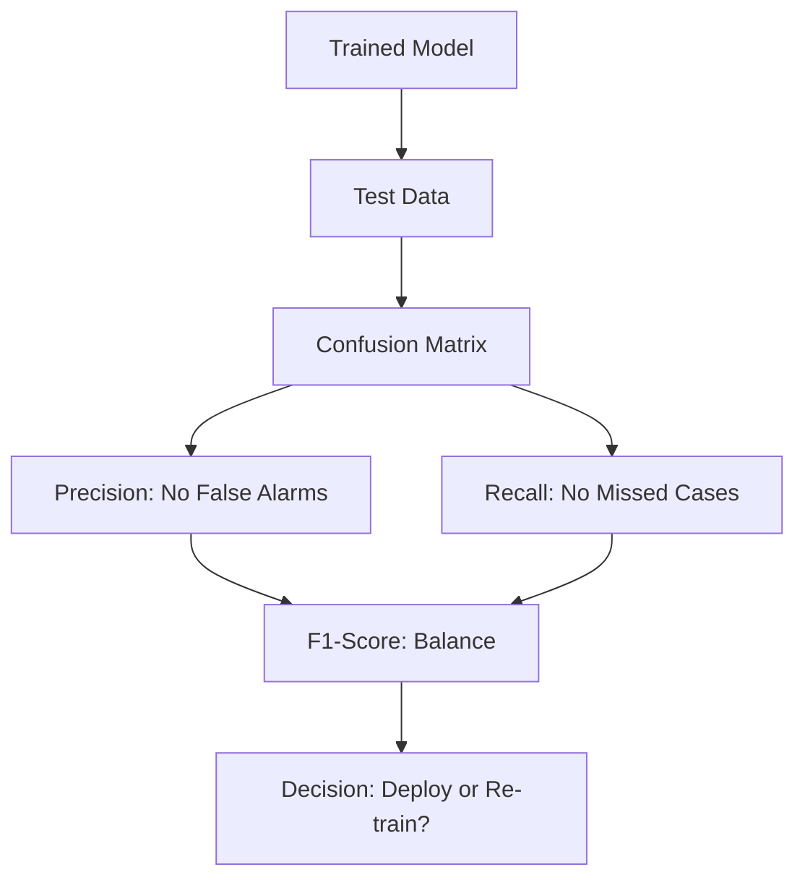

## 1. Chapter Overview
How do you know if your model is actually "good"? This chapter explores the rigorous process of **Model Evaluation**. We go beyond simple accuracy to discuss Precision, Recall, F1-Score, and ROC-AUC. We also cover the essential techniques of **Cross-Validation** and how to spot the silent killers of ML: **Overfitting** and **Data Leakage**.

## 2. Why This Topic Matters
In a medical model, an "accuracy" of 99% is meaningless if the model missed the 1% of patients who actually have the disease. Evaluating a model incorrectly leads to false confidence, resulting in models that work perfectly in the lab but disasterously in the real world.

## 3. Real-World Applications
- **Spam Filtering**: Maximizing "Precision" so that important emails aren't accidentally sent to the spam folder.
- **Cancer Detection**: Maximizing "Recall" to ensure that no case of cancer goes undetected, even if it means a few more false alarms.
- **Ad Campaigns**: Using "Lift Charts" to see if a model is better at picking customers than a random guess.

## 4. Core Intuition
Model evaluation is about **Testing for Reality**. A model is just a "hypothesis." We must subject it to stress tests (Cross-Validation) and measure its performance using a yardstick that matches our business goal (e.g., maximizing profit vs. minimizing risk).

## 5. Beginner-Friendly Explanation
### Explain Like I Am New
Imagine you are hiring a goalkeeper for your soccer team.
- **Accuracy**: They stopped 90% of all shots. (Sounds good!)
- **Precision**: When they *thought* they could stop a shot, they were right 99% of the time.
- **Recall**: Out of all the shots that went into the goal, they stopped 90%.
If your team is losing 1-0 in the final minute, you don't care about "accuracy" as much as you care that they stop THIS specific ball (High Recall). Evaluation is about deciding which of these stats matters most for your "game."

## 6. Technical Foundations
- **Confusion Matrix**: A table showing True Positives (TP), False Positives (FP), True Negatives (TN), and False Negatives (FN).
- **Precision**: $TP / (TP + FP)$ — Of all the times the model said "Yes," how often was it right?
- **Recall**: $TP / (TP + FN)$ — Of all the "Yes" cases in reality, how many did the model find?
- **F1-Score**: The harmonic mean of Precision and Recall.

## 7. Mathematical Foundations
- **ROC-AUC**: The "Area Under the Receiver Operating Characteristic Curve." It measures how well the model distinguishes between classes across *all* possible confidence thresholds.
- **Log-Loss**: A penalty that increases exponentially the further the model's predicted probability is from the actual label.

## 8. Step-by-Step Workflow
1. **Choose your Metric** based on the cost of a mistake (FP vs FN).
2. **K-Fold Cross-Validation**: Split your data into $K$ parts, and train/test $K$ different times to get an average score.
3. **Analyze the Errors**: Look at the samples your model missed. Is there a pattern?
4. **Iterate**: Change your features or model architecture if performance is plateauing.

## 9. Algorithms and Architectures
We introduce the **Model Comparison Pipeline**. We use Cross-Validation to objectively compare a Random Forest vs. a Logistic Regression on the same data, ensuring the "victory" isn't just due to a lucky data split.

## 10. Visual Explanation


## 11. Code Implementation
Generating a Confusion Matrix and Classification Report:

```python
from sklearn.metrics import confusion_matrix, classification_report, roc_auc_score
from sklearn.ensemble import RandomForestClassifier
from sklearn.datasets import make_classification
from sklearn.model_selection import train_test_split

# 1. Setup
X, y = make_classification(n_samples=1000, weights=[0.9, 0.1], random_state=42)
X_train, X_test, y_train, y_test = train_test_split(X, y, test_size=0.2)

# 2. Train
model = RandomForestClassifier().fit(X_train, y_train)
y_pred = model.predict(X_test)
y_prob = model.predict_proba(X_test)[:, 1]

# 3. Evaluate
print("Confusion Matrix:")
print(confusion_matrix(y_test, y_pred))
print("\nClassification Report:")
print(classification_report(y_test, y_pred))
print(f"ROC-AUC Score: {roc_auc_score(y_test, y_prob):.4f}")
```

## 12. Optimization Techniques
- **Threshold Tuning**: Changing the "cut-off" for a decision. Instead of 0.5, maybe you only say "Yes" if the model is 90% sure (increasing Precision).
- **Nested Cross-Validation**: The gold standard for picking the best model AND the best hyperparameters simultaneously.

## 13. Common Mistakes
- **Data Leakage**: Including information in your training data that wouldn't be available at the time of prediction (e.g., using "Treatment Received" to predict "Disease Diagnosis").
- **Optimizing for the wrong metric**: Using Accuracy for an imbalanced dataset.

## 14. Debugging Guide
1. If your training accuracy is 100% but test is 50%, you are **Overfitting**. (Simplify your model!).
2. If both are low, you are **Underfitting**. (Add more features!).

## 15. Performance Considerations
Cross-validation requires training the model $K$ times. For deep learning models that take weeks to train, we skip K-Fold and use a single, large **Validation Set**.

## 16. Research Evolution
The ROC curve was developed during World War II for analyzing radar signals (Detecting enemy planes vs. birds). It was adopted by the medical community in the 1970s and is now the standard for ML.

## 17. Industry Case Study
**Google's Ad Auction**: Google doesn't just show the ad with the highest bid; they show the one with the highest "Expected Value," which is (Bid Price $\times$ Predicted Click-Through Rate). The evaluation of that prediction model is worth billions of dollars.

## 18. Hands-On Exercise
- [ ] Create a confusion matrix by hand for 10 predictions.
- [ ] Calculate Precision and Recall from that matrix.
- [ ] Use `cross_val_score` in Scikit-Learn to get the average accuracy of a model across 5 folds.

## 19. Mini Project
**The Fraud Detector Evaluator**: Take a highly imbalanced fraud dataset. Show how a model can have 99% accuracy but a 0% F1-score. Use **SMOTE** (Synthetic Minority Over-sampling Technique) to fix the balance and re-evaluate.

## 20. Interview Questions
1. When would you prioritize Recall over Precision?
2. What is the difference between a Validation set and a Test set?
3. Explain ROC-AUC to a 5-year old.

## 21. Summary
Evaluation is the most honest part of data science. By using the right metrics and cross-validation, you ensure that your model is a reliable tool for decision-making, not just a mathematical toy.

## 22. Further Reading
- *Evaluating Machine Learning Models* by Alice Zheng.
- [Scikit-Learn Model Evaluation Guide](https://scikit-learn.org/stable/modules/model_evaluation.html)

## 23. Research Papers
- *A Taxonomy of Model Verification and Validation* (Sargent, 2013).

## 24. Key Takeaways
- Accuracy is often a lie.
- Use Precision/Recall for imbalanced data.
- Cross-validation prevents "lucky" results.
- Data Leakage is the most common way to fail.