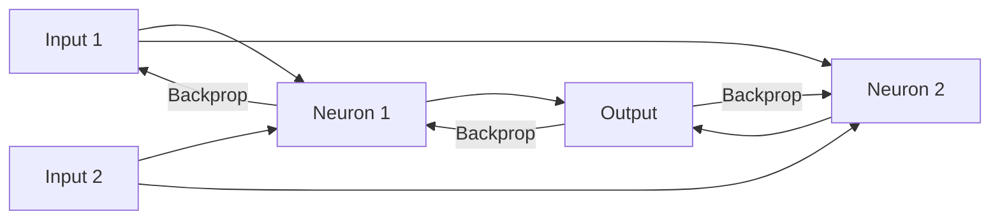

## 1. Chapter Overview
What makes a network "deep"? This chapter introduces the building blocks of modern AI: the **Perceptron**, **Activation Functions**, and the incredible mathematical feat called **Backpropagation**. We explore how millions of simple calculations can join together to solve complex, non-linear problems.

## 2. Why This Topic Matters
Classical ML algorithms (like Linear Regression) fail when patterns are highly complex or non-linear. Neural networks are "Universal Function Approximators"—given enough layers and data, they can theoretically learn *any* pattern, from recognizing a cat in a video to translating Mandarin to English.

## 3. Real-World Applications
- **Face ID**: Using deep neural networks to recognize your face in different lighting.
- **DeepL/Google Translate**: Real-time translation between hundreds of languages.
- **Drug Discovery**: Predicting how new molecules will interact with human cells.

## 4. Core Intuition
A neural network is like a **Complex Assembly Line**. 
- Each "Neuron" in the line receives parts (inputs), checks them against a weight (importance), adds a bias (correction), and then passes the result through a "Filter" (Activation Function).
- If the final product (prediction) is wrong, the "Backpropagation" system sends a message *backwards* down the line, telling each worker how to adjust their behavior to get it right next time.

## 5. Beginner-Friendly Explanation
### Explain Like I Am New
Imagine a massive orchestra.
- Each musician (a neuron) plays a note. 
- The conductor (Backpropagation) hears the music and realizes it's slightly off-key. 
- The conductor walks to each musician and says: "You, play slightly louder. You, play slightly softer."
After doing this 1,000 times, the orchestra sounds perfect. A neural network is just an orchestra made of math.

## 6. Technical Foundations
- **The Perceptron**: The single unit of a neural network ($y = \text{activation}(Wx + b)$).
- **Layers**: Input Layer, Hidden Layers (where the "magic" happens), and Output Layer.
- **Activation Functions**: Sigmoid, Tanh, and the modern standard: **ReLU** (Rectified Linear Unit).
- **Weights and Biases**: The "knobs" the model adjusts during training.

## 7. Mathematical Foundations
- **The Forward Pass**: A series of matrix multiplications ($Z^{(1)} = W^{(1)}X + b^{(1)}$).
- **Loss Function**: Measuring how far the "music" is from being perfect (e.g., Cross-Entropy).
- **The Backward Pass**: Using the **Chain Rule** from Chapter 9 to calculate the gradient for every weight in every layer.

## 8. Step-by-Step Workflow
1. **Initialize** weights randomly (but carefully, e.g., Xavier initialization).
2. **Standardize data** so all inputs have a mean of 0 and variance of 1.
3. **Forward Pass**: Calculate the output.
4. **Loss**: Compare output to the true label.
5. **Backpropagate**: Find the gradients.
6. **Update Weights**: Step down the gradient using an optimizer like Adam.

## 9. Algorithms and Architectures
We introduce the **Multilayer Perceptron (MLP)**. This is a "vanilla" neural network where every neuron in one layer is connected to every neuron in the next (Fully Connected).

## 10. Visual Explanation


## 11. Code Implementation
Building a simple Neural Network with NumPy to solve the XOR problem:

```python
import numpy as np

def relu(x): return np.maximum(0, x)
def sigmoid(x): return 1 / (1 + np.exp(-x))

# 1. Inputs: 4 samples with 2 features (XOR problem)
X = np.array([[0,0], [0,1], [1,0], [1,1]])
y = np.array([[0], [1], [1], [0]])

# 2. Weights (Simplified)
W1 = np.random.randn(2, 4) # Hidden layer with 4 neurons
W2 = np.random.randn(4, 1) # Output layer

# 3. Forward Pass
z1 = np.dot(X, W1)
a1 = relu(z1)
z2 = np.dot(a1, W2)
output = sigmoid(z2)

print(f"Initial Predictions:\n{output}")
```

## 12. Optimization Techniques
- **Batch Normalization**: Rescaling the data *inside* the hidden layers to stop the model from "exploding."
- **Dropout**: Randomly turning off some neurons during training to prevent the model from becoming too reliant on any single feature (Prevents overfitting).

## 13. Common Mistakes
- **Dead ReLU**: If your learning rate is too high, neurons can "die" (stay at zero forever).
- **Vanishing Gradients**: When gradients become so small that the early layers of the network stop learning.

## 14. Debugging Guide
1. Check the **Weights Histogram**. If they are all zero or all infinity, your initialization or learning rate is wrong.
2. Try to **overfit on a single data point**. If your model can't get that one right, your math code has a bug.

## 15. Performance Considerations
Neural networks require trillions of floating-point operations. CPUs are too slow for this; we use **GPUs (Graphics Processing Units)** because they have thousands of small cores designed for exactly this type of matrix math.

## 16. Research Evolution
Neural networks were invented in the 1950s (Rosenblatt) but died out because computers were too slow. They were resurrected in the 1980s with Backpropagation and finally exploded in 2012 (**AlexNet**) when researchers proved they could beat every other algorithm using GPUs.

## 17. Industry Case Study
**AlphaFold by DeepMind**: AlphaFold uses deep neural networks to predict the 3D shape of proteins. This solved a 50-year-old challenge in biology and is currently accelerating the development of new medicines.

## 18. Hands-On Exercise
- [ ] Diagram a network with 3 inputs, 5 hidden neurons, and 2 outputs.
- [ ] Calculate the total number of weights (parameters) in that network.
- [ ] Implement the ReLU function in Python.

## 19. Mini Project
**The Handwritten Digit Recognizer**: Use the MNIST dataset (images of numbers 0-9). Build a simple Feedforward network to classify them. See if you can get > 95% accuracy.

## 20. Interview Questions
1. What is the role of an Activation Function?
2. Why is Backpropagation better than random guessing for weights?
3. What is "Vanishing Gradient" and how does ReLU help fix it?

## 21. Summary
Neural networks are the foundation of modern AI. By chaining simple mathematical units together and using backpropagation to guide them, we create systems that can learn incredibly complex mappings.

## 22. Further Reading
- *Neural Networks and Deep Learning* by Michael Nielsen (Online Book).
- *Deep Learning with Python* by François Chollet.

## 23. Research Papers
- *Learning representations by back-propagating errors* (Rumelhart, Hinton, & Williams, 1986).

## 24. Key Takeaways
- Perceptron = Dot Product + Bias + Activation.
- Layers = Computational assembly lines.
- Backprop = Using Calculus to correct errors.
- ReLU is the default activation.