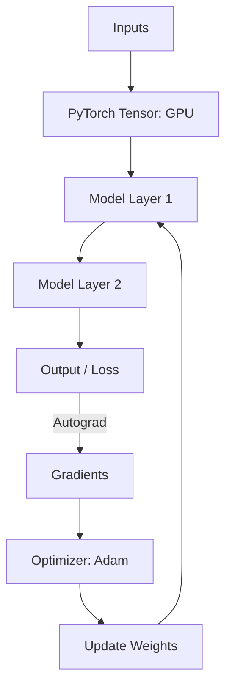

# Chapter 17: Deep Learning Frameworks

## 1. Chapter Overview
You don't need to write every backpropagation step by hand. This chapter introduces the "Big Two" of deep learning: **PyTorch** and **TensorFlow**. We explore how these frameworks automate the math, manage GPU memory, and allow us to build complex architectures with just a few lines of code.

## 2. Why This Topic Matters
Building a modern deep learning model from scratch with NumPy is like building a car from raw iron. It's possible, but incredibly slow. Frameworks like PyTorch handle the "heavy lifting"—automatic differentiation, GPU acceleration, and pre-built layers—so you can focus on the architecture and the data.

## 3. Real-World Applications
- **Research**: PyTorch is the favorite of AI researchers at Meta, OpenAI, and universities.
- **Production**: TensorFlow is widely used at Google and in industries requiring mobile deployment (TensorFlow Lite).
- **Embedded Systems**: Running AI on a Raspberry Pi or a smartphone.

## 4. Core Intuition
A deep learning framework is like a **Universal Calculator**.
- You define the numbers (Tensors).
- You define the operations (Addition, Convolution).
- The framework builds a "Graph" of these operations and can automatically figure out the slope (Gradient) at any point, allowing the model to learn without you writing the calculus.

## 5. Beginner-Friendly Explanation
### Explain Like I Am New
Imagine you have a giant set of "Smart LEGOs."
- Each LEGO block (PyTorch `nn.Module`) knows exactly how to connect to others.
- When you build a tower (a Model), the LEGOs remember how they were put together.
- If the tower falls (the Loss is high), you press a "Rewind" button (`loss.backward()`), and the LEGOs tell you exactly which ones need to be moved to make the tower more stable.

## 6. Technical Foundations
- **Tensors**: The multi-dimensional array object (like NumPy but on GPUs).
- **The Computational Graph**: A map of all math operations in a model.
- **Autograd**: The engine that automatically calculates gradients.
- **Optimization Algorithms**: Adam, SGD, RMSprop.

## 7. Mathematical Foundations
- **GPU Acceleration**: Operations are parallelized using **CUDA** (NVIDIA) or **ROCm** (AMD).
- **Precision**: Moving from 32-bit floats to 16-bit (**Mixed Precision**) to double the training speed.
- **Gradient Accumulation**: Efficiently training large models by splitting big math problems into small pieces.

## 8. Step-by-Step Workflow
1. **Define the Model Class** (inheriting from `nn.Module` in PyTorch).
2. **Move Tensors to Device** (CPU or `cuda`).
3. **Loop through the training data**.
4. **Zero the Gradients** (PyTorch accumulates them by default!).
5. **Forward Pass -> Loss -> Backward Pass -> Optimizer Step**.

## 9. Algorithms and Architectures
We introduce the **Model Blueprint Architecture**. By separating the "Layers" (the architecture) from the "Training Loop" (the logic), we create code that is modular, readable, and easy to share.

## 10. Visual Explanation


## 11. Code Implementation
Building a basic classifier in PyTorch:

```python
import torch
import torch.nn as nn
import torch.optim as optim

# 1. Define Model
class SimpleNet(nn.Module):
    def __init__(self):
        super(SimpleNet, self).__init__()
        self.fc = nn.Linear(10, 2) # 10 inputs, 2 outputs

    def forward(self, x):
        return self.fc(x)

# 2. Setup
model = SimpleNet()
criterion = nn.CrossEntropyLoss()
optimizer = optim.Adam(model.parameters(), lr=0.01)

# 3. Dummy Step
data = torch.randn(1, 10)
target = torch.empty(1, dtype=torch.long).random_(2)

optimizer.zero_grad()
output = model(data)
loss = criterion(output, target)
loss.backward()
optimizer.step()

print(f"Loss: {loss.item():.4f}")
```

## 12. Optimization Techniques
- **Data Loaders**: Using multi-threading to fetch data from your hard drive while the GPU is training.
- **Model Freezing**: Stopping some layers from learning (used in Transfer Learning).

## 13. Common Mistakes
- **Forgetting `.zero_grad()`**: Gradients will grow to infinity and the model will explode.
- **Device Mismatch**: Trying to do math between a Tensor on the CPU and a Tensor on the GPU.

## 14. Debugging Guide
1. Use `tensor.shape` constantly. 90% of DL errors are shape mismatches.
2. If training is slow, ensure `.to('cuda')` was called and your data loaders have `num_workers > 0`.

## 15. Performance Considerations
Modern models use **Distributed Data Parallel (DDP)** to train on 8, 80, or 8,000 GPUs simultaneously, syncing the math every few seconds across a high-speed network.

## 16. Research Evolution
TensorFlow was released by Google in 2015 and dominated early. PyTorch was released by Facebook (Meta) in 2016 and won the "hearts and minds" of researchers due to its "Pythonic" style and ease of debugging.

## 17. Industry Case Study
**Tesla Autopilot**: Tesla uses a massive PyTorch stack to train the "HydraNet"—a single neural network with many "heads" that simultaneously detects stop signs, lane lines, and pedestrians from 8 different camera feeds.

## 18. Hands-On Exercise
- [ ] Create a Tensor of zeros on your CPU.
- [ ] Move it to the GPU (if available).
- [ ] Multiply two Tensors and print the result.
- [ ] Define a linear layer with 5 inputs and 10 outputs.

## 19. Mini Project
**The Image Tagger**: Load a pre-trained "ResNet" model from the `torchvision` library. Give it a photo of your pet and see if it can correctly label what it is.

## 20. Interview Questions
1. What is a "Static" vs "Dynamic" computational graph?
2. Why is PyTorch usually preferred by researchers?
3. What does `loss.backward()` actually do under the hood?

## 21. Summary
Frameworks are the power tools of the modern data scientist. By mastering PyTorch or TensorFlow, you gain the ability to build and scale the most advanced AI models in the world.

## 22. Further Reading
- [PyTorch Tutorials](https://pytorch.org/tutorials/)
- [TensorFlow Core Documentation](https://www.tensorflow.org/guide)

## 23. Research Papers
- *Automatic differentiation in PyTorch* (Paszke et al., 2017).

## 24. Key Takeaways
- Frameworks = Math automation.
- Tensors = Matrices + GPU capability.
- Autograd = No more hand-written calculus.
- PyTorch for flexibility, TensorFlow for deployment.
