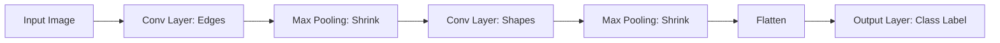

# Chapter 18: CNN Fundamentals

## 1. Chapter Overview
Standard neural networks "flatten" images into a single long line of numbers, losing all information about which pixels are next to each other. This chapter introduces **Convolutional Neural Networks (CNNs)**, the specialized architecture that preserves spatial relationships. We explore **Convolutions**, **Pooling**, and the intuition behind **Feature Maps**.

## 2. Why This Topic Matters
CNNs are the "eyes" of AI. They power everything from the autofocus on your smartphone camera to the medical imaging systems that spot tumors. Before CNNs, computer vision was incredibly difficult; after CNNs, computers became better than humans at many visual recognition tasks.

## 3. Real-World Applications
- **Satellite Imaging**: Automatically counting cars in parking lots or trees in forests from space.
- **Retail**: Cashier-less stores (like Amazon Go) that track what items you pick up using overhead cameras.
- **Healthcare**: Analyzing X-rays and MRIs to find microscopic fractures or shadows.

## 4. Core Intuition
A CNN is like a **Flashlight with a Filter**.
- Imagine holding a small flashlight (the "Kernel") and shining it on an image. 
- You move the flashlight across the image, bit by bit (the "Stride"). 
- The filter on the flashlight is looking for one specific thing: a vertical edge, a circle, or a specific texture. 
- By the time the CNN is "done," it has built a map of everywhere it found those edges and textures.

## 5. Beginner-Friendly Explanation
### Explain Like I Am New
If you are looking for a friend in a crowded stadium, you don't look at every seat one by one. You scan for a specific hair color or a specific shirt. 
A CNN does this in layers:
- **Layer 1**: Scans for simple edges (straight lines).
- **Layer 2**: Combines those edges into shapes (squares, circles).
- **Layer 3**: Combines shapes into features (eyes, wheels).
- **Layer 4**: Identifies the object (A Face, A Car).
A CNN is just a stack of increasingly advanced "scanners."

## 6. Technical Foundations
- **The Kernel (Filter)**: A small matrix (usually 3x3 or 5x5) that slides over the image.
- **The Convolution Operation**: Multiplying the kernel by the pixel values and summing them up.
- **Stride**: How many pixels the kernel moves at a time.
- **Padding**: Adding "fake" pixels around the edge so the kernel can reach the corners.

## 7. Mathematical Foundations
- **Cross-Correlation**: The actual math operation performed in most CNNs (very similar to convolution).
- **Max Pooling**: Reducing the size of the image by only keeping the brightest (highest) pixel in a 2x2 grid.
- **Receptive Field**: The area of the original image that a specific neuron can "see."

## 8. Step-by-Step Workflow
1. **Input**: A 3D tensor (Width x Height x RGB Channels).
2. **Convolutional Layers**: Extract features using many different kernels.
3. **Pooling Layers**: Compress the image to save memory and make the model faster.
4. **Flatten**: Turn the 2D grid of features into a 1D line at the very end.
5. **Fully Connected Layer**: Use those features to make a final guess (e.g., "99% sure this is a Sunflower").

## 9. Algorithms and Architectures
We introduce **Transfer Learning**. Instead of training a CNN from scratch (which requires millions of photos), we take a "Super-Model" like **VGG16** or **ResNet** that Google or Microsoft already trained, and we only change the "last layer" to fit our specific problem.

## 10. Visual Explanation


## 11. Code Implementation
Defining a CNN in PyTorch:

```python
import torch.nn as nn
import torch.nn.functional as F

class SimpleCNN(nn.Module):
    def __init__(self):
        super(SimpleCNN, self).__init__()
        # 1 input channel (Gray), 6 output channels, 3x3 kernel
        self.conv1 = nn.Conv2d(1, 6, kernel_size=3)
        self.pool = nn.MaxPool2d(2, 2)
        self.fc = nn.Linear(6 * 13 * 13, 10) # 10 classes

    def forward(self, x):
        x = self.pool(F.relu(self.conv1(x)))
        x = x.view(-1, 6 * 13 * 13) # Flatten
        x = self.fc(x)
        return x

model = SimpleCNN()
print(model)
```

## 12. Optimization Techniques
- **Data Augmentation**: Training the model on flipped, rotated, or blurry versions of the images so it learns that a cat upside-down is still a cat.
- **1x1 Convolutions**: A clever way to reduce the number of channels and save massive amounts of compute time.

## 13. Common Mistakes
- **Incorrect Output Shapes**: If your image is 28x28 and you use too many pooling layers, the image will become 1x1 or 0x0, crashing the code.
- **Poor Initialization**: If kernels all start with the same numbers, the model will never learn to see different features.

## 14. Debugging Guide
1. Visualize the **Feature Maps**. Look at the image after the first layer—do you see edges? If it's just gray noise, the model isn't learning.
2. Use `torchsummary` to check your model's parameter count and layer shapes.

## 15. Performance Considerations
CNNs are the most GPU-hungry of all models. We use **Batching** and **Half-precision (FP16)** to squeeze every bit of performance out of the hardware.

## 16. Research Evolution
CNNs were inspired by the biology of the cat's visual cortex (Hubel & Wiesel, 1950s). **Yann LeCun** created LeNet in 1989 for reading checks. The breakthrough happened in 2012 with **AlexNet**, which was the first to use massive GPUs and ReLU activations.

## 17. Industry Case Study
**Pinterest Visual Search**: Pinterest uses CNNs to represent every image as a "Pinterest Pin Vector." When you click on a picture of a wooden table, the CNN finds other images whose "vectors" are similar, showing you more tables without using any text tags.

## 18. Hands-On Exercise
- [ ] Take a 3x3 grid of numbers.
- [ ] Slide a 2x2 "Filter" over it and calculate the sum at each step.
- [ ] Apply Max Pooling to the result.

## 19. Mini Project
**The Road Sign Recognizer**: Use the GTSRB dataset (German Traffic Sign Recognition Benchmark). Build a CNN that can tell the difference between a "Stop" sign and a "Speed Limit" sign with 99% accuracy.

## 20. Interview Questions
1. Why is a CNN better for images than a standard Feedforward network?
2. What happens to the "spatial resolution" as you go deeper into a CNN?
3. What is the role of Padding?

## 21. Summary
CNNs are the foundation of modern computer vision. By mimicking the structure of the biological eye, they allow machines to extract deep hierarchical features from raw pixels.

## 22. Further Reading
- [CS231n: Convolutional Neural Networks for Visual Recognition (Stanford)](http://cs231n.stanford.edu/)
- *Deep Learning for Vision Systems* by Mohamed Elgendy.

## 23. Research Papers
- *ImageNet Classification with Deep Convolutional Neural Networks* (Krizhevsky et al., 2012).

## 24. Key Takeaways
- Convolutions = Local feature extractors.
- Pooling = Dimensionality reduction.
- CNNs are spatially invariant (Position doesn't matter).
- Transfer Learning is your best friend.
