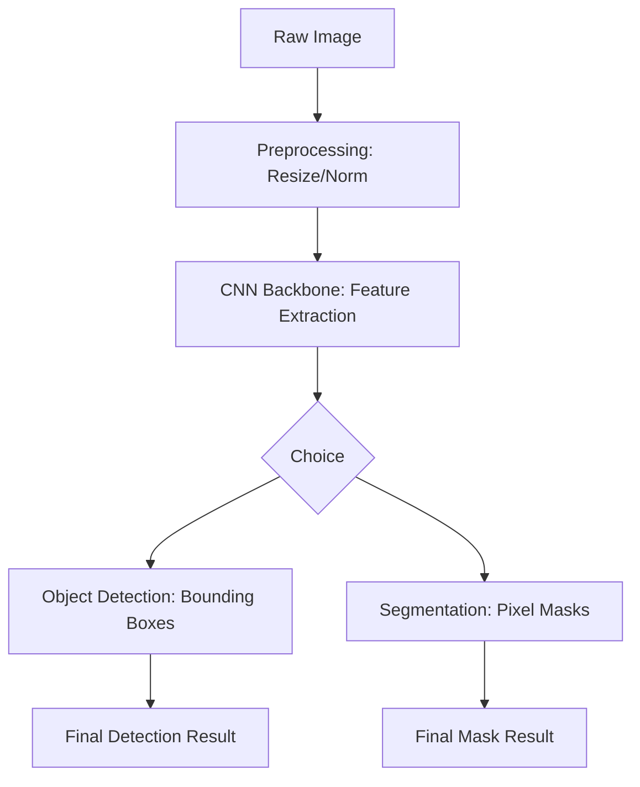

# Chapter 21: Computer Vision Basics

## 1. Chapter Overview
Now that we understand the math of CNNs, how do we apply it to the real world? This chapter covers the foundational tasks of **Computer Vision**: from essential image preprocessing techniques to advanced concepts like **Object Detection** and **Semantic Segmentation**.

## 2. Why This Topic Matters
Raw images are just grids of numbers. To an AI, a cat and a car look very similar until we apply computer vision principles. Understanding how to "prepare" images and how to locate multiple objects in one frame is the key to building self-driving cars and automated medical diagnostic tools.

## 3. Real-World Applications
- **Infrastructure**: Using drones to find cracks in bridges or power lines using object detection.
- **Agriculture**: Segmenting satellite images of farms to calculate crop health.
- **Fashion**: Automatically categorizing clothes in a photo for e-commerce search.

## 4. Core Intuition
Computer Vision is about **Spatial Intelligence**. 
- **Classification**: "Is there a dog in this photo?"
- **Detection**: "Where are the dogs in this photo, and how many are there?"
- **Segmentation**: "Which specific pixels in this photo belong to the dog and which to the grass?"

## 5. Beginner-Friendly Explanation
### Explain Like I Am New
Imagine you are looking at a messy room.
- **Preprocessing**: You turn on the lights (Brightness) and put on your glasses (Sharpening).
- **Object Detection**: You draw a box around every shoe on the floor. It doesn't matter if the shoe is red or blue; you just want to know where they are.
- **Segmentation**: You take a marker and carefully trace the outline of each shoe, separating it perfectly from the carpet.

## 6. Technical Foundations
- **Image Preprocessing**: Resizing, Normalizing, Grayscale conversion.
- **Bounding Boxes**: The $[x1, y1, x2, y2]$ coordinates of an object.
- **IoU (Intersection over Union)**: How we measure if our predicted box matches the true box.
- **Channels**: Why RGB (3 channels) is different from Grayscale (1 channel).

## 7. Mathematical Foundations
- **Non-Maximum Suppression (NMS)**: An algorithm that takes 100 overlapping boxes and keeps only the "best" one.
- **Anchor Boxes**: Pre-defined "shapes" (tall, wide, square) that the model uses as a starting point to guess an object's size.
- **Mean Average Precision (mAP)**: The gold standard metric for object detection.

## 8. Step-by-Step Workflow
1. **Prepare Data**: Resize all images to the same size (e.g., 224x224).
2. **Augment**: Flip and rotate images to make the model more robust.
3. **Backbone**: Use a pre-trained CNN (like ResNet) to extract features.
4. **Neck/Head**: Add additional layers to predict bounding boxes or pixel masks.
5. **Inference**: Run the model on a new image and apply NMS to clean up the boxes.

## 9. Algorithms and Architectures
We introduce the **YOLO (You Only Look Once)** architecture. Unlike older models that looked at an image 1,000 times to find objects, YOLO splits the image into a grid and makes all predictions in a single "glance," making it fast enough for real-time video.

## 10. Visual Explanation


## 11. Code Implementation
Using a pre-trained Object Detection model in PyTorch:

```python
import torchvision
from torchvision.models.detection import fasterrcnn_resnet50_fpn
from PIL import Image
import torch

# 1. Load pre-trained Faster R-CNN
model = fasterrcnn_resnet50_fpn(pretrained=True)
model.eval()

# 2. Load and transform image
img = Image.open("dog.jpg")
transform = torchvision.transforms.Compose([torchvision.transforms.ToTensor()])
img_t = transform(img).unsqueeze(0)

# 3. Detect
with torch.no_grad():
    predictions = model(img_t)

# 4. Filter high-confidence boxes
boxes = predictions[0]['boxes']
scores = predictions[0]['scores']
best_boxes = boxes[scores > 0.9]

print(f"Detected {len(best_boxes)} objects with high confidence.")
```

## 12. Optimization Techniques
- **Pruning**: Removing neural connections that aren't helping, making the model file smaller and faster on mobile phones.
- **Quantization**: Converting 32-bit numbers to 8-bit to speed up inference by 4x.

## 13. Common Mistakes
- **Incorrect Aspect Ratio**: Resizing a wide 16:9 photo into a 1:1 square makes the objects look "squashed," confusing the model.
- **Overlooking Lighting**: Training a model on only bright daytime photos; it will fail completely at night.

## 14. Debugging Guide
1. If your model detects "nothing," check if your pixel values are between 0-1 or 0-255. Models expect 0-1.
2. Draw your bounding boxes on the image! If they are shifted, your coordinate system is likely flipped.

## 15. Performance Considerations
Video is just 30 images per second. To do "Real-time" CV, your model must process one image in under 33 milliseconds. This is why YOLO and MobileNet are preferred over slower, more accurate models.

## 16. Research Evolution
CV started in the 1960s with researchers trying to program computers to describe a desk. The field was revolutionized by **Fei-Fei Li** and the **ImageNet** project, which provided the millions of photos needed for deep learning to finally "work."

## 17. Industry Case Study
**John Deere's See & Spray**: John Deere tractors use CV to identify weeds in a field in real-time. The tractor's nozzle only sprays the weed, reducing chemical use by up to 90%.

## 18. Hands-On Exercise
- [ ] Take a photo of your desk.
- [ ] Manually find the $[x1, y1, x2, y2]$ coordinates of your coffee mug.
- [ ] Explain why a simple threshold (e.g., "Look for anything red") is worse than a CNN for finding a mug.

## 19. Mini Project
**The Automatic Eye**: Build a "Security Camera" script. Use a webcam feed and a pre-trained YOLO model to send an alert every time a "Person" enters the frame.

## 20. Interview Questions
1. What is the difference between Object Detection and Instance Segmentation?
2. How does Non-Maximum Suppression (NMS) work?
3. What is Data Augmentation and why is it vital for CV?

## 21. Summary
Computer Vision is the bridge between pixels and objects. By mastering preprocessing, detection, and segmentation, you give your AI the ability to interact with the visual world.

## 22. Further Reading
- *Multiple View Geometry in Computer Vision* by Hartley and Zisserman.
- [OpenCV Tutorial Series](https://docs.opencv.org/master/d9/df8/tutorial_root.html)

## 23. Research Papers
- *YOLO: You Only Look Once* (Redmon et al., 2016).

## 24. Key Takeaways
- Vision = Hierarchical Features.
- Detection = Classification + Localization.
- Scaling and Lighting are the biggest challenges.
- Pre-trained models are the starting point for every project.
