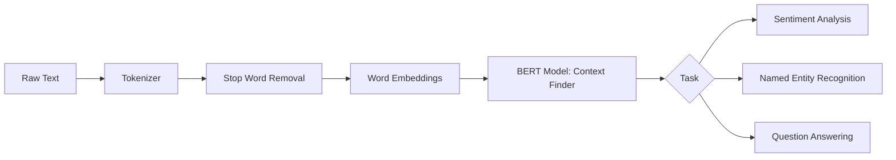

# Chapter 22: NLP Basics

## 1. Chapter Overview
How do we turn words into numbers? This chapter explores **Natural Language Processing (NLP)**, the field that enables machines to read, understand, and generate human language. We cover the entire pipeline: from **Tokenization** and cleaning to the power of **Word Embeddings** and the context-aware revolutionary model: **BERT**.

## 2. Why This Topic Matters
Language is messy. A single word can have many meanings, and a single meaning can be expressed in many ways. Unlike pixels in an image, words are "discrete" symbols. NLP is the art of translating the fluid, emotional, and context-heavy world of human speech into a mathematical space that a computer can compute.

## 3. Real-World Applications
- **Customer Support**: Chatbots that understand the "intent" of a customer's question.
- **Search**: Semantic search that finds documents about "Smartphones" even if you only typed "mobile phone."
- **Social Media**: Monitoring "Sentiment" across millions of tweets to see if a brand's reputation is improving.

## 4. Core Intuition
The goal of NLP is to find the **Vector Representation** of language.
- Every word is given a point in a high-dimensional room.
- In a "good" room, the words "King" and "Queen" are very close together, while "King" and "Banana" are far apart.
- This allows us to do "Word Math": $\text{King} - \text{Man} + \text{Woman} \approx \text{Queen}$.

## 5. Beginner-Friendly Explanation
### Explain Like I Am New
Imagine you are a detective trying to read a letter where half the words are missing.
- **Tokenization**: You chop the letter into individual words.
- **Stop Words**: You throw away the "the," "is," and "and" because they don't help you solve the crime.
- **Embeddings**: You look at the words surrounding a mystery word to guess what it is. If you see "I ate a juicy ____," you know it's a fruit.
NLP is just a very advanced version of this detective work.

## 6. Technical Foundations
- **Tokenization**: Breaking text into words, subwords, or characters.
- **Stemming & Lemmatization**: Reducing words to their root form (e.g., "running" -> "run").
- **Bag of Words (BoW)**: Counting how many times each word appears.
- **TF-IDF**: A way to ignore common words and focus on the unique, important ones in a document.

## 7. Mathematical Foundations
- **Cosine Similarity**: How we measure the "distance" between two word vectors.
- **Softmax**: Turning model outputs into a probability distribution over the entire dictionary.
- **Self-Attention**: (Recap from Ch 20) Allowing a word to look at all other words in a sentence to define itself.

## 8. Step-by-Step Workflow
1. **Lowercase and Clean**: Remove HTML tags, punctuation, and extra spaces.
2. **Tokenize**: Split the text.
3. **Remove Stop Words**: Drop the high-frequency/low-meaning words.
4. **Embed**: Convert tokens into vectors (using Word2Vec, GloVe, or BERT).
5. **Classify**: Pass the vectors into a model to get a result.

## 9. Algorithms and Architectures
We introduce the **Transformer Backbone**. While early NLP used LSTMs, modern NLP is dominated by **BERT** (Bidirectional Encoder Representations from Transformers). BERT is "Bi-directional," meaning it reads both left-to-right and right-to-left at the same time to understand the deepest possible context.

## 10. Visual Explanation


## 11. Code Implementation
Analyzing Sentiment using the `transformers` library:

```python
from transformers import pipeline

# 1. Load a pre-trained Sentiment Analysis model
classifier = pipeline("sentiment-analysis")

# 2. Test it
sentences = [
    "I absolutely loved this book, it was transformative!",
    "The plot was boring and the ending was predictable."
]

results = classifier(sentences)

for s, r in zip(sentences, results):
    print(f"Sentence: {s}")
    print(f"Label: {r['label']}, Confidence: {r['score']:.4f}\n")
```

## 12. Optimization Techniques
- **Subword Tokenization**: Instead of learning "running," "runs," and "runner," the model learns "run" + "##ing." This allows it to understand words it has never seen before.
- **Distillation**: Creating a "Mini-BERT" (DistilBERT) that is 40% smaller and 60% faster while keeping 97% of the intelligence.

## 13. Common Mistakes
- **Ignoring Negation**: A simple model might see "I do not like this" and think it's positive because it sees the word "like." 
- **Context Loss**: Using simple "Bag of Words" for complex questions where the order of words matters.

## 14. Debugging Guide
1. If your model fails on weird symbols, check your **Encoding** (Use UTF-8!).
2. Check your **Vocabulary Coverage**. If 50% of your words are marked as `[UNK]` (Unknown), your tokenizer is wrong for your data.

## 15. Performance Considerations
Large models have billions of parameters. To run them in real production, we use **Inference Servers** like NVIDIA Triton or AWS Inferentia chips specially designed for text processing.

## 16. Research Evolution
NLP began with "Rule-based" systems in the 1970s (If word = "angry", then sentiment = -1). The field shifted to "Statistical NLP" in the 2000s and finally to "Neural NLP" in 2013 with **Word2Vec**. Today, the "Transformer" is the undisputed king.

## 17. Industry Case Study
**Gmail Smart Compose**: Google uses a modified Transformer model to suggest the next words in your email. The model understands not just English, but the *style* of how you specifically write, saving users from typing billions of characters every week.

## 18. Hands-On Exercise
- [ ] Tokenize the sentence: "Supercalifragilisticexpialidocious."
- [ ] List 5 "Stop Words" in English.
- [ ] Explain the difference between "Stemming" and "Lemmatization."

## 19. Mini Project
**The Fake News Detector**: Build a classifier using a dataset of news headlines. Use TF-IDF and a Random Forest (from Ch 13) to see if the model can spot the difference between real headlines and AI-generated misinformation.

## 20. Interview Questions
1. What is the difference between Word2Vec and BERT?
2. Explain TF-IDF in simple terms.
3. What is "Named Entity Recognition" (NER)?

## 21. Summary
NLP is the bridge between human thought and machine logic. By turning text into context-rich vectors, we enable machines to participate in the most human of activities: communication.

## 22. Further Reading
- [Hugging Face NLP Course](https://huggingface.co/learn/nlp-course/chapter1/1)
- *Speech and Language Processing* by Dan Jurafsky (Online Textbook).

## 23. Research Papers
- *Attention Is All You Need* (Vaswani et al., 2017).
- *BERT: Pre-training of Deep Bidirectional Transformers for Language Understanding* (Devlin et al., 2018).

## 24. Key Takeaways
- Text -> Tokens -> Vectors.
- TF-IDF for speed; BERT for context.
- Cosine similarity measures meaning.
- Hugging Face is the library of choice.
