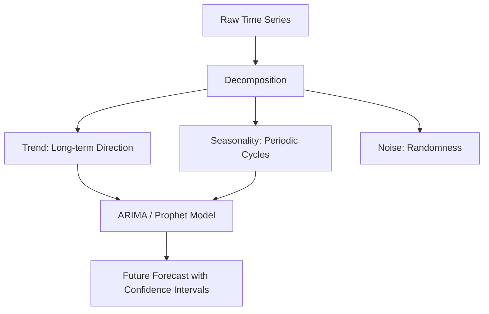

## 1. Chapter Overview
What will happen tomorrow? This chapter explores **Time Series Analysis**, the study of data points collected sequentially over time. We cover the core components of time-based data—**Trend**, **Seasonality**, and **Residuals**—and dive into the foundation of classical forecasting: the **ARIMA** model.

## 2. Why This Topic Matters
Unlike standard datasets, time series data has "Temporal Dependence"—the value today depends on the value yesterday. If you ignore this, you cannot predict the future. Time series models power the world’s weather forecasts, financial markets, and energy grids, allowing organizations to prepare instead of just reacting.

## 3. Real-World Applications
- **Economics**: Predicting GDP growth or inflation rates for the next quarter.
- **Retail**: Forecasting sales for Black Friday based on the last 5 years of data.
- **IoT**: Monitoring a factory machine’s vibration to predict when it will break before it happens.

## 4. Core Intuition
Time series analysis is about **Decomposition**. 
- We take a messy line and break it into parts:
- **Trend**: Is it going up or down over years?
- **Seasonality**: Does it repeat every Monday or every December?
- **Residuals/Noise**: What is left over (the random "wiggles")?
By understanding the past patterns, we can extend the line into the future.

## 5. Beginner-Friendly Explanation
### Explain Like I Am New
Imagine you are a fisherman trying to predict how many fish you will catch tomorrow.
- **Trend**: Over the last 10 years, the lake is getting cleaner, so there are more fish every year.
- **Seasonality**: Fish are always more active in the Spring than in the Winter.
- **Stationarity**: If the lake was drained and refilled, all your old data would be useless because the "rules" of the lake changed.
Forecasting is just looking at the calendar and the "history book" at the same time.

## 6. Technical Foundations
- **Stationarity**: The statistical properties (mean, variance) do not change over time.
- **Autocorrelation (ACF)**: How much a value today correlates with its value $N$ days ago.
- **Lag**: The time delay (e.g., Lag-1 is yesterday, Lag-7 is last week).
- **Differencing**: Subtracting yesterday's value from today's to make the data "stationary."

## 7. Mathematical Foundations
- **AR (Autoregressive)**: $Y_t = \phi Y_{t-1} + \epsilon$ (The future is a function of the past).
- **MA (Moving Average)**: $Y_t = \epsilon_t + \theta \epsilon_{t-1}$ (The future is a function of past errors).
- **ARIMA (p, d, q)**: Combining AR, Integrated (Differencing), and MA into one powerful equation.

## 8. Step-by-Step Workflow
1. **Visualize**: Plot the data. Do you see a trend or seasonality?
2. **Test for Stationarity**: Use the ADF (Augmented Dickey-Fuller) test.
3. **Difference**: If not stationary, subtract values until it is.
4. **Identify Parameters**: Use ACF and PACF plots to find $p$ and $q$.
5. **Train & Forecast**: Fit the ARIMA model and predict the next $N$ steps.

## 9. Algorithms and Architectures
We introduce **Facebook Prophet**. While ARIMA is powerful, it is difficult to tune. Prophet is an automated tool that handles missing data, outliers, and complex seasonalities (like holidays) effortlessly, making it the industry favorite for business forecasting.

## 10. Visual Explanation


## 11. Code Implementation
Forecasting with `statsmodels`:

```python
import pandas as pd
import matplotlib.pyplot as plt
from statsmodels.tsa.arima.model import ARIMA

# 1. Create fake airline passenger data: Trend + Noise
data = [100 + i + (i % 12) for i in range(100)]
series = pd.Series(data)

# 2. Fit ARIMA (1, 1, 1)
model = ARIMA(series, order=(1, 1, 1))
model_fit = model.fit()

# 3. Forecast next 10 steps
forecast = model_fit.forecast(steps=10)

# 4. Plot
plt.plot(series, label='History')
plt.plot(range(100, 110), forecast, label='Forecast', color='red')
plt.legend()
plt.show()
```

## 12. Optimization Techniques
- **Log Transformation**: If the "wiggles" get bigger as the line goes up (Heteroscedasticity), take the `log` of the data to stabilize the variance.
- **Rolling Windows**: Calculating the average of the last 7 days to smooth out noise.

## 13. Common Mistakes
- **Applying ML to Non-Stationary Data**: Standard models (like Random Forest) will give you 99% accuracy by "cheating" and then fail in the real world.
- **Ignoring the "Random Walk"**: Some things (like individual stock prices) are mathematically impossible to predict using only history.

## 14. Debugging Guide
1. If your forecast is a perfectly flat line, your model likely failed to find any signal in the noise. Check your $d$ (Differencing) parameter.
2. Check your **Residuals**. If you see a pattern in the residuals, there is still "info" in the data that your model missed.

## 15. Performance Considerations
Time series models are usually small and fast. However, if you are predicting 1,000 different stocks across 1,000 different cities, we use **Vector Autoregression (VAR)** or specialized **RNNs** (from Ch 19).

## 16. Research Evolution
Forecasting was formalised by **Box and Jenkins** in the 1970s (The creators of ARIMA). The field stayed mostly stagnant until the 2010s, when deep learning and automated tools (like Prophet) revolutionized the scale at which we can forecast.

## 17. Industry Case Study
**Walmart Inventory Management**: Walmart uses a combination of Prophet and Deep Learning to predict the demand for every item in every store. By knowing exactly how many gallons of milk will sell next Tuesday, they reduce waste and save billions in logistics costs.

## 18. Hands-On Exercise
- [ ] Plot your own bank balance over the last 30 days.
- [ ] Identify the "Trend" and any "Weekly Seasonality" (e.g., Payday).
- [ ] Calculate the "Differenced" data (Today's balance minus yesterday's).

## 19. Mini Project
**The Crypto Predictor**: Download 1 year of Bitcoin price data. Use an ARIMA model to predict the price for the next 7 days. Compare your prediction to the actual price. Why did the model miss the big "spike"? Hint: Look at the news.

## 20. Interview Questions
1. What is Stationarity and why is it required for ARIMA?
2. What are p, d, and q in an ARIMA model?
3. How do you handle "Holidays" in a sales forecast?

## 21. Summary
Time series analysis allows us to look into the future with statistical confidence. By decomposing the past into trends and cycles, we can make informed decisions in a world of constant change.

## 22. Further Reading
- *Forecasting: Principles and Practice* (Hyndman & Athanasopoulos) - The best free textbook online.
- [Prophet Documentation](https://facebook.github.io/prophet/)

## 23. Research Papers
- *Time series analysis: forecasting and control* (Box & Jenkins, 1970).

## 24. Key Takeaways
- Always check for Stationarity first.
- Decompose = Trend + Seasonality + Noise.
- ARIMA is the baseline; Prophet is the workhorse.
- Confidence intervals are just as important as the forecast itself.