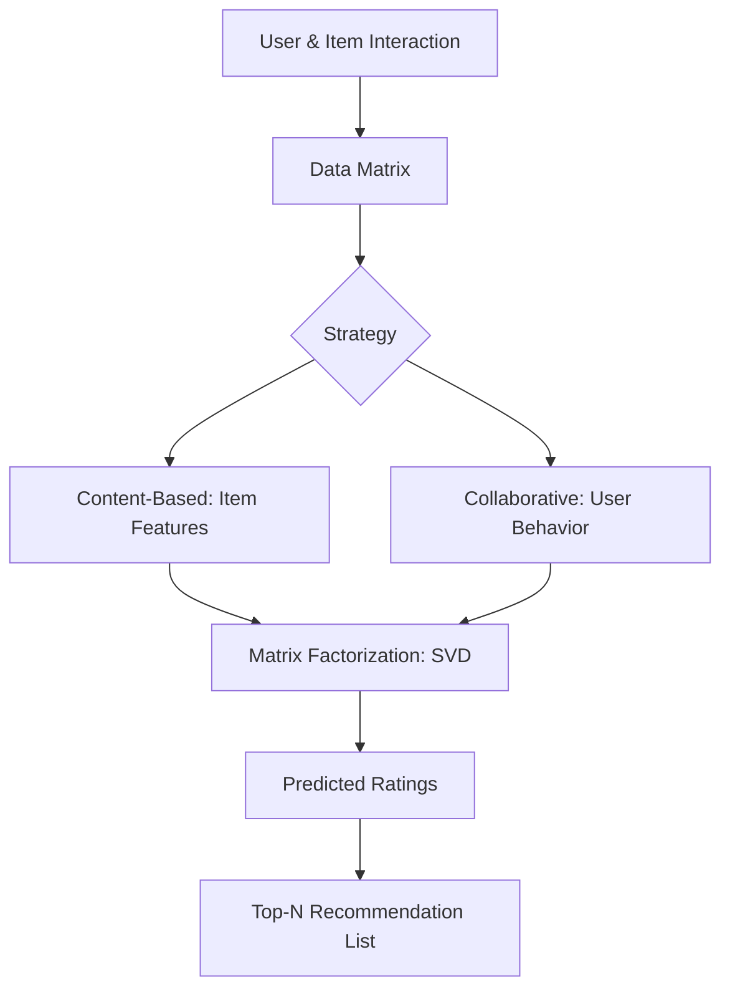

## 1. Chapter Overview
How do Netflix and Amazon know exactly what you want before you do? This chapter explores **Recommendation Systems**, the algorithms that power the personalized internet. We cover **Content-Based Filtering**, **Collaborative Filtering**, and the mathematics of **Matrix Factorization**. We also discuss the "Cold Start" problem and how to evaluate recommendations.

## 2. Why This Topic Matters
We live in an era of "Information Overload." There are millions of movies, songs, and products. A recommendation system act as a "filter" that brings the most relevant items to the user. For companies like Netflix, these algorithms are worth billions, as they are the primary reason users stay subscribed.

## 3. Real-World Applications
- **E-commerce**: Amazon's "Customers who bought this also bought..." section.
- **Entertainment**: Spotify's personalized radios and Netflix's "Top Picks for You."
- **Social Media**: The algorithms that decide which posts appear first in your Instagram or LinkedIn feed.

## 4. Core Intuition
Recommendation is about **Finding Similarities**.
- **Content-Based**: "You like this red shirt, so you might like this other red shirt." (Item-to-Item)
- **Collaborative**: "User A and User B both like Apples. User A also likes Oranges. Therefore, User B will probably like Oranges." (User-to-Item)

## 5. Beginner-Friendly Explanation
### Explain Like I Am New
Imagine you are at a library.
- **Content-Based**: The librarian says, "Since you liked that book about Dragons, here is another book about Dragons."
- **Collaborative**: The librarian says, "The person who checked out that same Dragon book also loved this book about Knights. You should try it."
One looks at the *category* of the item; the other looks at the *habits* of other people. Combining both is how modern AI works.

## 6. Technical Foundations
- **The Utility Matrix**: A giant table where rows are Users, columns are Items, and the cells are Ratings (1-5 stars).
- **Sparsity**: Most users haven't rated most items, so the matrix is 99% empty.
- **Explicit vs. Implicit Feedback**: Explicit is a star rating; Implicit is clicking a link or watching a video to the end.

## 7. Mathematical Foundations
- **Cosine Similarity**: Comparing user profiles to find "neighbors."
- **Singular Value Decomposition (SVD)**: A way to take a giant, sparse matrix and compress it into small, dense vectors (Embddings) that represent "Latent Features" (like "Action level" or "Romance").

## 8. Step-by-Step Workflow
1. **Collect Data**: Capture user interactions (clicks, buys, ratings).
2. **Build the Matrix**: Map users and items to IDs.
3. **Choose Strategy**: Content, Collaborative, or Hybrid.
4. **Train**: Use an algorithm like SVD to fill in the "blanks" in the matrix.
5. **Rank**: Sort all items by their predicted rating and show the top 10 to the user.

## 9. Algorithms and Architectures
We introduce the **Surprise** library. While you can build recommenders in Scikit-Learn, Surprise is a specialized library designed specifically for matrix factorization and ranking, offering pre-built versions of SVD and KNN for recommendation.

## 10. Visual Explanation


## 11. Code Implementation
Building a simple SVD Recommender with `Surprise`:

```python
from surprise import SVD, Dataset, Reader
from surprise.model_selection import train_test_split

# 1. Load the built-in movielens dataset
data = Dataset.load_builtin('ml-100k')

# 2. Split
trainset, testset = train_test_split(data, test_size=0.2)

# 3. Use SVD (The algorithm that won the Netflix Prize)
algo = SVD()
algo.fit(trainset)

# 4. Predict rating for a specific user and item
uid = str(196) # User 196
iid = str(302) # Item 302
prediction = algo.predict(uid, iid)

print(f"Predicted Rating: {prediction.est:.2f}")
```

## 12. Optimization Techniques
- **Hybrid Systems**: Combining Content and Collaborative filtering to get the "best of both worlds."
- **Negative Sampling**: Training the model on items the user *ignored* to help it learn what they *don't* like.

## 13. Common Mistakes
- **The Filter Bubble**: Recommending only things the user already likes, preventing them from discovering anything new (Serendipity).
- **Popularity Bias**: Only recommending "The Avengers" and "Star Wars" because everyone likes them, ignoring the user's specific niche interests.

## 14. Debugging Guide
1. **Cold Start**: If your model returns "Error" for new users, it's because it has no data. You must have a "fallback" (like showing them Top 10 Popular items).
2. Check your **Precision@K**. If it's 0.0, your model is recommending items the user has already bought/seen.

## 15. Performance Considerations
As $N$ grows to billions (like YouTube), calculating similarities between every user is impossible. We use **Approximate Nearest Neighbors (ANN)** libraries like Faiss (Facebook) to find similar users in milliseconds.

## 16. Research Evolution
The field exploded in 2006 with the **Netflix Prize**—a $1M contest to improve their recommender by 10%. The winners combined many different models (Ensembles) and popularized **Matrix Factorization** as the gold standard.

## 17. Industry Case Study
**TikTok's "For You" Page**: TikTok uses a hyper-fast recommendation engine that processes your behavior in real-time. Within 15 minutes of use, the model has analyzed your "watch time" for hundreds of videos and built a precise profile of your interests, resulting in the highest engagement in the industry.

## 18. Hands-On Exercise
- [ ] List 5 items you recently bought/watched.
- [ ] Categorize them (Content-Based) and think of 5 similar people (Collaborative).
- [ ] Explain why recommending "Toilet Paper" to someone who just bought "Toilet Paper" is usually a bad recommendation.

## 19. Mini Project
**The Movie Matcher**: Build a recommender script. Use the MovieLens dataset. Let a user type in their favorite movie, and use Cosine Similarity to find the top 5 most similar movies based on what *other* people liked.

## 20. Interview Questions
1. How do you handle a "New User" with zero data (Cold Start)?
2. What is the difference between Singular Value Decomposition (SVD) and Principal Component Analysis (PCA)?
3. Why is "Implicit Feedback" more common in industry than "Explicit Ratings"?

## 21. Summary
Recommendation systems are the engines of the personalized web. By mastering the balance between item features and user behavior, you can build systems that provide value to both the business and the end-user.

## 22. Further Reading
- *Recommender Systems: The Textbook* by Charu Aggarwal.
- [Surprise Library Documentation](http://surpriselib.com/)

## 23. Research Papers
- *Matrix Factorization Techniques for Recommender Systems* (Koren et al., 2009).

## 24. Key Takeaways
- Content = "This item is like that item."
- Collaborative = "You are like that person."
- Cold Start is the biggest hurdle.
- SVD is the classic, powerful solution.