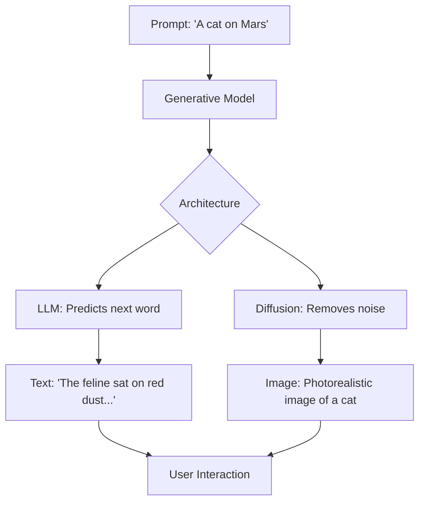

# Chapter 25: Introduction to Generative AI

## 1. Chapter Overview
We have spent 24 chapters teaching machines to "recognize" and "predict." Now, we teach them to **Create**. This chapter introduces **Generative AI**, the frontier of data science. We explore the difference between Generative and Discriminative models, the intuition behind **GANs** and **Diffusion**, and the rise of **Large Language Models (LLMs)**.

## 2. Why This Topic Matters
Generative AI represents a shift in the role of computers—from calculators to creators. It is the technology behind ChatGPT, Midjourney, and Sora. Understanding how these models work allows you to not just use them, but to build applications that generate text, images, and code that never existed before.

## 3. Real-World Applications
- **Content Creation**: Generating marketing copy, blog posts, and emails in seconds.
- **Design**: Creating photorealistic images or architectural mockups from a text prompt.
- **Entertainment**: Generating non-player character (NPC) dialogue in video games or custom music tracks for videos.

## 4. Core Intuition
Generative AI is about **Learning the Probability Distribution**.
- A "Discriminative" model learns the *boundary* between Cat and Dog.
- A "Generative" model learns *exactly what a dog looks like*. 
- If you know the formula for "Dogginess," you can sample from that formula to create a brand-new dog that doesn't exist in the real world.

## 5. Beginner-Friendly Explanation
### Explain Like I Am New
Imagine a student and an art critic.
- **Discriminative AI (The Critic)**: Looks at a painting and says, "That is a Monet" or "That is a forgery."
- **Generative AI (The Student)**: Studies 10,000 Monets until they understand his brushstrokes and colors. Then, the student can paint a brand-new scene in the style of Monet.
Generative AI is a student that has studied the entire internet and can now mimic almost any style of human creativity.

## 6. Technical Foundations
- **Latent Space**: The hidden, mathematical "map" where the model stores the concepts it learned (e.g., "Sadness," "Brightness," "Fluffiness").
- **Tokens**: The atomic units of text that LLMs process.
- **Prompts**: The instructions we give to the "Latent Space" to pull out a specific result.
- **Temperature**: A setting that controls how "creative" (random) vs. "factual" (predictable) the model is.

## 7. Mathematical Foundations
- **Probabilistic Sampling**: Instead of picking the one "best" word, the model chooses from a set of likely words.
- **Noise Addition/Removal**: The core of Diffusion models. You start with static (pure noise) and the model slowly "cleans" it until an image emerges.
- **Loss Functions**: Adversarial Loss (used in GANs) where two models fight each other to get better.

## 8. Step-by-Step Workflow
1. **Define the Task**: Is it Text-to-Text, Text-to-Image, or Image-to-Video?
2. **Select Model**: Use an API (OpenAI/Anthropic) or an open-source model (Llama/Stable Diffusion).
3. **Draft the Prompt**: Be specific about the persona, context, and output format.
4. **Iterate**: Adjust the prompt or the "Hyperparameters" (like Top-K or Temperature).
5. **Guardrails**: Apply filters to ensure the output is safe and accurate.

## 9. Algorithms and Architectures
We introduce the **Encoder-only vs. Decoder-only** distinction. BERT (Encoder) is for understanding; GPT (Decoder) is for generating. We also touch on **Multimodal Models**, which can "see" images and "read" text simultaneously to describe what's in a video or follow visual instructions.

## 10. Visual Explanation


## 11. Code Implementation
Generating text using the OpenAI API style (Pseudocode/Conceptual):

```python
# Conceptual implementation using a Generative Model
from transformers import pipeline

# 1. Load a Text Generation pipeline (using GPT-2 for simplicity)
generator = pipeline('text-generation', model='gpt2')

# 2. Give it a starting "Seed"
prompt = "The future of data science is"

# 3. Generate
result = generator(prompt, max_length=50, num_return_sequences=1)

print(result[0]['generated_text'])
```

## 12. Optimization Techniques
- **Fine-Tuning**: Taking a general model (like Llama) and giving it a small, specialized dataset (like "Medical Records") to make it an expert in that one field.
- **RAG (Retrieval-Augmented Generation)**: Connecting the model to a private database so it can answer questions about *your* data without being retrained.

## 13. Common Mistakes
- **Hallucination**: The model "confidently lies" because its goal is to be plausible, not necessarily factual.
- **Ignoring Context Window**: Trying to paste an entire 500-page book into a model that can only remember 20 pages.

## 14. Debugging Guide
1. If the output is "Robotic," increase the **Temperature**.
2. If the model is giving dangerous or biased advice, you need better **System Prompts** (The hidden instructions given to the model).

## 15. Performance Considerations
Generative models are massive. Running them requires cutting-edge hardware (H100 GPUs). To save costs, we use **Quantization** (4-bit or 8-bit) and **Prompt Caching** to avoid re-reading the same instructions 1,000 times.

## 16. Research Evolution
2014: **GANs** (Goodfellow) allowed for "deep fakes." 
2017: **Transformers** (Google) provided the scale. 
2020: **GPT-3** (OpenAI) showed that "Scale is All You Need." 
2023: **Generative AI** became the fastest-adopted technology in human history.

## 17. Industry Case Study
**Duolingo Max**: Duolingo uses GPT-4 to allow language learners to "Roleplay" scenarios (like ordering a coffee) with an AI that provides real-time feedback on their grammar and social nuances, replacing the need for an expensive human tutor.

## 18. Hands-On Exercise
- [ ] Write a prompt to summarize a complex news article into 3 bullet points for a 10-year-old.
- [ ] Explain the difference between "Prompting" and "Fine-Tuning."
- [ ] Find an AI-generated image online and try to spot the "artifacts" (mistakes the model made).

## 19. Mini Project
**The AI Poet**: Use a pre-trained generative model. Write a script that takes a "Topic" and an "Emoji," and generates a 4-line poem that must include that emoji.

## 20. Interview Questions
1. How does a Diffusion model create an image from "Static"?
2. What is a "Hallucination" and how do you stop it?
3. Why did the Transformer architecture enable the rise of LLMs?

## 21. Summary
Generative AI is a new medium of human expression. By understanding the probability distributions and latent spaces behind these models, you can move from being a consumer to a creator of the next generation of intelligent systems.

## 22. Further Reading
- *Generative Deep Learning* by David Foster.
- [OpenAI Prompt Engineering Guide](https://platform.openai.com/docs/guides/prompt-engineering)

## 23. Research Papers
- *Generative Adversarial Nets* (Goodfellow et al., 2014).
- *Denoising Diffusion Probabilistic Models* (Ho et al., 2020).

## 24. Key Takeaways
- Generative = Creating; Discriminative = Sorting.
- LLMs are next-word predictors.
- Diffusion is the standard for images.
- RAG is the solution for model "honesty."
