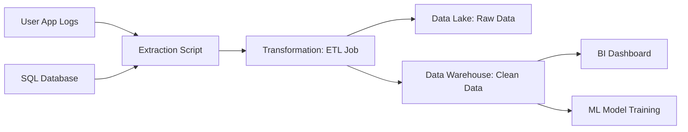

## 1. Chapter Overview
Data doesn't just "appear" in a clean CSV file. This chapter explores **Data Pipelines**, the industrial machinery that moves data from its messy origin to its usable destination. We cover the **ETL (Extract, Transform, Load)** process, the rise of **Data Lakes** and **Warehouses**, and how to use orchestrators like **Apache Airflow**.

## 2. Why This Topic Matters
In a real company, data is spread across 50 different databases, logs, and spreadsheets. If you manually download and clean this every day, you will never have time to build models. A "Data Engineer" builds the pipelines that automate this process, ensuring that the Data Scientist always has fresh, high-quality data.

## 3. Real-World Applications
- **Finance**: Moving millions of bank transactions every hour into a "Fraud Detection" system.
- **E-commerce**: Syncing inventory levels across 500 stores every minute.
- **Streaming**: Collecting every click and "pause" from users to update their recommendations.

## 4. Core Intuition
A Data Pipeline is a **Digital Assembly Line**.
- **Extract**: Pulling data from the source (e.g., a SQL database or an API).
- **Transform**: Cleaning, filtering, and converting data types (The "Kitchen" where the raw food is cooked).
- **Load**: Sending the finished product to its destination (e.g., a Data Warehouse like Snowflake or BigQuery).

## 5. Beginner-Friendly Explanation
### Explain Like I Am New
Imagine a city with a giant water system.
- **Extract**: The pump takes water from the river.
- **Transform**: The filter removes the dirt and adds chlorine.
- **Load**: The pipes send clean water to every house.
If the pump breaks, everyone is thirsty. If the filter fails, everyone gets sick. A data pipeline is same—it’s the "plumbing" of the AI world.

## 6. Technical Foundations
- **ETL vs. ELT**: Do you clean the data *before* or *after* you move it?
- **Batch Processing**: Moving data in big chunks (e.g., once every night).
- **Streaming**: Moving data as it happens (e.g., "Real-time" Kafka pipes).
- **Schema**: The "Blueprint" of the data (Columns, Types, Rules).

## 7. Mathematical Foundations
- **Data Integrity Metrics**: Calculating the "Success Rate" of a pipeline ($Success / Total$).
- **Latentcy**: The time it takes for a piece of data to move from source to destination.
- **Throughput**: How many Gigabytes of data moving per second.

## 8. Step-by-Step Workflow
1. **Identify Sources**: Where is the data?
2. **Design the Schema**: What should the final table look like?
3. **Build the Transformer**: Write the Python or SQL code to clean the data.
4. **Orchestrate**: Use a tool (like a "Cron job" or "Airflow") to run the code automatically.
5. **Monitor**: Set up alerts so you know immediately if the pipeline breaks.

## 9. Algorithms and Architectures
We introduce **The Lambda Architecture**. This design allows you to handle both "Slow Batch" data (which is 100% accurate) and "Fast Stream" data (which is 90% accurate but instant) at the same time, merging them into a single coherent view of the truth.

## 10. Visual Explanation


## 11. Code Implementation
A simple "Scripted" pipeline using Python:

```python
import pandas as pd
import sqlite3

def run_pipeline():
    # 1. Extract
    raw_data = pd.read_csv("raw_sales.csv")
    
    # 2. Transform (Clean)
    # Convert dates, remove nulls, calculate profit
    raw_data['date'] = pd.to_datetime(raw_data['date'])
    clean_data = raw_data.dropna()
    clean_data['profit'] = clean_data['revenue'] - clean_data['cost']
    
    # 3. Load
    conn = sqlite3.connect('company_warehouse.db')
    clean_data.to_sql('sales_daily', conn, if_exists='append', index=False)
    print("Pipeline Success: 100 rows loaded.")

run_pipeline()
```

## 12. Optimization Techniques
- **Parallelization**: Running 10 ETL jobs at once instead of one after another.
- **Incremental Loading**: Only downloading the data that has changed "Since Yesterday," instead of re-downloading the whole history every night.

## 13. Common Mistakes
- **No Error Handling**: If one row is "corrupted," the whole pipeline crashes. Use `try-except` blocks!
- **Data Drift**: The data "Source" changes its format (e.g., changing "Date" to "Timestamp") and your pipeline fails silently.

## 14. Debugging Guide
1. **Check the Source**: Did the file even exist this morning?
2. **Log Everything**: Every step of the pipeline should write a line to a "Log File" so you can see exactly where it failed.

## 15. Performance Considerations
As data grows to Petabytes, standard Python fails. We use "Distributed Engines" like **Apache Spark** or **dbt (Data Build Tool)** which spread the work across 1,000 servers.

## 16. Research Evolution
Pipelines used to be custom "cobbled-together" scripts. In 2014, Airbnb released **Apache Airflow**, which turned pipeline building into a professional engineering discipline using "DAGs" (Directed Acyclic Graphs).

## 17. Industry Case Study
**Uber Michelangelo**: Uber's internal platform manages thousands of pipelines. It automatically tracks "Data Lineage"—knowing exactly which database a specific prediction came from—so that if a bug is found, they can trace it back to the exact "pipe" that leaked the bad data.

## 18. Hands-On Exercise
- [ ] List all the "Sources" of data in your life (Phone, Bank, Email).
- [ ] Diagram a pipeline to "Merge" your bank transactions and your workout logs.
- [ ] Write a Python script to double all numbers in a list and save them to a new file.

## 19. Mini Project
**The Weather Archiver**: Use a free Weather API. Write a script that runs every hour (a pipeline!) to fetch the current temperature and append it to a CSV file. After 24 hours, you have your own custom dataset.

## 20. Interview Questions
1. What is the difference between ETL and ELT?
2. What happens if a pipeline runs twice on the same data? (Idempotency).
3. How do you monitor a pipeline that runs at 3 AM?

## 21. Summary
Pipelines are the backbone of data science. Without a reliable flow of clean data, the most advanced AI models are useless. By mastering the assembly line, you ensure your models are always powered by the "truth."

## 22. Further Reading
- *Fundamentals of Data Engineering* by Joe Reis and Matt Housley.
- [Apache Airflow Documentation](https://airflow.apache.org/)

## 23. Research Papers
- *The Data Management of the Future* (Stonebraker, 2012).

## 24. Key Takeaways
- Pipeline = Assembly Line.
- Extract -> Transform -> Load.
- Automate everything with Airflow.
- No pipeline is finished without Monitoring.