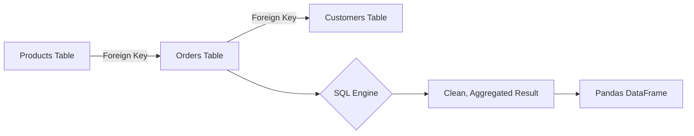

## 1. Chapter Overview
Python is the language of models, but **SQL (Structured Query Language)** is the language of data. This chapter moves beyond simple `SELECT` statements to explore high-level SQL techniques: **Joins**, **Window Functions**, **Common Table Expressions (CTEs)**, and how to query billions of rows in modern warehouses like BigQuery and Snowflake.

## 2. Why This Topic Matters
In industry, your data lives in a SQL database. If you can only use Pandas, you are limited to the data you can fit in your computer's RAM. If you master SQL, you can clean and aggregate Terabytes of data directly on the database server, bringing only the final, clean dataset into Python for modeling.

## 3. Real-World Applications
- **User Analytics**: Calculating the "7-day retention" of users by joining login tables with registration tables.
- **Financial Reporting**: Summing monthly revenue across 100 different countries using `GROUP BY`.
- **E-commerce**: Finding the "Top 3 best-selling products" in every category using window functions.

## 4. Core Intuition
SQL is **Declarative**. 
- In Python, you tell the computer *how* to do something (a loop). 
- In SQL, you tell the database *what* you want ("Give me all users who bought a shirt").
The database then finds the most efficient way to get that information for you.

## 5. Beginner-Friendly Explanation
### Explain Like I Am New
Imagine a giant warehouse filled with millions of boxes.
- **SELECT**: You say, "Bring me all the blue boxes."
- **WHERE**: "Only the blue boxes that weigh more than 10kg."
- **JOIN**: "Match the blue boxes with the red ribbons stored in the other room."
- **GROUP BY**: "Put the boxes in piles based on which city they are going to and tell me how many are in each pile."
SQL is just your way of giving orders to the warehouse robot.

## 6. Technical Foundations
- **Primary vs. Foreign Keys**: The ID numbers that link tables together.
- **Joins**: Inner, Left, Right, and Full (How to combine tables).
- **Aggregations**: `SUM()`, `AVG()`, `COUNT()`, `MAX()`.
- **Filtering**: `WHERE` (filters rows) vs. `HAVING` (filters groups).

## 7. Mathematical Foundations
- **Set Theory**: SQL is based on the math of sets (Venn diagrams). An `INNER JOIN` is the intersection of two sets.
- **Relational Algebra**: The underlying logic that powers the database engine.
- **Indices**: Mathematical "Maps" that allow the database to find data in $O(1)$ or $O(\log n)$ time instead of scanning every row.

## 8. Step-by-Step Workflow
1. **Explore**: Use `LIMIT 10` to see what the data looks like.
2. **Filter**: Narrow down to the specific time range or category you need.
3. **Join**: Pull in extra info from other tables.
4. **Aggregate**: Turn millions of rows into a few summary numbers.
5. **Format**: Use `ORDER BY` and aliases (`AS`) to make the output readable.

## 9. Algorithms and Architectures
We introduce **Window Functions** (`OVER`, `PARTITION BY`). These allow you to perform calculations across a set of rows that are related to the current row (e.g., getting a "running total" of sales) without collapsing the rows into a single group.

## 10. Visual Explanation


## 11. Code Implementation
An advanced SQL query using CTEs and Window Functions:

```sql
-- Calculate the Rank of each customer based on their total spend
WITH CustomerSpend AS (
    SELECT 
        customer_id,
        SUM(total_price) as total_spent
    FROM orders
    GROUP BY 1
)
SELECT 
    customer_id,
    total_spent,
    RANK() OVER (ORDER BY total_spent DESC) as whale_rank
FROM CustomerSpend
WHERE total_spent > 1000
LIMIT 10;
```

## 12. Optimization Techniques
- **Common Table Expressions (CTEs)**: Using `WITH` to break a massive, unreadable query into small, logical steps.
- **EXPLAIN PLAN**: A command that shows you exactly how the database is "thinking" and where it is being slow.

## 13. Common Mistakes
- **SELECT***: Never use `SELECT *` on a billion-row table. It will crash the system and cost your company money (in cloud costs).
- **Cartesian Product**: Forgetting a `JOIN` condition, resulting in every row matching every other row (e.g., 1,000 rows $\times$ 1,000 rows = 1,000,000 rows).

## 14. Debugging Guide
1. If your query is "Missing Data," check if you used an `INNER JOIN` instead of a `LEFT JOIN`.
2. Run your query on 10 rows first to verify the logic before running it on the full dataset.

## 15. Performance Considerations
As datasets hit the "Big Data" scale, we use **Columnar Databases** (BigQuery, Snowflake). These store data "vertically," allowing them to sum a billion numbers in seconds but making it slow to insert a single new row.

## 16. Research Evolution
SQL was invented at IBM in the 1970s. It was predicted to die many times (e.g., the "NoSQL" movement of 2010), but it has survived because of its mathematical elegance and the rise of "SQL-on-Hadoop" and "Cloud Data Warehouses."

## 17. Industry Case Study
**Uber's Peak Pricing**: Uber uses complex SQL queries on their "Data Lake" to calculate moving averages of supply (drivers) and demand (riders) in every city block every minute. This SQL-driven logic determines the "Surge" price you see on your app.

## 18. Hands-On Exercise
- [ ] Write a SQL query to find the average age of users in a "Users" table.
- [ ] Connect a "Sales" table to a "Products" table using a `LEFT JOIN`.
- [ ] Use a Window Function to find the "previous day's sales" for every row.

## 19. Mini Project
**The Retail Analyst**: Use a sample SQL database (like Chinook or Northwind). Write a single query that identifies the top 3 customers from every country based on their total purchase value.

## 20. Interview Questions
1. What is the difference between `WHERE` and `HAVING`?
2. Explain the different types of Joins with a Venn diagram.
3. How do you handle `NULL` values in a `SUM()` calculation?

## 21. Summary
SQL is the foundation of data-driven business. By mastering complex joins and window functions, you gain the power to harvest insights from even the largest and messiest data warehouses.

## 22. Further Reading
- *SQL for Data Analysis* by Cathy Tanimura.
- [Mode Analytics SQL Tutorial](https://mode.com/sql-tutorial/)

## 23. Research Papers
- *A Relational Model of Data for Large Shared Data Banks* (E.F. Codd, 1970 - The paper that started it all).

## 24. Key Takeaways
- SQL is declarative (WHAT, not HOW).
- Joins are the heart of relational data.
- CTEs provide readability.
- Window functions provide powerful row-level insights.