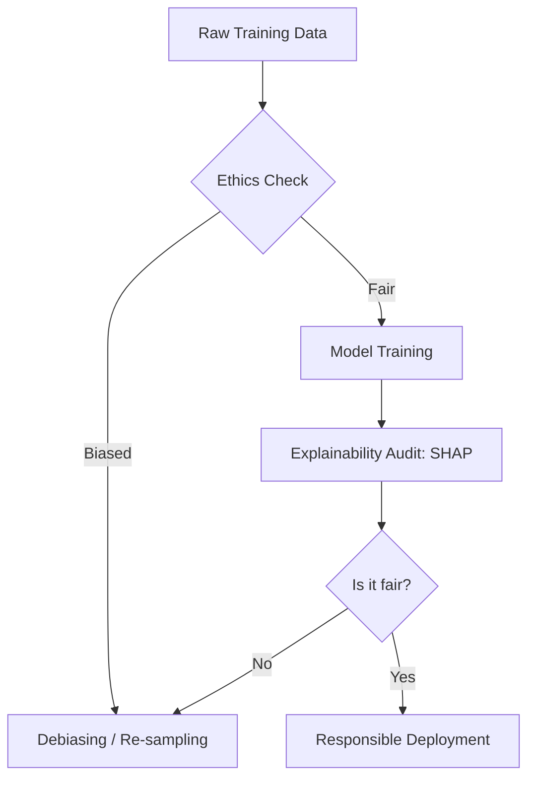

## 1. Chapter Overview
Data science is not just about "what we can do," but "what we *should* do." This chapter explores the ethical challenges of the AI era: **Algorithmic Bias**, **Data Privacy**, **Explainability**, and the environmental impact of large models. We learn how to build AI that is not only powerful but also fair, transparent, and sustainable.

## 2. Why This Topic Matters
AI models can perpetuate human prejudices. If a model is trained on biased data, it will make biased predictions (e.g., in hiring or lending), which can ruin lives. As a data scientist, you are the "Guardian of the Truth." Ensuring your model is ethical is just as important as ensuring it is accurate.

## 3. Real-World Applications
- **Lending**: Ensuring that a credit-scoring model doesn't discriminate based on race or gender.
- **Law Enforcement**: Auditing facial recognition systems to ensure they work equally well for all skin tones.
- **Social Media**: Managing "Echo Chambers" where algorithms only show users information that confirms their existing biases.

## 4. Core Intuition
Responsible AI is about **Alignment**. 
- We want the model's "Goals" to align with "Human Values." 
- This means the model shouldn't just maximize profit; it should also maximize Fairness, Privacy, and Safety.

## 5. Beginner-Friendly Explanation
### Explain Like I Am New
Imagine you are building a robot that chooses which children get a scholarship.
- **Bias**: If you only show the robot photos of children in expensive clothes, it might learn that "Rich = Smart." 
- **Explainability**: If the robot rejects a child, the parents have a right to ask "Why?" If the robot just says "Because my math said so," that's not good enough.
- **Privacy**: The robot shouldn't tell the whole neighborhood the children's secret test scores.
Ethics is about making sure your robot behaves like a good, fair person.

## 6. Technical Foundations
- **Algorithmic Bias**: When a model consistently favors one group over another.
- **Fairness Metrics**: Mathematical ways to measure if a model is biased (e.g., Demographic Parity).
- **GDPR & PII**: The laws (General Data Protection Regulation) and concepts (Personally Identifiable Information) that protect user privacy.
- **Explainability (XAI)**: Tools that help us "peak inside the black box."

## 7. Mathematical Foundations
- **Disparate Impact**: A calculation: $(\% \text{ Success for Group A}) / (\% \text{ Success for Group B})$. If it’s less than 0.8, the model is likely biased.
- **SHAP (Shapley Additive Explanations)**: Using game theory to calculate exactly how much each feature contributed to a specific prediction.
- **Differential Privacy**: Adding "Mathematical Noise" to data so you can learn trends without being able to identify a specific individual.

## 8. Step-by-Step Workflow
1. **Audit the Data**: Check if some groups are under-represented.
2. **Train with Fairness**: Use "Regularization" to penalize the model if it starts using protected labels (like gender) to make decisions.
3. **Explain Predictions**: Use SHAP or LIME to audit 100 random predictions. Do they make sense?
4. **Impact Assessment**: Write a document explaining the potential harms of the model if it fails.
5. **Continuous Monitoring**: Watch for "Bias Drift" once the model is live.

## 9. Algorithms and Architectures
We introduce **SHAP and LIME**. These are "Model-Agnostic" explainers. You can use them on any model (from a simple line to a complex Transformer) to generate a "Importance Plot" showing which features the model was looking at when it made a decision.

## 10. Visual Explanation


## 11. Code Implementation
Generating a SHAP values plot (Conceptual):

```python
import shap
import xgboost

# 1. Train a model
X, y = shap.datasets.boston()
model = xgboost.XGBRegressor().fit(X, y)

# 2. Explain the model's predictions using SHAP
explainer = shap.Explainer(model)
shap_values = explainer(X)

# 3. Visualize the first prediction's explanation
shap.plots.waterfall(shap_values[0])
```

## 12. Optimization Techniques
- **Adversarial Debiasing**: Training two models. One model tries to make a prediction; the second model tries to "guess" the person's gender from the first model's prediction. If the second model can guess correctly, the first model is biased and must be retrained.
- **Federated Learning**: Training models on users' phones without ever sending their private data to a central server (Used by Apple/Google).

## 13. Common Mistakes
- **Ignoring "Proxies"**: You might remove "Race" from your data, but if you keep "Zip Code," the model might use it as a proxy for race, resulting in the same bias.
- **The Transparency Paradox**: Giving *too much* explanation can allow hackers to "reverse engineer" your model and find ways to cheat it.

## 14. Debugging Guide
1. If your model gets 99% accuracy on one group but 40% on another, your training data is **Imbalanced**. Spend more money/time collecting data for the under-represented group.
2. If SHAP shows the model is ignoring all the features and just looking at one "ID" number, the model is "Memorizing" instead of "Learning."

## 15. Performance Considerations
Complex explainability calculations (like SHAP) can be 1,000x slower than the prediction itself. In production, we usually explain only a **Sample** of predictions or use "Global Explanations" that summarize the whole model once.

## 16. Research Evolution
Ethics was a "philosophical" topic until the 2010s. The 2016 **COMPAS** study (showing bias in criminal sentencing AI) and the **Cambrige Analytica** scandal forced the world to realize that AI ethics is an urgent engineering problem.

## 17. Industry Case Study
**Microsoft's Responsible AI Standard**: Microsoft has a dedicated "AETHER" committee that reviews every major AI product. They famously stopped selling facial recognition to police departments until federal laws could be established to ensure the technology was being used fairly and safely.

## 18. Hands-On Exercise
- [ ] List 5 "Protected Attributes" (e.g., Age, Gender).
- [ ] Explain why "Zip Code" might be a proxy for "Income."
- [ ] Look at a privacy policy of an app you use. Can you find where it mentions "Data for AI training"?

## 19. Mini Project
**The Fair Hirer**: Take a dataset of job applicants. Build a model that predicts "Hire" vs "No Hire." Use SHAP to see if the model is giving a higher score to "Male" applicants. Once you find the bias, try to remove it and see how it affects the accuracy.

## 20. Interview Questions
1. How do you detect bias in a dataset before training?
2. What is the difference betweeen SHAP and LIME?
3. What is GDPR and how does it affect data science?

## 21. Summary
Ethics is the "Moral Compass" of the data scientist. By building models that are transparent, fair, and private, you ensure that AI remains a force for good in society, protecting the rights of every individual it touches.

## 22. Further Reading
- *Weapons of Math Destruction* by Cathy O'Neil.
- [AI Ethics Guidelines (European Commission)](https://digital-strategy.ec.europa.eu/en/library/ethics-guidelines-trustworthy-ai)

## 23. Research Papers
- *Equality of Opportunity in Supervised Learning* (Hardt et al., 2016).

## 24. Key Takeaways
- Bias is in the data, not just the code.
- Accuracy is not Fairness.
- SHAP = Transparency.
- Privacy-by-design is the law.