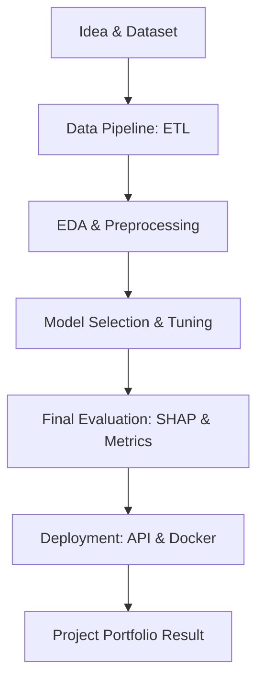

# Chapter 30: Final Projects

## 1. Chapter Overview
This is where everything comes together. This chapter provides four **Capstone Projects** that require you to use the full stack of skills you've learned—from Data Engineering and Math to Deep Learning and Deployment. Choose a project that matches your career interests and build it from the ground up.

## 2. Why This Topic Matters
Employers don't just want to know that you've read a book; they want to see what you can *build*. A completed capstone project is the "Proof of Concept" that you are a competent data scientist. It shows you can handle messy data, choose the right model, and deliver a working product.

## 3. Real-World Applications
- **Resume Portfolio**: A GitHub repository showing a live link to your deployed model.
- **Problem Solving**: Solving a real problem in your community (e.g., analyzing local crime patterns or air quality).
- **Startup Idea**: Many successful AI startups began as "Final Projects" during university or self-study.

## 4. Core Intuition
A final project is about **End-to-End Ownership**. 
- You are no longer just "the math guy" or "the coder." 
- You are the **Product Owner**. 
- You define the problem, hunt for the data, build the pipeline, train the model, and deploy the solution.

## 5. Beginner-Friendly Explanation
### Explain Like I Am New
Imagine you have spent the last month learning how to use every tool in a woodshop (Saws, Drills, Sanders). 
- **The Projects**: Instead of just making a single hole or a single cut, you are now building a complete dining table.
- You have to plan the table, buy the wood, cut it, assemble it, and paint it. 
By the end, you have a beautiful piece of furniture you can use and show off to your friends.

## 6. Technical Foundations
- **Repository Structure**: Organizing your code, data, and models in a professional way.
- **Documentation**: Writing a `README.md` that explains exactly how to run your project.
- **Versioning**: Using Git to track your changes.

## 7. Mathematical Foundations
- **Baseline Comparison**: Proving that your complex model is actually better than a simple average or a linear regression.
- **Confidence Intervals**: Reporting not just a "Number," but the range of error for your predictions.

## 8. Step-by-Step Workflow
1. **The Proposal**: Write 1 page on what you are building and why.
2. **Data Acquisition**: Find a dataset on Kaggle, AWS Open Data, or scrape your own.
3. **The Pipeline**: Build the ETL to clean your data.
4. **The Model**: Train and tune your algorithm.
5. **The API**: Deploy using FastAPI and Docker.

## 9. Algorithms and Architectures
We offer three "Tracks":
1. **The Computer Vision Track**: Using YOLO for real-time detection.
2. **The NLP Track**: Using BERT or GPT for a specialized chatbot or summarizer.
3. **The Analytics Track**: Using SQL and Time Series to build a business forecasting dashboard.

## 10. Visual Explanation


## 11. Code Implementation (Project Skeleton)
A recommended folder structure for your final project:

```text
/my_final_project
  /data
    raw_data.csv
    processed_data.csv
  /notebooks
    01_exploration.ipynb
    02_modeling.ipynb
  /src
    pipeline.py
    model.py
    app.py (FastAPI)
  /tests
    test_pipeline.py
  requirements.txt
  Dockerfile
  README.md
```

## 12. Optimization Techniques
- **Code Reviews**: Ask a friend or use an AI to review your code for bugs and efficiency.
- **Hyperparameter Sweeps**: Using `Weights & Biases` or `Optuna` to automatically find the best settings for your model.

## 13. Common Mistakes
- **Scope Creep**: Trying to build "The next Facebook" in two weeks. Keep your project small and focused!
- **Ignoring the README**: If I can't figure out how to run your code in 3 minutes, I will stop looking at your project.

## 14. Debugging Guide
1. If your model doesn't work, **Start Simpler**. Build a model with only 1 feature first.
2. Check your **Environment**. If the code works in a Notebook but not in Docker, you are missing a dependency.

## 15. Performance Considerations
If your project uses a Large Language Model (LLM), consider the **API Costs**. Use small models for development and only switch to the "Big" models for your final results.

## 16. Research Evolution
Data science projects used to be "one-off" reports. Today, the trend is **"The Full-Stack Data Scientist"**—someone who can build the data, the model, and the interface.

## 17. Industry Case Study
**The Kaggle "Winning" Strategy**: The people who win $100,000 competitions on Kaggle don't just use one model; they build massive pipelines that ensemble 50 different models and use advanced "Feature Engineering" that requires deep domain knowledge of the data.

## 18. Hands-On Exercise
- [ ] Pick your project track (CV, NLP, or Analytics).
- [ ] Find a dataset for that track on Kaggle.com.
- [ ] Write 3 sentences explaining who would use your project and why.

## 19. Mini Project: The Capstone Starters
### Project 1: The Personal Guard (CV)
Build a system that detects "Package Deliveries" from a porch camera video and sends a notification.
### Project 2: The Review Summarizer (NLP)
Build an app that takes 100 Amazon reviews for a product and gives a 1-sentence "Bottom Line" summary.
### Project 3: The Stock Predictor (Analytics)
Predict the price of a commodity (like Gold or Coffee) for the next 30 days and justify the confidence of your prediction.

## 20. Interview Questions
1. Walk me through your capstone project from start to finish.
2. What was the hardest part about collecting the data?
3. If you had more time, how would you improve the model?

## 21. Summary
The final project is the culmination of your journey. By taking an idea from raw data to a live product, you prove that you have the skills, the perseverance, and the creativity to be a successful data scientist.

## 22. Further Reading
- *Building Machine Learning Pipelines* by Hannes Hapke.
- [Portfolio Projects for Data Scientists (Medium)](https://medium.com/towards-data-science/tagged/portfolio-projects)

## 23. Research Papers
- *Software Engineering for Machine Learning: A Case Study* (Amershi et al., 2019).

## 24. Key Takeaways
- Projects > Certifications.
- End-to-end is the goal.
- Documentation is your business card.
- Build something you are passionate about!
