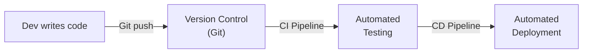
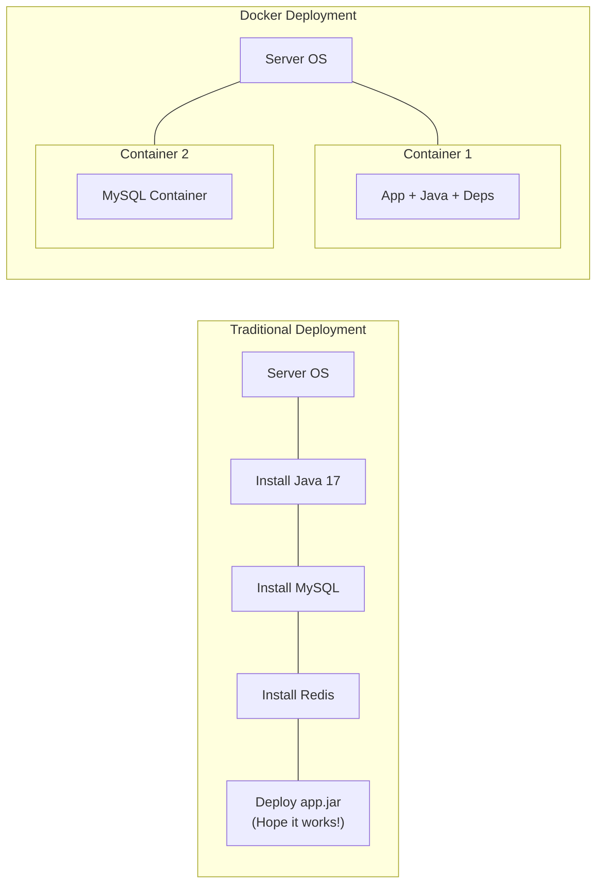
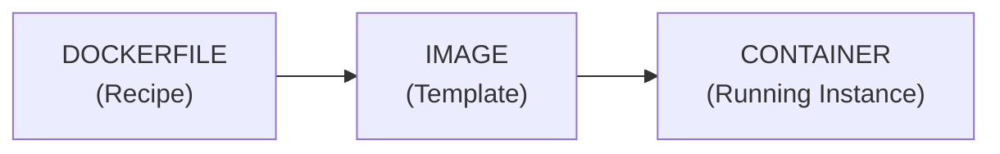
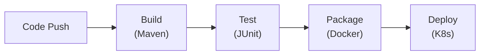
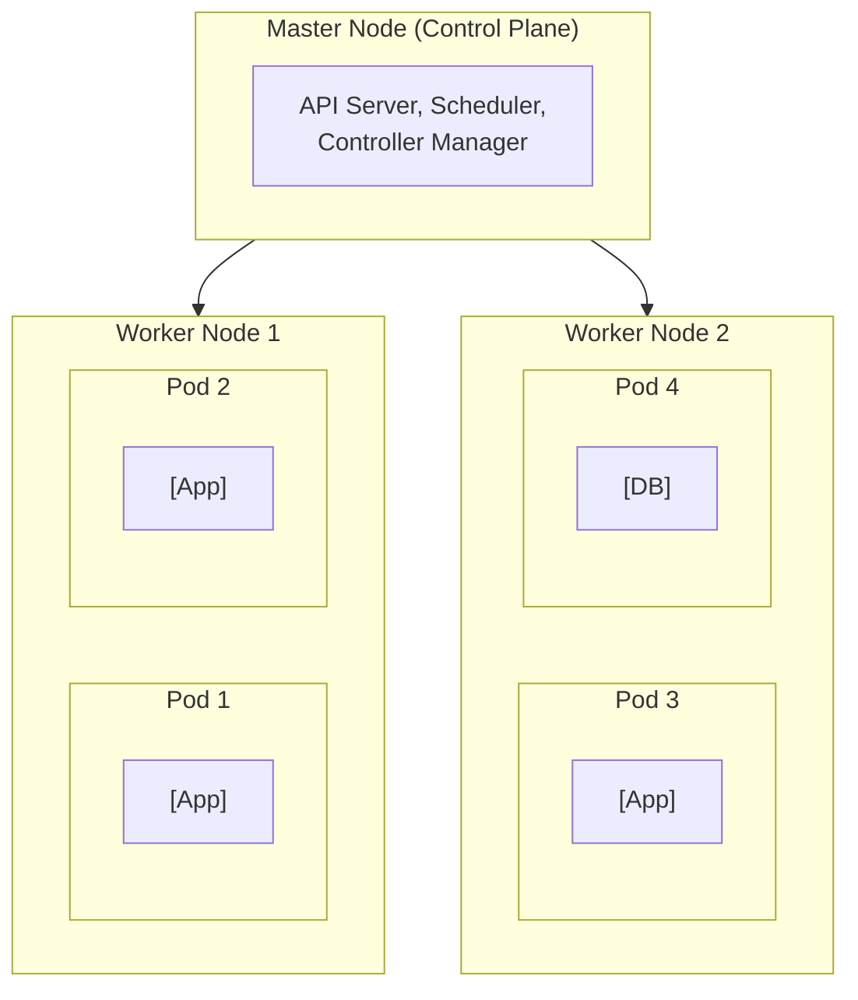

# DevOps Essentials — Docker & CI/CD

This guide covers devops essentials — docker & ci/cd with practical context, implementation notes, and review-ready takeaways.

## Why DevOps?

> 🏭 **Story: The Car Assembly Line**
>
> Before Henry Ford's assembly line, cars were handcrafted — slow, inconsistent, expensive. The assembly line automated production — each station did ONE job, and every car came out identical.
>
> **DevOps** is the assembly line for software: automate building (compile), testing, packaging (Docker), and deploying so every release is consistent. "It works on my machine" becomes "It works everywhere."



## Docker Fundamentals

> 📦 **Story: The Shipping Container**
>
> Before shipping containers, goods were loaded loose onto ships — fragile items broke, items got lost, loading took weeks. **Shipping containers** standardized everything — pack once, ship anywhere, unpack exactly as packed.
>
> **Docker containers** do the same for software: package your app + ALL its dependencies into a standardized container. It runs the same on your laptop, CI server, and production.

```
#### Traditional vs Docker Deployment



### Key Docker Concepts

```

Dockerfile:    Blueprint/recipe. Steps to build the image.
Image:         Immutable template. Built from Dockerfile. Like a class.
Container:     Running instance of an image. Like an object.
Registry:      Storage for images (Docker Hub, AWS ECR).
Volume:        Persistent storage for containers.
Network:       Communication between containers.
```

### Essential Docker Commands

```bash
docker build -t my-app:1.0 .

docker run -d -p 8080:8080 --name my-app my-app:1.0

docker ps

docker logs my-app
docker logs -f my-app  # Follow (live tail)

docker stop my-app
docker rm my-app

docker exec -it my-app bash  # Open a shell

docker images

docker rmi my-app:1.0

docker pull mysql:8.0
```

## Dockerfile for Spring Boot

### Basic Dockerfile

```dockerfile
FROM eclipse-temurin:17-jdk-alpine

WORKDIR /app

COPY target/*.jar app.jar

EXPOSE 8080

ENTRYPOINT ["java", "-jar", "app.jar"]
```

### Optimized Multi-Stage Dockerfile

```dockerfile

FROM maven:3.9-eclipse-temurin-17 AS builder
WORKDIR /build
COPY pom.xml .
RUN mvn dependency:go-offline          # Cache dependencies
COPY src ./src
RUN mvn package -DskipTests            # Build the JAR

FROM eclipse-temurin:17-jre-alpine     # JRE only (smaller!)
WORKDIR /app

RUN addgroup -S spring && adduser -S spring -G spring
USER spring:spring

COPY --from=builder /build/target/*.jar app.jar

EXPOSE 8080

ENTRYPOINT ["java", \
    "-XX:+UseContainerSupport", \
    "-XX:MaxRAMPercentage=75.0", \
    "-jar", "app.jar"]
```

**Why multi-stage?**

- Stage 1: Has Maven + JDK (~400MB) — only used for building
- Stage 2: Has only JRE (~80MB) — used for running
- Final image is MUCH smaller and doesn't include build tools

## Docker Compose — Multi-Container Apps

```yaml

services:
  mysql:
    image: mysql:8.0
    container_name: app-mysql
    environment:
      MYSQL_ROOT_PASSWORD: root
      MYSQL_DATABASE: myapp
    ports:
      - "3307:3306"      # Host:Container (3307 to avoid conflict)
    volumes:
      - mysql-data:/var/lib/mysql   # Persist data
    healthcheck:
      test: ["CMD", "mysqladmin", "ping", "-h", "localhost"]
      interval: 10s
      timeout: 5s
      retries: 5

  redis:
    image: redis:7-alpine
    container_name: app-redis
    ports:
      - "6379:6379"

  app:
    build: .           # Build from local Dockerfile
    container_name: spring-app
    ports:
      - "8080:8080"
    environment:
      SPRING_DATASOURCE_URL: jdbc:mysql://mysql:3306/myapp   # 'mysql' = service name
      SPRING_DATASOURCE_USERNAME: root
      SPRING_DATASOURCE_PASSWORD: root
      SPRING_REDIS_HOST: redis
    depends_on:
      mysql:
        condition: service_healthy    # Wait for MySQL to be ready
      redis:
        condition: service_started

volumes:
  mysql-data:      # Named volume for data persistence
```

```bash
docker-compose up -d

docker-compose logs -f app

docker-compose down

docker-compose down -v
```

## CI/CD Pipeline Concepts

```
Continuous Integration (CI):
Developer pushes code → Automated build → Automated tests → Report

Continuous Delivery (CD):
CI passed → Deploy to staging automatically → Manual approval for production

Continuous Deployment:
CI passed → Deploy to production automatically (no manual step)



## GitHub Actions for Java Projects

```yaml
name: Java CI/CD Pipeline

on:
  push:
    branches: [ main, develop ]
  pull_request:
    branches: [ main ]

jobs:
  build-and-test:
    runs-on: ubuntu-latest

    services:
      mysql:
        image: mysql:8.0
        env:
          MYSQL_ROOT_PASSWORD: root
          MYSQL_DATABASE: testdb
        ports:
          - 3306:3306
        options: >-
          --health-cmd "mysqladmin ping -h localhost"
          --health-interval 10s
          --health-timeout 5s
          --health-retries 5

    steps:
      - name: Checkout code
        uses: actions/checkout@v4

      - name: Set up JDK 17
        uses: actions/setup-java@v4
        with:
          java-version: '17'
          distribution: 'temurin'
          cache: maven  # Cache Maven dependencies

      - name: Build with Maven
        run: mvn clean compile

      - name: Run tests
        run: mvn test
        env:
          SPRING_DATASOURCE_URL: jdbc:mysql://localhost:3306/testdb
          SPRING_DATASOURCE_USERNAME: root
          SPRING_DATASOURCE_PASSWORD: root

      - name: Package
        run: mvn package -DskipTests

      - name: Build Docker image
        run: docker build -t my-app:${{ github.sha }} .

```

## Kubernetes Basics

```
Why Kubernetes?
Docker runs containers on ONE machine.
Kubernetes manages containers across MANY machines.



```yaml
apiVersion: apps/v1
kind: Deployment
metadata:
  name: spring-app
spec:
  replicas: 3            # Run 3 instances
  selector:
    matchLabels:
      app: spring-app
  template:
    metadata:
      labels:
        app: spring-app
    spec:
      containers:
        - name: spring-app
          image: my-app:latest
          ports:
            - containerPort: 8080
          env:
            - name: SPRING_PROFILES_ACTIVE
              value: "prod"
          resources:
            requests:
              memory: "256Mi"
              cpu: "250m"
            limits:
              memory: "512Mi"
              cpu: "500m"
apiVersion: v1
kind: Service
metadata:
  name: spring-app-service
spec:
  type: LoadBalancer
  selector:
    app: spring-app
  ports:
    - port: 80
      targetPort: 8080
```

## Interview Questions & Answers

### Conceptual Questions

**Q1: What is the difference between a Docker image and a container?**

**A:** An **image** is an immutable template containing the code, runtime, libraries, and dependencies — like a class in OOP. A **container** is a running instance of an image — like an object. You can run MULTIPLE containers from the same image. Images are stored in registries (Docker Hub); containers exist only while running.

**Q2: Why is Docker important for microservices?**

**A:** Each microservice can have different dependencies (Java 17, Node 20, Python 3.11) — Docker packages each with its OWN environment. Containers start in seconds (vs minutes for VMs). Docker Compose orchestrates multiple services locally. Kubernetes manages thousands of containers in production.

### Medium-Hard Questions

**Q3: What is the difference between `CMD` and `ENTRYPOINT` in a Dockerfile?**

**A:** `CMD` provides DEFAULT arguments that can be overridden: `docker run myapp bash` replaces CMD. `ENTRYPOINT` sets the FIXED command — arguments are APPENDED: `docker run myapp --debug` runs `ENTRYPOINT --debug`.

Best practice: Use `ENTRYPOINT` for the main command (`java -jar app.jar`) and `CMD` for default flags. Combined: `ENTRYPOINT ["java", "-jar", "app.jar"]` + `CMD ["--spring.profiles.active=dev"]`.

**Q4: How do you handle secrets (passwords, API keys) in Docker?**

**A:** NEVER put secrets in Dockerfiles or `docker-compose.yml`. Solutions:

1. **Environment variables** at runtime: `docker run -e DB_PASSWORD=secret myapp`
2. **Docker Secrets** (Swarm mode): encrypted, available only to authorized services
3. **Kubernetes Secrets**: stored in etcd, mounted as files/env vars
4. **External secret managers**: HashiCorp Vault, AWS Secrets Manager

> 🎯 **Session 19 Summary:** You've mastered Docker fundamentals (images, containers, volumes), writing Dockerfiles (multi-stage builds), Docker Compose (multi-container orchestration), CI/CD pipelines (GitHub Actions), and Kubernetes basics. DevOps skills are essential for modern backend developers!
