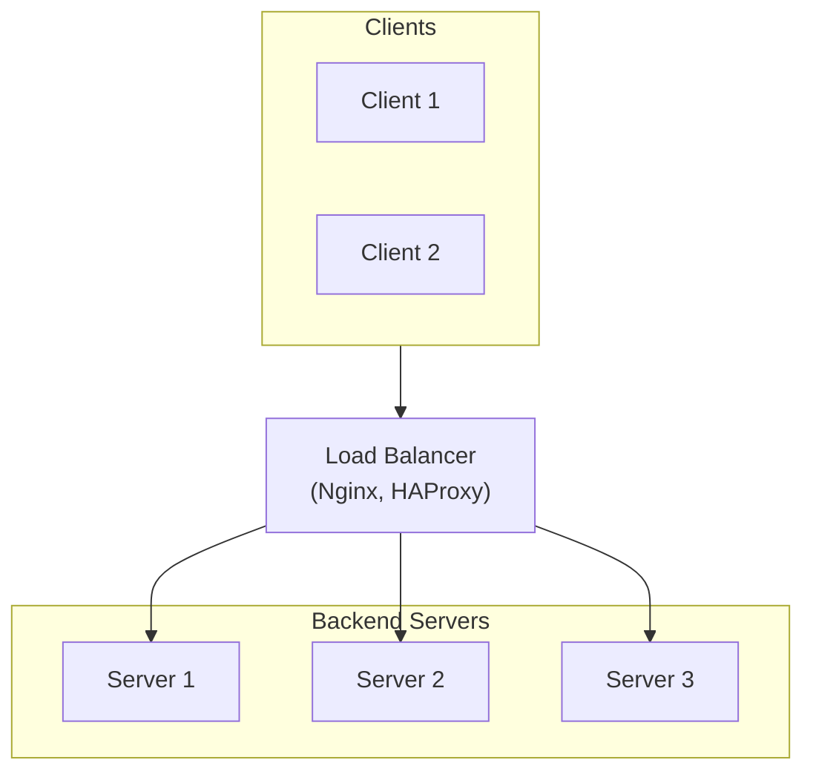
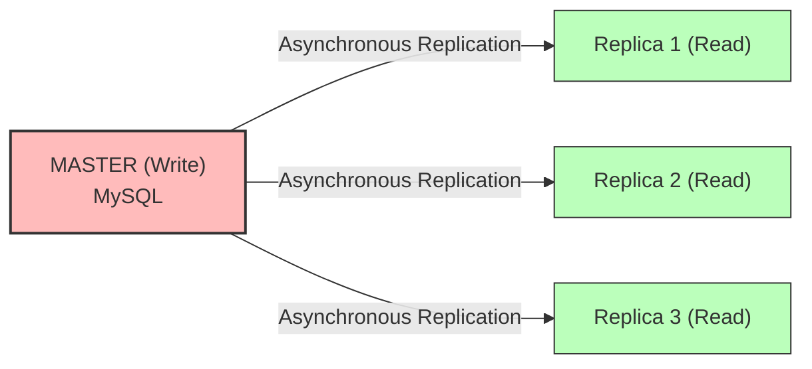
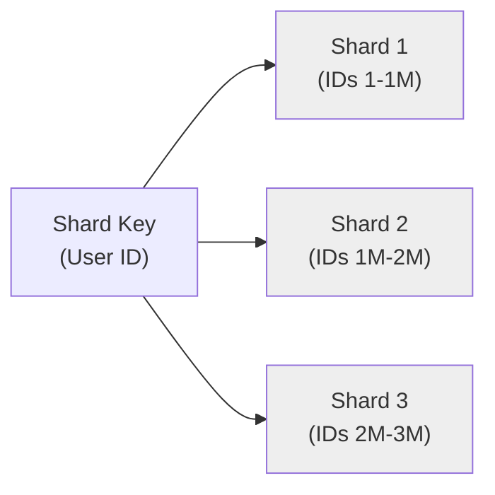
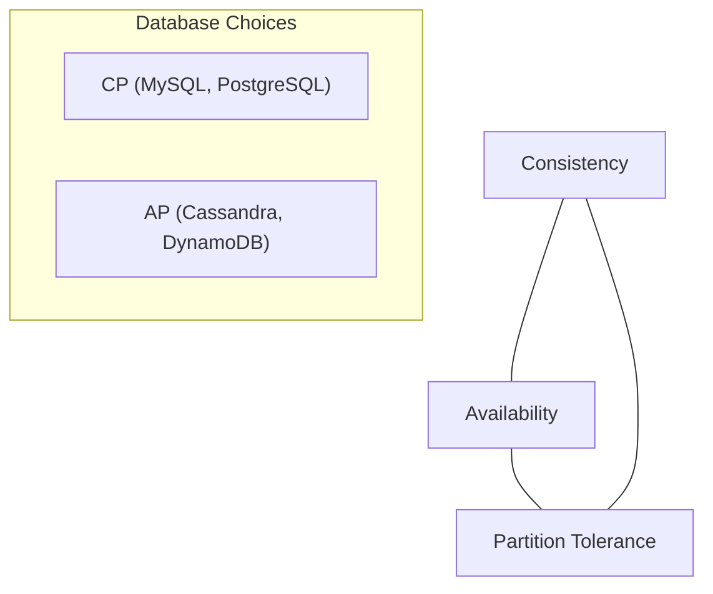
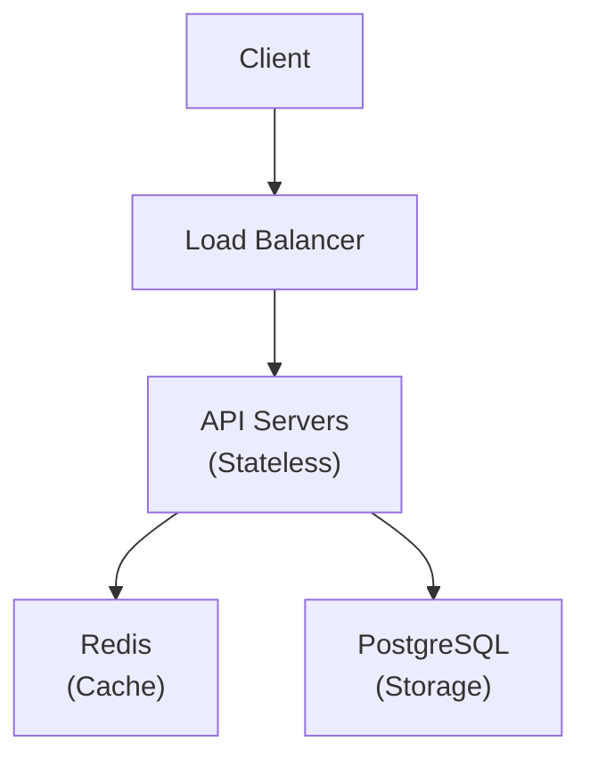
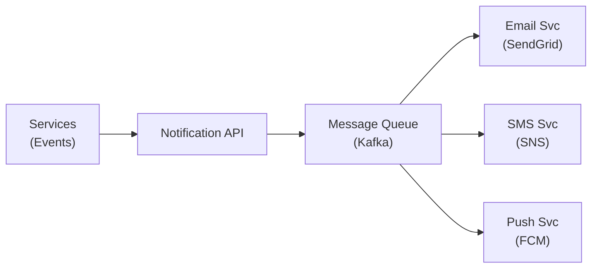

# System Design Fundamentals

This guide covers system design fundamentals with practical context, implementation notes, and review-ready takeaways.

## Why System Design?

> 🏙️ **Story: Building a City**
>
> Designing software for millions of users is like designing a city. A village road works for 100 people but not 1 million. You need highways (load balancers), multiple water tanks (database replicas), postal sorting centers (message queues), and zoning laws (service boundaries). **System design** is the art of building software cities that don't collapse under growth.

## Scalability

#### Vertical vs Horizontal Scaling

| Aspect | Vertical Scaling (Scale UP) | Horizontal Scaling (Scale OUT) |
| :--- | :--- | :--- |
| **Strategy** | Buy a BIGGER machine | Add MORE machines |
| **Visual** | `[ 64 CPU, 512GB RAM ]` | `[ S1 ] [ S2 ] [ S3 ]` |
| **Cost** | $$$$$$ (Exponential) | $ + $ + $ (Linear) |
| **Limit** | Physical hardware ceiling | Almost unlimited |
| **Fault Tolerance** | Single point of failure | If one dies, others continue |
| **Complexity** | Simple | Need load balancer, distributed state |

## Load Balancing



**Algorithms:**
| Algorithm | How it works | Best for |
|-----------|-------------|----------|
| **Round Robin** | 1→2→3→1→2→3 | Equal servers |
| **Weighted Round Robin** | More requests to powerful servers | Mixed hardware |
| **Least Connections** | Route to server with fewest active connections | Long-lived connections |
| **IP Hash** | Same client IP → same server | Session stickiness |
| **Random** | Random server selection | High randomness needed |

## Database Scaling

### Replication



*   **Write → Master only**
*   **Read → Any replica (load balanced)**
*   **Read/Write ratio is typically 80/20**, so replicas handle 80% of traffic.

### Sharding



Each shard holds a SUBSET of data. Queries are routed based on a shard key.
*   **Pros**: Massive horizontal scaling for writes.
*   **Cons**: Cross-shard queries are complex, re-sharding is painful.

## CAP Theorem

```
#### The CAP Triangle



| Property | Description |
| :--- | :--- |
| **C (Consistency)** | Every read gets the LATEST write (all nodes agree) |
| **A (Availability)** | Every request gets a response (system never goes down) |
| **P (Partition Tolerance)** | System works even if network between nodes fails |

In distributed systems, **P is guaranteed** (networks WILL fail). So you choose between CP (consistent but might be unavailable) or AP (available but might be stale).

*   **MongoDB**: CP (consistent, sacrifices availability during partition)
*   **Cassandra**: AP (available, may return stale data briefly)
```

## Rate Limiting

```java
// Rate limiting prevents abuse and protects backend resources

// Using Bucket4j library
@RestController
public class ApiController {

    // Token bucket: 10 tokens, refills 10 per minute
    private final Bucket bucket = Bucket.builder()
            .addLimit(Bandwidth.classic(10, Refill.intervally(10, Duration.ofMinutes(1))))
            .build();

    @GetMapping("/api/data")
    public ResponseEntity<String> getData() {
        if (bucket.tryConsume(1)) {
            return ResponseEntity.ok("Here's your data!");
        }
        return ResponseEntity.status(HttpStatus.TOO_MANY_REQUESTS)
                .body("Rate limit exceeded. Try again later.");
    }
}
```

**Common Algorithms:**

- **Token Bucket:** Tokens added at fixed rate; each request consumes a token
- **Sliding Window:** Count requests in rolling time window
- **Leaky Bucket:** Requests processed at constant rate; queue overflow is rejected

## System Design Template

```
1. REQUIREMENTS CLARIFICATION (5 min)
   - Functional: What should the system DO?
   - Non-functional: Scale? Latency? Availability?
   - Constraints: Budget? Tech stack? Team size?

2. ESTIMATION (5 min)
   - Users: DAU, peak QPS
   - Storage: Data size, growth rate
   - Bandwidth: Read/write ratio

3. HIGH-LEVEL DESIGN (10 min)
   - Draw the big picture: clients, services, databases
   - Identify core components

4. DETAILED DESIGN (15 min)
   - Dive into critical components
   - Database schema, API design, algorithms

5. BOTTLENECKS & TRADE-OFFS (5 min)
   - Scalability, failure points, trade-offs
```

## Case Study: Design a URL Shortener

```
Requirements:
- Shorten long URLs: long.com/very/long/path → short.ly/abc123
- Redirect: short.ly/abc123 → original URL
- Scale: 100M URLs/month, 10:1 read:write ratio


URL Generation:
- Base62 encoding of auto-increment ID → 6-char string
- Base62: [0-9a-zA-Z] = 62 chars, 62^6 = 56 billion combinations

API Design:
POST /api/shorten  { "url": "https://very-long-url.com/..." }
  → { "shortUrl": "https://short.ly/abc123" }

GET /abc123
  → 301 Redirect to original URL

Database:
| id (PK) | short_code | original_url | created_at |
| :--- | :--- | :--- | :--- |
| 1 | abc123 | `https://very-long-url.com/...` | 2024-01-01 |

Read path: Check Redis cache first → if miss, query DB → cache result
Write path: Generate ID → encode to Base62 → store in DB → cache
```

## Case Study: Design a Notification System

```
Requirements:
- Send Email, SMS, Push notifications
- Support 10M notifications/day
- Template-based messages
- Priority levels (urgent, normal, low)


Flow:
1. Order Service publishes OrderCreated event to Kafka
2. Notification API consumes event, determines notification type
3. Renders template with user data
4. Publishes to channel-specific queue (email/sms/push)
5. Channel workers send actual notifications
6. Store delivery status in DB

Priority Queue: High-priority (OTP, security) processed first
Rate Limiting: Max 5 SMS/user/hour to prevent spam
Deduplication: Hash of (user + template + timestamp) to avoid duplicates
```

## Interview Questions & Answers

### Conceptual Questions

**Q1: What is the difference between vertical and horizontal scaling? When to use each?**

**A:** Vertical = bigger machine (more CPU/RAM). Simple but has hardware limits and single point of failure. Horizontal = more machines. Complex but virtually unlimited and fault-tolerant. Start vertical (simpler), switch to horizontal when hitting limits or needing high availability.

### Medium-Hard Questions

**Q2: How would you design a system to handle 10,000 requests per second?**

**A:**

1. **Load balancer** distributes across multiple app servers
2. **Stateless API servers** — any server handles any request
3. **Redis caching** for frequently accessed data (reduces DB load by 80%)
4. **Read replicas** for the database (handle read-heavy traffic)
5. **Message queues** for async processing (decouple heavy operations)
6. **CDN** for static content (images, CSS, JS)
7. **Connection pooling** (HikariCP) to reuse DB connections
8. **Rate limiting** to protect from abuse

**Q3: Explain eventual consistency with a real-world example.**

**A:** When you post on Instagram, your follower in another country might see it 2 seconds later — not instantly. The post is written to the nearest datacenter (immediately visible to you), then REPLICATED to other datacenters. For those 2 seconds, different users see different states. This is **eventual consistency** — all replicas will EVENTUALLY converge to the same state, but not instantly. Choose this when availability is more important than instant consistency (social media, shopping carts).

> 🎯 **Session 22 Summary:** You've mastered system design fundamentals: scalability (vertical/horizontal), load balancing, database scaling (replication/sharding), CAP theorem, CDN, rate limiting, and designed two real systems (URL shortener, notification system). These concepts are essential for both building large-scale systems and acing system design interviews!
