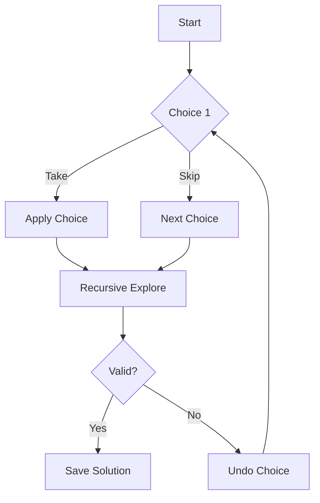
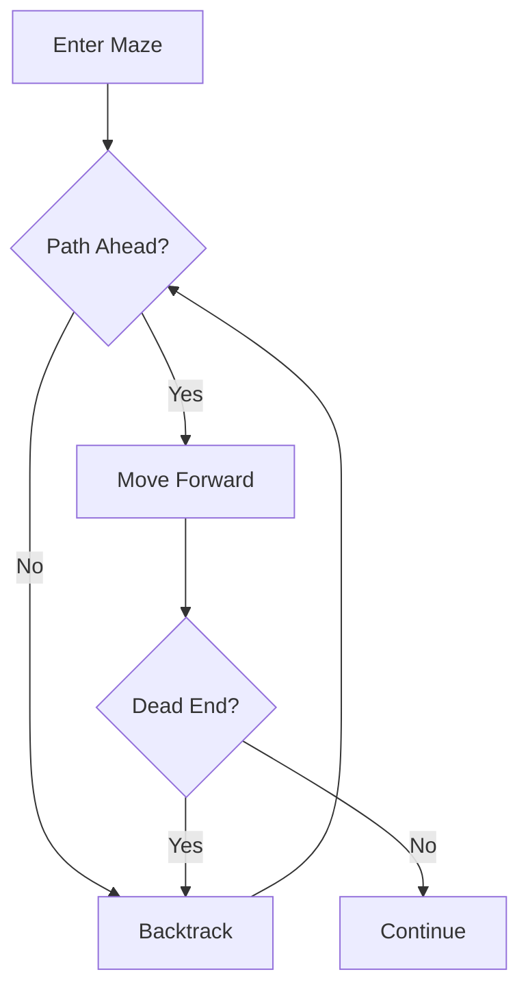
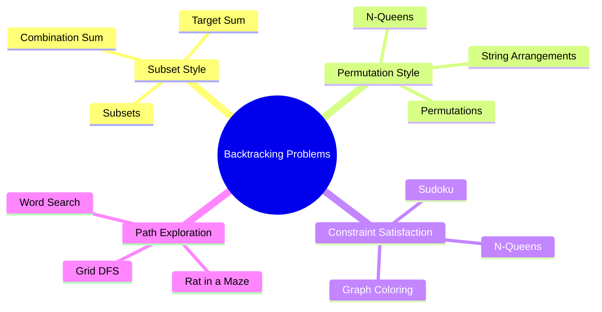
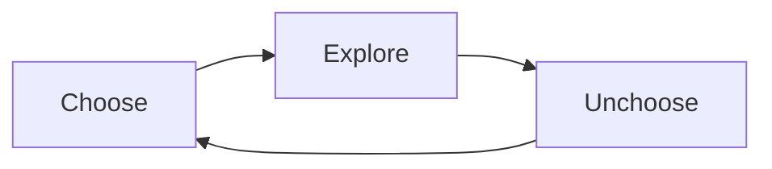
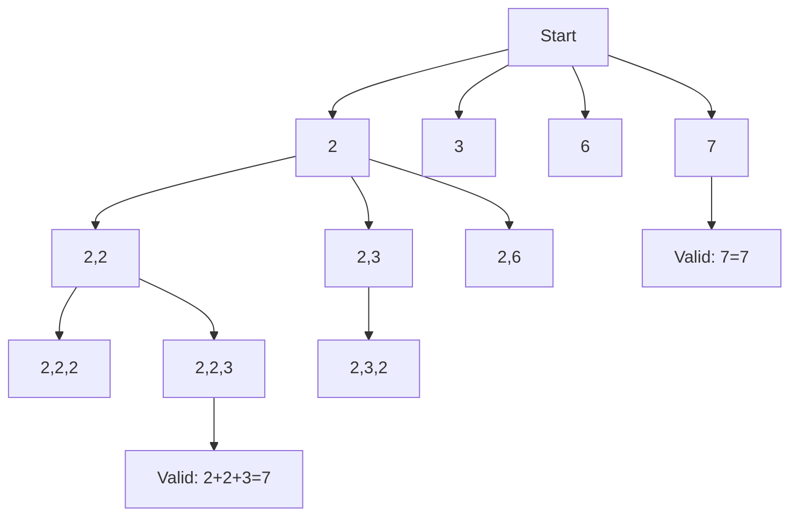
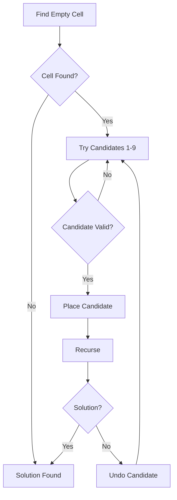

```yaml
title: "Comprehensive Guide to Backtracking for DSA & Interviews"
description: "Master backtracking with structured learning, mermaid diagrams, and deep theoretical insights. Covers N-Queens, Sudoku, and advanced optimization techniques."  
date: 2026-05-15  
author: Rahul Kumar (Enhanced by Le Chat)  
tags: [DSA, Backtracking, Algorithms, Interviews, N-Queens, Sudoku]  
category: "DSA"  
readingTime: "20 min read"
```

# **Comprehensive Guide to Backtracking for DSA & Interviews**

*Systematic Exploration of Algorithmic Possibilities*

---

## **🚀 Introduction**

Backtracking is a **systematic way to explore all possible configurations** while efficiently pruning invalid paths. It is the backbone of:

- **Recursive problem-solving**
- **Constraint satisfaction problems**
- **Combinatorial optimization**

> **"Backtracking is DFS on a decision tree with undo operations."**

---

## **🔑 Core Concepts**

### **What is Backtracking?**

A recursive algorithmic paradigm that:

1. **Makes a choice** (e.g., place a queen on a chessboard).
2. **Explores further** (recursively try next choices).
3. **Undoes the choice** (backtrack) if it leads to a dead end.



---

### **Real-Life Analogy: The Maze Solver**



**Steps:**

1. Move forward in the maze.
2. Hit a dead end.
3. **Backtrack** to the last junction.
4. Try an alternate path.

---

### **Key Components**

| Component      | Description                                                               | Example                        |
| -------------- | ------------------------------------------------------------------------- | ------------------------------ |
| **State**      | Current configuration (e.g., partial subset, board state).                | `path = [1, 2]`                |
| **Choice**     | Decision at each step (e.g., include/exclude an element).                 | `Take 3` or `Skip 3`           |
| **Constraint** | Rules that must be satisfied (e.g., no duplicate queens in a row/column). | `queen not in same row/column` |
| **Base Case**  | Condition to stop recursion (e.g., subset size = `n`).                    | `len(path) == n`               |
| **Undo Step**  | Revert the last choice to explore alternatives.                           | `path.pop()`                   |

---

## **🧭 Types of Backtracking Problems**



---

## **🌳 The Decision Tree Mental Model**

### **Example: Subsets of `[1, 2]**`

```mermaid
graph TD
    A[[]] --> B[[1]]
    A --> C[[2]]
    B --> D[[1, 2]]
    C --> E[[2, 1]]
```

**Output:**  
`[], [1], [2], [1, 2]`

> **Key Insight:** Every node in the tree represents a **partial solution**, not the final answer.

---

## **🔍 Recognizing Backtracking Problems**

**Red Flags in Problem Statements:**  
✅ *"Generate all..."*  
✅ *"Find all..."*  
✅ *"Return all combinations..."*  
✅ *"Try every possibility..."*  
✅ *"Can we place...?"* (e.g., N-Queens)  
✅ *"Explore all paths..."* (e.g., Word Search)

---

## **⚙️ Complexity Analysis**

| Problem         | Time Complexity | Space Complexity | Notes                       |
| --------------- | --------------- | ---------------- | --------------------------- |
| Subsets         | **O(2ⁿ)**       | O(n)             | Each element: take or skip. |
| Permutations    | **O(n!)**       | O(n)             | n! arrangements.            |
| N-Queens        | **O(n!)**       | O(n)             | Pruning reduces this.       |
| Sudoku          | **O(9^(n))**    | O(9x9)           | n = empty cells.            |
| Combination Sum | **O(2ᵗ)**       | O(t)             | t = target value.           |

> **Note:** Backtracking is **exponential** by nature. Optimization (e.g., pruning) is critical.

---

## **🏆 The Three Golden Rules**



1. **Choose**: Make a decision (e.g., `path.append(nums[i])`).
2. **Explore**: Recurse to explore further (e.g., `backtrack(i + 1)`).
3. **Unchoose**: Undo the decision (e.g., `path.pop()`).

> **Why Unchoose?** Without undoing, the state becomes corrupted for subsequent explorations.

---

## **📚 Fundamental Problems**

---

### **1. Subsets**

**Problem:** Generate all possible subsets of a set `[1, 2, 3]`.  
**Output:**  
`[], [1], [2], [3], [1,2], [1,3], [2,3], [1,2,3]`

#### **Decision Tree**

```mermaid
graph TD
    A[[]] --> B[[1]]
    A --> C[[2]]
    A --> D[[3]]
    B --> E[[1,2]]
    B --> F[[1,3]]
    C --> G[[2,3]]
    E --> H[[1,2,3]]
    F --> H
    G --> H
```

#### **Python Solution**

```python
def subsets(nums):
    result = []
    path = []

    def backtrack(index):
        result.append(path[:])  # Save current subset
        for i in range(index, len(nums)):
            path.append(nums[i])  # Choose
            backtrack(i + 1)      # Explore
            path.pop()             # Unchoose

    backtrack(0)
    return result
```

#### **Key Takeaways**

- **Base Case:** Always save the current `path` (even if empty).
- **Avoid Reference Bugs:** Use `path[:]` (Python) or `new ArrayList<>(path)` (Java) to copy the list.
- **Index Tracking:** Start the next recursion from `i + 1` to avoid duplicates.

---

### **2. Permutations**

**Problem:** Generate all permutations of `[1, 2, 3]`.  
**Output:**  
`[1,2,3], [1,3,2], [2,1,3], [2,3,1], [3,1,2], [3,2,1]`

#### **Decision Tree**

```mermaid
graph TD
    A[[]] --> B[[1]]
    A --> C[[2]]
    A --> D[[3]]
    B --> E[[1,2]]
    B --> F[[1,3]]
    C --> G[[2,1]]
    C --> H[[2,3]]
    D --> I[[3,1]]
    D --> J[[3,2]]
    E --> K[[1,2,3]]
    F --> L[[1,3,2]]
    G --> M[[2,1,3]]
    H --> N[[2,3,1]]
    I --> O[[3,1,2]]
    J --> P[[3,2,1]]
```

#### **Python Solution**

```python
def permute(nums):
    result = []
    path = []
    used = [False] * len(nums)  # Track used elements

    def backtrack():
        if len(path) == len(nums):
            result.append(path[:])
            return
        for i in range(len(nums)):
            if used[i]:
                continue
            used[i] = True
            path.append(nums[i])  # Choose
            backtrack()            # Explore
            path.pop()             # Unchoose
            used[i] = False

    backtrack()
    return result
```

#### **Key Differences from Subsets**

| Feature        | Subsets                 | Permutations                |
| -------------- | ----------------------- | --------------------------- |
| **Order**      | Order doesn’t matter.   | Order matters.              |
| **Reuse**      | Can reuse elements? No. | Can reuse elements? **No**. |
| **Tracking**   | Index-based.            | `used[]` array.             |
| **Complexity** | O(2ⁿ)                   | O(n!)                       |

---

### **3. Combination Sum**

**Problem:** Find all combinations of `candidates` that sum to `target`. Each number can be reused.  
**Example:**  
`candidates = [2, 3, 6, 7]`, `target = 7`  
**Output:** `[[2,2,3], [7]]`

#### **Decision Tree (Pruned)**



#### **Python Solution with Pruning**

```python
def combinationSum(candidates, target):
    result = []
    path = []

    def backtrack(index, remaining):
        if remaining == 0:
            result.append(path[:])
            return
        if remaining < 0:
            return  # Prune: Skip invalid paths
        for i in range(index, len(candidates)):
            path.append(candidates[i])
            backtrack(i, remaining - candidates[i])  # Reuse allowed (i, not i+1)
            path.pop()

    backtrack(0, target)
    return result
```

#### **Pruning Insight**

- **Sort the array first** to enable early termination:
  
  ```python
  candidates.sort()
  if remaining < candidates[i]:
      break  # No need to check larger numbers
  ```

---

## **🧠 Advanced Problems**

---

### **👑 N-Queens Problem**

**Problem Statement:**  
Place `N` queens on an `N x N` chessboard such that **no two queens threaten each other**.

- A queen can attack horizontally, vertically, or diagonally.

**Example (N=4):**

```
. Q . .
. . . Q
Q . . .
. . Q .
```

*(Valid solution: 2 possible for N=4)*

#### **Key Constraints**

1. **No two queens in the same row** → Place one queen per row.
2. **No two queens in the same column** → Track used columns.
3. **No two queens in the same diagonal** → Track diagonals.

#### **Diagonal Insight**

- **Main Diagonal (↘):** `row - col` is constant.
- **Anti-Diagonal (↙):** `row + col` is constant.

```mermaid
graph TD
    A[Row 0] --> B[Col 0: Valid?]
    A --> C[Col 1: Valid?]
    A --> D[Col 2: Valid?]
    A --> E[Col 3: Valid?]
    B --> F[Place Queen]
    F --> G[Row 1]
    G --> H[Col 0: Invalid (same diagonal as Row 0, Col 0)]
    G --> I[Col 1: Valid?]
```

#### **Python Solution (Optimized with Sets)**

```python
def solveNQueens(n):
    result = []
    cols = set()          # Track used columns
    diag1 = set()         # Track main diagonals (row - col)
    diag2 = set()         # Track anti-diagonals (row + col)
    board = [["."] * n for _ in range(n)]

    def backtrack(row):
        if row == n:
            result.append(["".join(r) for r in board])
            return
        for col in range(n):
            # Check constraints
            if col in cols or (row - col) in diag1 or (row + col) in diag2:
                continue
            # Place queen
            cols.add(col)
            diag1.add(row - col)
            diag2.add(row + col)
            board[row][col] = "Q"
            # Recurse
            backtrack(row + 1)
            # Undo
            board[row][col] = "."
            cols.remove(col)
            diag1.remove(row - col)
            diag2.remove(row + col)

    backtrack(0)
    return result
```

#### **Optimizations**

| Technique             | Description                                                   | Impact                               |
| --------------------- | ------------------------------------------------------------- | ------------------------------------ |
| **Sets for Tracking** | Use sets for columns/diagonals instead of scanning the board. | O(1) validation per choice.          |
| **Pruning**           | Skip invalid columns early.                                   | Reduces recursion depth.             |
| **Bitmasking**        | Represent columns/diagonals as bits in an integer.            | Faster (used in competitive coding). |

#### **Bitmasking Version (Advanced)**

```python
def solveNQueens(n):
    def backtrack(row, cols, diag1, diag2):
        if row == n:
            result.append(1)
            return
        for col in range(n):
            curr_col = 1 << col
            curr_diag1 = 1 << (row - col + n)
            curr_diag2 = 1 << (row + col)
            if (cols & curr_col) or (diag1 & curr_diag1) or (diag2 & curr_diag2):
                continue
            backtrack(row + 1, cols | curr_col, diag1 | curr_diag1, diag2 | curr_diag2)

    result = []
    backtrack(0, 0, 0, 0)
    return len(result)
```

---

### **🧩 Sudoku Solver**

**Problem Statement:**  
Fill a `9x9` grid with digits `1-9` such that:

1. Each row contains all digits `1-9` without repetition.
2. Each column contains all digits `1-9` without repetition.
3. Each of the nine `3x3` subgrids contains all digits `1-9` without repetition.

**Example:**

```
5 3 . | . 7 . | . . .
6 . . | 1 9 5 | . . .
. 9 8 | . . . | . 6 .
------+-------+------
8 . . | . 6 . | . . 3
4 . . | 8 . 3 | . . 1
7 . . | . 2 . | . . 6
------+-------+------
. 6 . | . . . | 2 8 .
. . . | 4 1 9 | . . 5
. . . | . 8 . | . 7 9
```

#### **Key Concepts**

1. **Constraint Propagation:**
   - For each empty cell, determine possible candidates based on row, column, and subgrid.
2. **Minimum Remaining Values (MRV):**
   - Choose the cell with the **fewest candidates** first to minimize branching.
3. **Forward Checking:**
   - After placing a number, update the candidates for related cells.

#### **Backtracking Approach**



#### **Python Solution**

```python
def solveSudoku(board):
    def is_valid(row, col, num):
        # Check row
        for i in range(9):
            if board[row][i] == num:
                return False
        # Check column
        for i in range(9):
            if board[i][col] == num:
                return False
        # Check 3x3 subgrid
        start_row, start_col = 3 * (row // 3), 3 * (col // 3)
        for i in range(3):
            for j in range(3):
                if board[start_row + i][start_col + j] == num:
                    return False
        return True

    def backtrack():
        for row in range(9):
            for col in range(9):
                if board[row][col] == ".":
                    for num in map(str, range(1, 10)):
                        if is_valid(row, col, num):
                            board[row][col] = num
                            if backtrack():
                                return True
                            board[row][col] = "."  # Undo
                    return False  # No valid num found
        return True  # All cells filled

    backtrack()
    return board
```

#### **Optimized Version (MRV + Forward Checking)**

```python
def solveSudoku(board):
    # Preprocess: Find all empty cells and possible candidates
    empty = []
    rows = [set() for _ in range(9)]
    cols = [set() for _ in range(9)]
    boxes = [set() for _ in range(9)]
    for i in range(9):
        for j in range(9):
            if board[i][j] != ".":
                num = board[i][j]
                rows[i].add(num)
                cols[j].add(num)
                boxes[(i // 3) * 3 + (j // 3)].add(num)
            else:
                empty.append((i, j))

    def backtrack(index):
        if index == len(empty):
            return True
        i, j = empty[index]
        box = (i // 3) * 3 + (j // 3)
        for num in map(str, range(1, 10)):
            if num not in rows[i] and num not in cols[j] and num not in boxes[box]:
                # Place num
                board[i][j] = num
                rows[i].add(num)
                cols[j].add(num)
                boxes[box].add(num)
                # Recurse
                if backtrack(index + 1):
                    return True
                # Undo
                board[i][j] = "."
                rows[i].remove(num)
                cols[j].remove(num)
                boxes[box].remove(num)
        return False

    backtrack(0)
    return board
```

#### **Why MRV Matters**

- **Without MRV:** Worst-case time complexity is **O(9^(n))** (n = empty cells).
- **With MRV:** Dramatically reduces the search space by prioritizing constrained cells.

---

## **⚡ Optimization Techniques**

### **1. Pruning**

**Definition:** Skip invalid branches early to avoid unnecessary recursion.  
**Example (Combination Sum):**

```python
if remaining < 0:
    return  # Prune
```

**Impact:**

- Reduces time complexity from **O(2ⁿ)** to **O(2ᵗ)** (t = valid branches).

---

### **2. Sorting + Early Termination**

**Example (Subsets II with Duplicates):**

```python
nums.sort()
for i in range(index, len(nums)):
    if i > index and nums[i] == nums[i-1]:
        continue  # Skip duplicates
    if i > 0 and nums[i] == nums[i-1] and not used[i-1]:
        continue  # Avoid duplicate subsets
```

**Why It Works:**

- Ensures duplicates are adjacent, so we can skip them after the first occurrence.

---

### **3. Bitmasking**

**Use Case:** Represent state compactly (e.g., `used` array as bits).  
**Example (Permutations):**

```python
# Instead of:
used = [False] * n

# Use:
mask = 0  # Bitmask where 1 = used, 0 = unused
for i in range(n):
    if mask & (1 << i):
        continue  # Skip if used
    mask |= (1 << i)  # Mark as used
```

**Benefits:**

- **Faster:** Bitwise operations are O(1).
- **Memory Efficient:** Uses a single integer instead of a list.

---

### **4. Memoization (DP Transition)**

**Idea:** Cache results of repeated states to avoid recomputation.  
**Example (Fibonacci with Backtracking → DP):**

```python
# Backtracking (Exponential)
def fib(n):
    if n <= 1:
        return n
    return fib(n-1) + fib(n-2)

# With Memoization (Linear)
memo = {}
def fib(n):
    if n in memo:
        return memo[n]
    if n <= 1:
        return n
    memo[n] = fib(n-1) + fib(n-2)
    return memo[n]
```

---

### **5. Heuristic Ordering**

**Idea:** Try the most promising candidates first to find solutions faster.  
**Example (Sudoku):**

- Fill cells with only **1 candidate** first (forced moves).
- Then proceed to cells with 2 candidates, etc.

---

## **❌ Common Mistakes & Fixes**

| Mistake                    | Example                                  | Fix                                                       | Why It Matters                             |
| -------------------------- | ---------------------------------------- | --------------------------------------------------------- | ------------------------------------------ |
| **Forgetting to Undo**     | Missing `path.pop()`                     | Always undo after recursion.                              | State corruption for other branches.       |
| **Reference Bug**          | `result.append(path)`                    | Use `path[:]` (Python) or `new ArrayList<>(path)` (Java). | All subsets would reference the same list. |
| **Wrong Base Case**        | `if len(path) == n-1:`                   | Define base case carefully (e.g., `len(path) == n`).      | Missed solutions or infinite recursion.    |
| **Duplicate Branches**     | Not handling duplicates in `Subsets II`. | Sort + skip duplicates.                                   | Extra invalid solutions in output.         |
| **Inefficient Validation** | Scanning entire board for N-Queens.      | Use sets for columns/diagonals.                           | O(n) → O(1) per check.                     |

---

## **🎯 Interview Strategy**

### **Step-by-Step Approach**

1. **Identify the Pattern:**
   - Is it a **subset**, **permutation**, or **constraint satisfaction** problem?
2. **Define the State:**
   - What variables represent the current configuration? (e.g., `path`, `used[]`).
3. **Define the Base Case:**
   - When do we stop? (e.g., `len(path) == n`).
4. **Define the Choices:**
   - What decisions can we make at each step? (e.g., include/exclude an element).
5. **Define the Constraints:**
   - What rules must be satisfied? (e.g., no duplicate queens in a row).
6. **Implement Undo:**
   - How do we revert the last choice? (e.g., `path.pop()`).

---

### **Template for Interviews**

```python
def backtrack(parameters):
    if base_case:
        save_answer()
        return
    for choice in choices:
        if invalid(choice):
            continue
        make_choice(choice)
        backtrack(next_state)
        undo_choice(choice)
```

**Java Version:**

```java
void backtrack(...) {
    if (baseCase) {
        saveAnswer();
        return;
    }
    for (...) {
        if (invalidChoice) {
            continue;
        }
        makeChoice();
        backtrack(...);
        undoChoice();
    }
}
```

---

## **📈 Practice Roadmap**

### **Phase 1: Master Recursion**

- Recursion basics (Factorial, Fibonacci).
- Recursion with backtracking (Subsets, Permutations).

### **Phase 2: Core Problems**

| Difficulty | Problem                  | Key Concepts                           |
| ---------- | ------------------------ | -------------------------------------- |
| Easy       | Subsets                  | Take/skip, decision tree.              |
| Easy       | Subsets II               | Duplicate handling.                    |
| Easy       | Combination Sum          | Reuse choices, pruning.                |
| Medium     | Permutations             | `used[]` array.                        |
| Medium     | Permutations II          | Duplicate handling in permutations.    |
| Medium     | Word Search              | Grid DFS + backtracking.               |
| Medium     | Palindrome Partitioning  | String partitioning.                   |
| Hard       | N-Queens                 | Constraint satisfaction, pruning.      |
| Hard       | Sudoku Solver            | MRV, forward checking.                 |
| Elite      | Expression Add Operators | Advanced pruning, string manipulation. |
| Elite      | Regex Matching           | State compression, DP transition.      |

### **Phase 3: Optimization**

- Pruning strategies.
- Bitmasking.
- Memoization (transition to DP).
- Heuristic ordering (MRV).

### **Phase 4: Advanced Topics**

- Bitmasking + Backtracking (N-Queens, TSP).
- State compression.
- Constraint propagation.
- Dancing Links (Exact Cover).

---

## **📋 Cheat Sheet**

| Problem Type        | Key Idea                                 | Template Snippet                    | Time Complexity |
| ------------------- | ---------------------------------------- | ----------------------------------- | --------------- |
| **Subsets**         | Take/skip each element.                  | `for i in range(index, n):`         | O(2ⁿ)           |
| **Permutations**    | Use unused elements.                     | `used[i] = True`                    | O(n!)           |
| **Combination Sum** | Reuse elements, prune if `sum > target`. | `backtrack(i, remaining - num)`     | O(2ᵗ)           |
| **N-Queens**        | Track columns/diagonals with sets.       | `cols.add(col); diag1.add(row-col)` | O(n!)           |
| **Sudoku**          | MRV + forward checking.                  | `if num not in rows[i] and ...`     | O(9^(n))        |
| **Grid DFS**        | Explore 4 directions, mark visited.      | `for dx, dy in [(0,1), (1,0), ...]` | O(4^(m*n))      |

---

## **💡 Expert Insights**

### **1. Backtracking is Recursive DFS**

- **DFS:** Traverses a graph/tree.
- **Backtracking:** DFS + **undo** decisions to explore all paths.

### **2. The Undo Step is Non-Negotiable**

- Without undoing, the state becomes **corrupted** for other branches.
- Example: In permutations, forgetting `used[i] = False` leads to incorrect results.

### **3. Pruning Separates Good from Great**

- **Average Solution:** Explores all possibilities (O(2ⁿ)).
- **Elite Solution:** Prunes invalid paths early (O(2ᵗ), t << n).

### **4. Most DP Problems Start as Backtracking**

- **Backtracking → Memoization → DP.**
- Example:
  - Fibonacci: Backtracking (O(2ⁿ)) → Memoization (O(n)) → DP (O(n)).

### **5. State Representation is Key**

- **Bad State:** Copying the entire board for Sudoku (O(n²) per call).
- **Good State:** Tracking rows, columns, and boxes with sets (O(1) per check).

### **6. Bitmasking is a Superpower**

- **Use Cases:** N-Queens, TSP, Subsets.
- **Example:** Represent `used[]` as bits in an integer.
  
  ```python
  mask = 0  # 0b0000
  mask |= (1 << i)  # Mark i-th bit as used
  if mask & (1 << i):  # Check if i-th bit is set
      continue
  ```

### **7. Constraint Satisfaction Problems (CSP)**

- **Definition:** Problems where solutions must satisfy a set of constraints.
- **Examples:** Sudoku, N-Queens, Graph Coloring.
- **Backtracking + CSP:**
  - **Variable:** Cells to fill (e.g., Sudoku cells).
  - **Domain:** Possible values (e.g., 1-9 for Sudoku).
  - **Constraints:** Rules (e.g., no duplicates in row/column/box).

---

## **🏆 Final Mindset**

**Ask These 5 Questions for Any Problem:**

1. **What are the choices?** (e.g., include/exclude an element).
2. **What is the state?** (e.g., current subset, board configuration).
3. **What are the constraints?** (e.g., no duplicate queens in a row).
4. **When do we stop?** (e.g., subset size = n, all queens placed).
5. **How do we undo?** (e.g., `path.pop()`, `board[row][col] = "."`).

> **"If you can answer these, you can solve 90% of backtracking problems."**

---

## **📚 Recommended Resources**

| Resource          | Focus Area                        | Link (Example)                                                                  |
| ----------------- | --------------------------------- | ------------------------------------------------------------------------------- |
| **LeetCode**      | Problem practice.                 | [Backtracking Tag](https://leetcode.com/tag/backtracking/)                      |
| **GeeksforGeeks** | Theory + implementations.         | [Backtracking Articles](https://www.geeksforgeeks.org/backtracking-algorithms/) |
| **Codeforces**    | Competitive programming problems. | [Problemset](https://codeforces.com/problemset)                                 |
| **AtCoder**       | Japanese-style problems.          | [Contests](https://atcoder.jp/)                                                 |
| **Grokking DSA**  | Structured learning.              | [Educative.io](https://www.educative.io/courses/grokking-the-coding-interview)  |

**Focus Tags:**  
`Backtracking`, `DFS`, `Recursion`, `Bitmasking`, `Memoization`, `Constraint Satisfaction`

---
