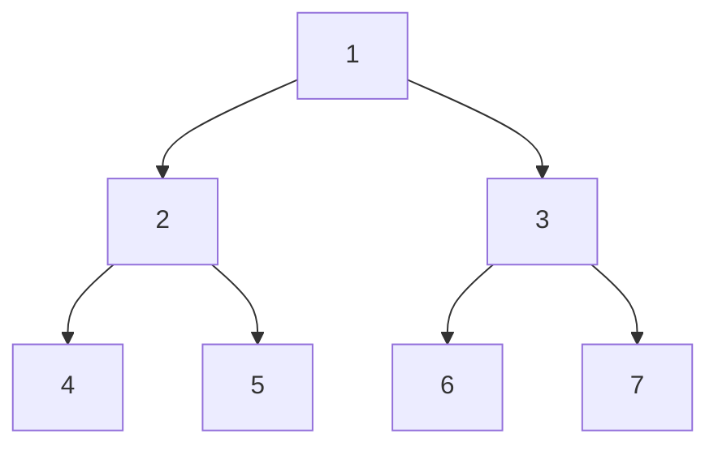
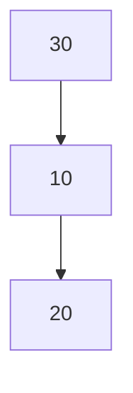
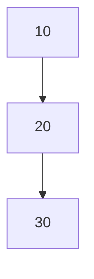

# Tree Patterns in DSA: A Comprehensive Guide

---

## Introduction

Trees are one of the most fundamental and versatile data structures in computer science. They are widely used in algorithms for searching, sorting, and organizing data hierarchically. Understanding **tree patterns** is crucial for solving a variety of DSA problems, from binary tree traversals to more complex tree structures like AVL trees, segment trees, and tries.

This guide covers:

- **Core Tree Patterns** (DFS, BFS, Path-based, Tree Construction)

- **Advanced Tree Patterns** (Balanced Trees, Views, BST Operations)

- **Tips & Tricks** for optimization and problem-solving

- **Interview Q&A** with conceptual and practical questions

---

## Core Tree Patterns

---

### Depth-First Search (DFS)

**DFS** is a fundamental tree traversal method that explores as far as possible along each branch before backtracking. It is the foundation for many tree-based algorithms.

#### Types of DFS Traversals

|           |                     |                                                                     |
| --------- | ------------------- | ------------------------------------------------------------------- |
| Traversal | Order               | Description                                                         |
| Preorder  | Root → Left → Right | Visit the root before its subtrees.                                 |
| Inorder   | Left → Root → Right | Visit the root after the left subtree and before the right subtree. |
| Postorder | Left → Right → Root | Visit the root after both subtrees.                                 |

#### Code Examples

#### Python

```python
class TreeNode:
    def __init__(self, val=0, left=None, right=None):
        self.val = val
        self.left = left
        self.right = right

def preorder(root):
    if not root:
        return []
    return [root.val] + preorder(root.left) + preorder(root.right)

def inorder(root):
    if not root:
        return []
    return inorder(root.left) + [root.val] + inorder(root.right)

def postorder(root):
    if not root:
        return []
    return postorder(root.left) + postorder(root.right) + [root.val]

# Example usage:
root = TreeNode(1, TreeNode(2), TreeNode(3))
print("Preorder:", preorder(root))  # Output: [1, 2, 3]
print("Inorder:", inorder(root))    # Output: [2, 1, 3]
print("Postorder:", postorder(root)) # Output: [2, 3, 1]
```

#### Java

```java
import java.util.*;

class TreeNode {
    int val;
    TreeNode left, right;
    TreeNode(int val) { this.val = val; }
}

public class TreeTraversal {
    public static List<Integer> preorder(TreeNode root) {
        List<Integer> result = new ArrayList<>();
        if (root == null) return result;
        result.add(root.val);
        result.addAll(preorder(root.left));
        result.addAll(preorder(root.right));
        return result;
    }

    public static List<Integer> inorder(TreeNode root) {
        List<Integer> result = new ArrayList<>();
        if (root == null) return result;
        result.addAll(inorder(root.left));
        result.add(root.val);
        result.addAll(inorder(root.right));
        return result;
    }

    public static List<Integer> postorder(TreeNode root) {
        List<Integer> result = new ArrayList<>();
        if (root == null) return result;
        result.addAll(postorder(root.left));
        result.addAll(postorder(root.right));
        result.add(root.val);
        return result;
    }

    public static void main(String[] args) {
        TreeNode root = new TreeNode(1);
        root.left = new TreeNode(2);
        root.right = new TreeNode(3);
        System.out.println("Preorder: " + preorder(root));  // Output: [1, 2, 3]
        System.out.println("Inorder: " + inorder(root));    // Output: [2, 1, 3]
        System.out.println("Postorder: " + postorder(root)); // Output: [2, 3, 1]
    }
}
```

---

#### Story: The Explorer and the Tree

Imagine you are an explorer in a dense forest (the tree). To map the forest:

- **Preorder**: You record your current position (root) before exploring left and right.

- **Inorder**: You explore left, record your position, then explore right.

- **Postorder**: You explore left, then right, and finally record your position.

This story helps visualize the traversal order.

---

---

---

### Breadth-First Search (BFS)

**BFS** explores the tree level by level, using a queue. It is essential for problems involving levels, such as finding the maximum depth of a tree.

#### Code Examples

#### Python

```python
from collections import deque

def level_order(root):
    if not root:
        return []
    result, queue = [], deque([root])
    while queue:
        level = []
        for _ in range(len(queue)):
            node = queue.popleft()
            level.append(node.val)
            if node.left:
                queue.append(node.left)
            if node.right:
                queue.append(node.right)
        result.append(level)
    return result

# Example usage:
root = TreeNode(1, TreeNode(2), TreeNode(3))
print("Level Order:", level_order(root))  # Output: [[1], [2, 3]]
```

#### Java

```java
import java.util.*;

public class LevelOrderTraversal {
    public static List<List<Integer>> levelOrder(TreeNode root) {
        List<List<Integer>> result = new ArrayList<>();
        if (root == null) return result;
        Queue<TreeNode> queue = new LinkedList<>();
        queue.add(root);
        while (!queue.isEmpty()) {
            int levelSize = queue.size();
            List<Integer> level = new ArrayList<>();
            for (int i = 0; i < levelSize; i++) {
                TreeNode node = queue.poll();
                level.add(node.val);
                if (node.left != null) queue.add(node.left);
                if (node.right != null) queue.add(node.right);
            }
            result.add(level);
        }
        return result;
    }

    public static void main(String[] args) {
        TreeNode root = new TreeNode(1);
        root.left = new TreeNode(2);
        root.right = new TreeNode(3);
        System.out.println("Level Order: " + levelOrder(root)); // Output: [[1], [2, 3]]
    }
}
```

---

#### Diagram: BFS Traversal



**BFS Order:** `[1, 2, 3, 4, 5, 6, 7]`

---

---

---

### Path-Based Patterns

**Path-based patterns** involve traversing from the root to a leaf or finding paths that satisfy certain conditions (e.g., sum of node values).

#### Example: Root-to-Leaf Path Sum

**Problem:** Find all root-to-leaf paths where the sum of node values equals a target sum.

**Python Solution**

```python
def path_sum(root, target_sum):
    def dfs(node, current_sum, path, result):
        if not node:
            return
        current_sum += node.val
        path.append(node.val)
        if not node.left and not node.right and current_sum == target_sum:
            result.append(list(path))
        dfs(node.left, current_sum, path, result)
        dfs(node.right, current_sum, path, result)
        path.pop()

    result = []
    dfs(root, 0, [], result)
    return result

# Example usage:
root = TreeNode(5, TreeNode(4, TreeNode(11, TreeNode(7), TreeNode(2))), TreeNode(8, TreeNode(13), TreeNode(4, None, TreeNode(1))))
print("Path Sum:", path_sum(root, 22))  # Output: [[5, 4, 11, 2]]
```

**Java Solution**

```java
import java.util.*;

public class PathSum {
    public static List<List<Integer>> pathSum(TreeNode root, int targetSum) {
        List<List<Integer>> result = new ArrayList<>();
        dfs(root, targetSum, new ArrayList<>(), result);
        return result;
    }

    private static void dfs(TreeNode node, int remainingSum, List<Integer> path, List<List<Integer>> result) {
        if (node == null) return;
        path.add(node.val);
        remainingSum -= node.val;
        if (node.left == null && node.right == null && remainingSum == 0) {
            result.add(new ArrayList<>(path));
        }
        dfs(node.left, remainingSum, path, result);
        dfs(node.right, remainingSum, path, result);
        path.remove(path.size() - 1);
    }

    public static void main(String[] args) {
        TreeNode root = new TreeNode(5);
        root.left = new TreeNode(4);
        root.left.left = new TreeNode(11);
        root.left.left.left = new TreeNode(7);
        root.left.left.right = new TreeNode(2);
        root.right = new TreeNode(8);
        root.right.left = new TreeNode(13);
        root.right.right = new TreeNode(4);
        root.right.right.right = new TreeNode(1);
        System.out.println("Path Sum: " + pathSum(root, 22)); // Output: [[5, 4, 11, 2]]
    }
}
```

---

#### Story: The Treasure Map

Imagine a treasure map (the tree) where each node is a clue. The treasure (target sum) is hidden along a path from the root to a leaf. You need to find all such paths.

---

---

---

### Tree Construction Patterns

**Tree construction patterns** involve building a tree from given traversal orders (e.g., inorder + preorder/postorder).

#### Example: Build Tree from Inorder and Preorder

**Python Solution**

```python
def build_tree(inorder, preorder):
    inorder_map = {val: idx for idx, val in enumerate(inorder)}

    def helper(in_start, in_end):
        if in_start > in_end:
            return None
        root_val = preorder.pop(0)
        root = TreeNode(root_val)
        root_idx = inorder_map[root_val]
        root.left = helper(in_start, root_idx - 1)
        root.right = helper(root_idx + 1, in_end)
        return root

    return helper(0, len(inorder) - 1)

# Example usage:
inorder = [9, 3, 15, 20, 7]
preorder = [3, 9, 20, 15, 7]
root = build_tree(inorder, preorder)
print("Inorder:", inorder)  # Output: [9, 3, 15, 20, 7]
```

**Java Solution**

```java
import java.util.*;

public class BuildTree {
    private Map<Integer, Integer> inorderMap = new HashMap<>();

    public TreeNode buildTree(int[] inorder, int[] preorder) {
        for (int i = 0; i < inorder.length; i++) {
            inorderMap.put(inorder[i], i);
        }
        return helper(inorder, preorder, 0, inorder.length - 1, 0);
    }

    private TreeNode helper(int[] inorder, int[] preorder, int inStart, int inEnd, int preStart) {
        if (inStart > inEnd) return null;
        int rootVal = preorder[preStart];
        TreeNode root = new TreeNode(rootVal);
        int rootIdx = inorderMap.get(rootVal);
        root.left = helper(inorder, preorder, inStart, rootIdx - 1, preStart + 1);
        root.right = helper(inorder, preorder, rootIdx + 1, inEnd, preStart + rootIdx - inStart + 1);
        return root;
    }

    public static void main(String[] args) {
        int[] inorder = {9, 3, 15, 20, 7};
        int[] preorder = {3, 9, 20, 15, 7};
        BuildTree bt = new BuildTree();
        TreeNode root = bt.buildTree(inorder, preorder);
        System.out.println("Tree built successfully!");
    }
}
```

---

---

## Advanced Tree Patterns

---

### Balanced Tree Patterns (AVL Trees)

**AVL trees** are self-balancing binary search trees where the height difference between left and right subtrees (balance factor) is at most 1.

#### Key Operations

- **Insertion**: Insert a node and rebalance if necessary.

- **Rotation**: Left and right rotations to maintain balance.

#### Python Implementation (AVL Insertion)

```python
class AVLNode:
    def __init__(self, val):
        self.val = val
        self.left = None
        self.right = None
        self.height = 1

def height(node):
    if not node:
        return 0
    return node.height

def balance_factor(node):
    if not node:
        return 0
    return height(node.left) - height(node.right)

def rotate_right(y):
    x = y.left
    T2 = x.right
    x.right = y
    y.left = T2
    y.height = max(height(y.left), height(y.right)) + 1
    x.height = max(height(x.left), height(x.right)) + 1
    return x

def rotate_left(x):
    y = x.right
    T2 = y.left
    y.left = x
    x.right = T2
    x.height = max(height(x.left), height(x.right)) + 1
    y.height = max(height(y.left), height(y.right)) + 1
    return y

def insert(root, val):
    if not root:
        return AVLNode(val)
    if val < root.val:
        root.left = insert(root.left, val)
    else:
        root.right = insert(root.right, val)
    root.height = max(height(root.left), height(root.right)) + 1
    balance = balance_factor(root)
    # Left Left Case
    if balance > 1 and val < root.left.val:
        return rotate_right(root)
    # Right Right Case
    if balance < -1 and val > root.right.val:
        return rotate_left(root)
    # Left Right Case
    if balance > 1 and val > root.left.val:
        root.left = rotate_left(root.left)
        return rotate_right(root)
    # Right Left Case
    if balance < -1 and val < root.right.val:
        root.right = rotate_right(root.right)
        return rotate_left(root)
    return root

# Example usage:
root = None
root = insert(root, 10)
root = insert(root, 20)
root = insert(root, 30)
print("AVL Tree Inserted!")
```

---

#### Diagram: AVL Rotations



**Left Rotation:**



---

---

---

### Tree Views (Top, Bottom, Left, Right)

**Tree views** involve visualizing the tree from specific angles (e.g., top view, bottom view, left view, right view).

#### Example: Left View of a Binary Tree

**Python Solution**

```python
def left_view(root):
    if not root:
        return []
    result = []
    queue = deque([root])
    while queue:
        level_size = len(queue)
        for i in range(level_size):
            node = queue.popleft()
            if i == 0:
                result.append(node.val)
            if node.left:
                queue.append(node.left)
            if node.right:
                queue.append(node.right)
    return result

# Example usage:
root = TreeNode(1, TreeNode(2), TreeNode(3))
print("Left View:", left_view(root))  # Output: [1, 2]
```

**Java Solution**

```java
import java.util.*;

public class LeftView {
    public static List<Integer> leftView(TreeNode root) {
        List<Integer> result = new ArrayList<>();
        if (root == null) return result;
        Queue<TreeNode> queue = new LinkedList<>();
        queue.add(root);
        while (!queue.isEmpty()) {
            int levelSize = queue.size();
            for (int i = 0; i < levelSize; i++) {
                TreeNode node = queue.poll();
                if (i == 0) result.add(node.val);
                if (node.left != null) queue.add(node.left);
                if (node.right != null) queue.add(node.right);
            }
        }
        return result;
    }

    public static void main(String[] args) {
        TreeNode root = new TreeNode(1);
        root.left = new TreeNode(2);
        root.right = new TreeNode(3);
        System.out.println("Left View: " + leftView(root)); // Output: [1, 2]
    }
}
```

---

#### Story: The Architect’s Blueprint

Imagine you are an architect designing a building (the tree). The **left view** is what you see if you stand to the left of the building and look straight ahead.

---

---

---

### Binary Search Tree (BST) Patterns

**BST patterns** involve operations specific to binary search trees, such as validation, insertion, deletion, and finding the lowest common ancestor (LCA).

#### Example: Validate BST

**Python Solution**

```python
def is_valid_bst(root, min_val=float('-inf'), max_val=float('inf')):
    if not root:
        return True
    if not (min_val < root.val < max_val):
        return False
    return is_valid_bst(root.left, min_val, root.val) and is_valid_bst(root.right, root.val, max_val)

# Example usage:
root = TreeNode(2, TreeNode(1), TreeNode(3))
print("Is Valid BST:", is_valid_bst(root))  # Output: True
```

**Java Solution**

```java
public class ValidateBST {
    public static boolean isValidBST(TreeNode root) {
        return isValidBST(root, Long.MIN_VALUE, Long.MAX_VALUE);
    }

    private static boolean isValidBST(TreeNode node, long minVal, long maxVal) {
        if (node == null) return true;
        if (node.val <= minVal || node.val >= maxVal) return false;
        return isValidBST(node.left, minVal, node.val) && isValidBST(node.right, node.val, maxVal);
    }

    public static void main(String[] args) {
        TreeNode root = new TreeNode(2);
        root.left = new TreeNode(1);
        root.right = new TreeNode(3);
        System.out.println("Is Valid BST: " + isValidBST(root)); // Output: true
    }
}
```

---

---

## Tips & Tricks

---

### 3.1 General Tips

1. **Use Recursion for DFS**: Recursion simplifies DFS implementations, but be mindful of stack overflow for very deep trees.

2. **Use Iteration for BFS**: BFS requires a queue, so iterative approaches are natural.

3. **Memoization**: For problems involving repeated calculations (e.g., path sums), use memoization or dynamic programming.

4. **Balance Trees**: For problems involving balanced trees (e.g., AVL, Red-Black), ensure rotations are correctly implemented.

5. **Edge Cases**: Always consider edge cases like empty trees, single-node trees, and skewed trees.

---

### 3.2 Optimization Tips

|                   |                                                                         |
| ----------------- | ----------------------------------------------------------------------- |
| Pattern           | Optimization Tip                                                        |
| DFS               | Use iterative DFS with a stack to avoid recursion limits.               |
| BFS               | Use a deque for level-order traversal to efficiently manage levels.     |
| Path Sum          | Prune paths early if the current sum exceeds the target.                |
| Tree Construction | Use hash maps to store indices for inorder traversal in O(1) time.      |
| AVL Tree          | Precompute heights and balance factors to avoid redundant calculations. |

---

---

## Interview Q&A

---

### 4.1 Conceptual Questions

|                                                       |                                                                                                                                       |
| ----------------------------------------------------- | ------------------------------------------------------------------------------------------------------------------------------------- |
| Question                                              | Answer                                                                                                                                |
| **What is the difference between DFS and BFS?**       | DFS explores as far as possible before backtracking, while BFS explores level by level.                                               |
| **When would you use Inorder vs Preorder traversal?** | Inorder is used for BST validation and traversal, while Preorder is used for copying trees or serialization.                          |
| **What is a balanced tree?**                          | A tree where the height difference between left and right subtrees is at most 1 (e.g., AVL, Red-Black trees).                         |
| **How do you find the LCA in a BST?**                 | Traverse from the root, moving left if both nodes are smaller, right if both are larger, and return the current node if they diverge. |
| **What is the time complexity of tree traversals?**   | O(n) for all standard traversals (DFS, BFS), where n is the number of nodes.                                                          |

---

### 4.2 Practical Coding Questions

|                                              |                                                                                                     |
| -------------------------------------------- | --------------------------------------------------------------------------------------------------- |
| Question                                     | Solution                                                                                            |
| **Find the maximum depth of a binary tree.** | Use DFS to track depth recursively.                                                                 |
| **Check if a tree is symmetric.**            | Compare left and right subtrees recursively.                                                        |
| **Find the diameter of a binary tree.**      | The diameter is the longest path between any two nodes, which may or may not pass through the root. |
| **Serialize and deserialize a binary tree.** | Use Preorder traversal for serialization and reconstruct the tree during deserialization.           |
| **Flatten a binary tree to a linked list.**  | Use a modified Preorder traversal to rearrange nodes.                                               |

---

#### Example: Find the Diameter of a Binary Tree

**Python Solution**

```python
def diameter_of_binary_tree(root):
    diameter = 0
    def height(node):
        nonlocal diameter
        if not node:
            return 0
        left_height = height(node.left)
        right_height = height(node.right)
        diameter = max(diameter, left_height + right_height)
        return max(left_height, right_height) + 1
    height(root)
    return diameter

# Example usage:
root = TreeNode(1, TreeNode(2, TreeNode(4), TreeNode(5)), TreeNode(3))
print("Diameter:", diameter_of_binary_tree(root))  # Output: 3
```

**Java Solution**

```java
public class DiameterOfBinaryTree {
    private int diameter = 0;

    public int diameterOfBinaryTree(TreeNode root) {
        height(root);
        return diameter;
    }

    private int height(TreeNode node) {
        if (node == null) return 0;
        int leftHeight = height(node.left);
        int rightHeight = height(node.right);
        diameter = Math.max(diameter, leftHeight + rightHeight);
        return Math.max(leftHeight, rightHeight) + 1;
    }

    public static void main(String[] args) {
        TreeNode root = new TreeNode(1);
        root.left = new TreeNode(2);
        root.left.left = new TreeNode(4);
        root.left.right = new TreeNode(5);
        root.right = new TreeNode(3);
        DiameterOfBinaryTree db = new DiameterOfBinaryTree();
        System.out.println("Diameter: " + db.diameterOfBinaryTree(root)); // Output: 3
    }
}
```

---

---

## Common Mistakes and Edge Cases

---

### 5.1 Common Mistakes

1. **Forgetting to Handle Null Nodes**: Always check for `null` before accessing node attributes.

2. **Incorrect Base Cases**: For recursive functions, ensure the base case is correctly defined.

3. **Ignoring Balance Factors**: In AVL trees, always update heights and balance factors after insertion/deletion.

4. **Overcomplicating Path Sums**: For path sum problems, prune paths early if the current sum exceeds the target.

5. **Assuming BST Properties**: Always validate BST properties explicitly, as not all binary trees are BSTs.

---

### 5.2 Edge Cases

|                  |                                                                       |
| ---------------- | --------------------------------------------------------------------- |
| Edge Case        | Description                                                           |
| Empty Tree       | Return appropriate values (e.g., `[]` for traversals, `0` for depth). |
| Single Node      | Ensure traversals and operations work for a single node.              |
| Skewed Tree      | Test for left-skewed or right-skewed trees.                           |
| Duplicate Values | Handle duplicates in BSTs (e.g., allow only in the right subtree).    |
| Large Inputs     | Test for performance and stack overflow with large trees.             |

---

---

## Additional Resources

---

- **Books**:
  
  - *Introduction to Algorithms* by Cormen et al.
  
  - *Data Structures and Algorithms in Java/Python* by Robert Sedgewick.

- **Online Courses**:
  
  - [Coursera: Data Structures](https://www.coursera.org/learn/data-structures)
  
  - [LeetCode Tree Problems](https://leetcode.com/problemset/all/?difficulty=EASY&page=1&listId=wpwgkgt)

- **Practice Platforms**:
  
  - [LeetCode](https://leetcode.com/)
  
  - [HackerRank](https://www.hackerrank.com/domains/tutorials/10-days-of-statistics)
  
  - [GeeksforGeeks](https://www.geeksforgeeks.org/)
